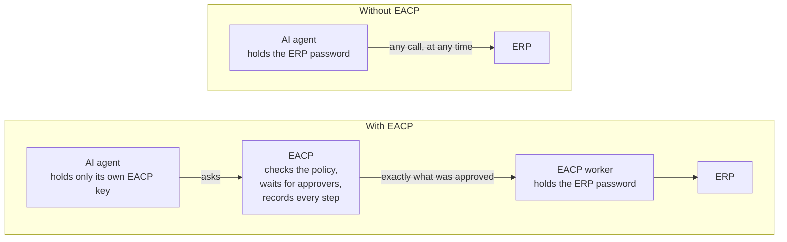
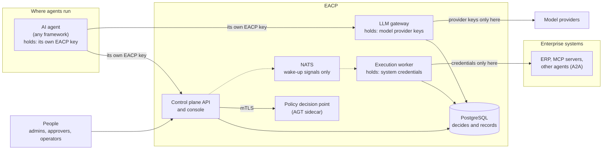
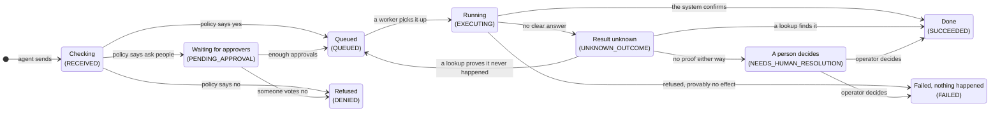
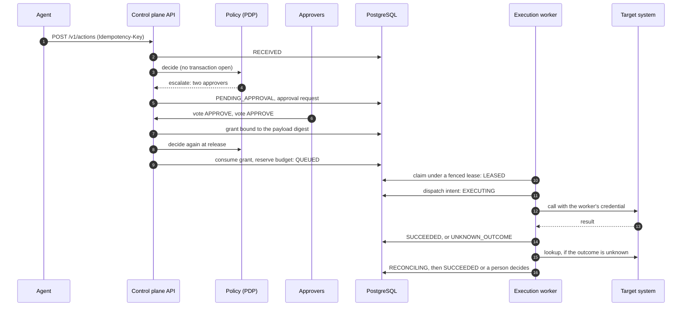

[English](README.md) | [ไทย](README.th.md)

# EACP: Enterprise Agent Control Plane

[](https://github.com/atipongsena/eacp/actions/workflows/ci.yml)
[](LICENSE)
[](go.mod)

EACP is a control plane for AI agents that act on enterprise systems. Agents can be built with any framework and run
anywhere, but when one wants to do something that matters (place a purchase order, post a ledger entry, delegate to
another agent, call a paid model), the request goes through EACP. EACP checks who is asking and what they may do,
asks the policy, waits for the people who must approve, executes the action exactly as approved, and keeps evidence
of every step in PostgreSQL.

## What EACP is and the problem it solves

Giving an AI agent access to enterprise systems goes wrong in ways ordinary API gateways were not built for:

- **A retried call orders twice.** Agents retry after timeouts and restarts. Without care, the second attempt places
  a second purchase order.
- **An approval authorises something else.** A manager approves "250,000 THB to ACME", and a different payload runs
  because something changed between the approval and the execution.
- **The agent holds the credential.** An agent with the ERP password can use it for anything, and no control sees it.
- **Nobody knows what happened.** A call times out after it was sent. Did the order go through? Guessing "no" and
  retrying may duplicate it; guessing "yes" may lose it.

EACP answers each of these structurally. Agents never receive enterprise credentials: only EACP's execution worker
holds them. Every action passes one state machine in PostgreSQL. An approval is bound to the exact payload and used
once. An outcome that is not known is reconciled against the target system, or handed to a person with the
evidence, never guessed.

The difference in one picture:



The agent can still ask for anything, but it can only *get* what the policy and the approvers allow, and it never
touches the password that would let it go around them.


## Guarantees and where they stop

The first slice of EACP was built to make one statement true:

> Privileged agent actions cannot bypass the control plane, approvals are durable, retries cannot casually duplicate
> irreversible side effects, and ambiguous execution outcomes are handled explicitly rather than guessed.

Each part of it is an invariant with tests ([INVARIANTS.md](docs/INVARIANTS.md)). It holds for a **conforming
deployment** ([ADR-001](docs/adr/ADR-001-product-boundary-and-enforcement-point.md) §3a): the target systems accept
privileged calls only from EACP's worker, agents have no network route to them, and an agent's EACP key grants
nothing at a target. EACP cannot make an arbitrary system conform; it can only refuse to be the weak link.

EACP never claims exactly-once execution. An effect is idempotent where the target supports it, effectively-once
where it can be reconciled, and at-most-once where a retry would be unsafe. The
[threat model](docs/security/THREAT_MODEL.md) lists what remains outside its reach, such as prompt injection, which
EACP bounds but does not prevent.

## Architecture

EACP sits between two zones it keeps apart: where agents run, and the systems they act on. The labels say which key
each part holds.



- **Control plane API** ([`cmd/controlplane-api`](cmd/controlplane-api)) serves the `/v1` API and the operator
  console. It authenticates agents and people, runs governance and approvals, and releases actions. Its background
  loops sweep expired work, relay signals and open incidents.
- **Execution worker** ([`cmd/execution-worker`](cmd/execution-worker)) is the only process that holds connector
  credentials. It claims released actions under a fenced lease, records a dispatch intent before every call, calls
  the target, and reconciles outcomes it could not observe.
- **LLM gateway** ([`cmd/llm-gateway`](cmd/llm-gateway)) lets agents call models with their usual SDK. It admits each
  call in PostgreSQL (allowlist, kill switches, budget) before sending it, and is the only holder of provider keys.
- **PostgreSQL** is the authority. Registry rules, state transitions, separation of duties, budgets and kill states
  are triggers and functions, every tenant table has Row-Level Security, and the audit journal is a hash chain.
- **The policy decision point** answers governance questions. It runs the Microsoft Agent Governance Toolkit, ACS and
  OPA in a sidecar behind mutual TLS, or an in-process evaluator; both pass the same conformance set.
- **NATS JetStream** only wakes things up. Nothing is claimed, executed or cancelled because of a message, so losing
  it slows EACP down and changes nothing else.

[ARCHITECTURE.md](docs/ARCHITECTURE.md) covers the networks, trust boundaries, the execution fabric and high
availability in detail.

## The life of an action

Every request an agent sends ends in one of a few places. In words, with the real state names in brackets:



The one path EACP never takes is guessing: a result nobody can prove goes to a person, with the evidence. The
sequence below follows a purchase that needs two approvers, step by step.



1. **Submit.** The agent sends the action with its own key and an `Idempotency-Key`. The same key and body always
   return the same action, so a retry never creates a second one.
2. **Govern.** EACP checks the registry (the agent version is active, the tool is on its allowlist with a certified
   contract) and asks the PDP. The verdict allows, denies or escalates. If the PDP is down, the action waits and
   nothing executes.
3. **Approve.** Eligible people vote. PostgreSQL enforces separation of duties: the subject and the agent's owner
   cannot approve, and nobody votes twice. A quorum creates a grant bound to the exact payload and policy version.
4. **Release.** One transaction revalidates everything under the current policy, consumes the grant once, reserves
   the budget and pins the policy and contract versions.
5. **Claim.** A worker takes the action under a lease with a generation number. A worker that loses its lease can no
   longer write anything.
6. **Dispatch intent.** Before any external call, the worker records the attempt in PostgreSQL, after checking once
   more that nothing changed: no kill, no cancel, no open circuit, the same policy and contract.
7. **Execute.** The worker calls the target with its credential. The agent never sees it.
8. **Complete or reconcile.** A definite result is recorded. An ambiguous one becomes `UNKNOWN_OUTCOME`: the
   reconciler looks the operation up in the target. A found record settles it. "Not found" settles it only when the
   contract says the lookup is authoritative; otherwise an operator decides, with evidence.

## A tour of the console

The operator console at `/ui/` is a client of the same API. It has no authority of its own, keeps its key only in the
tab's memory, and asks for confirmation before every change ([ADR-028](docs/adr/ADR-028-operator-console.md)).

### Approvals


An approver sees the requests they are eligible to vote on, with the exact payload the policy saw. People who may not
approve a request (its subject, the agent's owner) never see it here.

### Execution and evidence


The execution view lists actions by state. This one shows an action in `NEEDS_HUMAN_RESOLUTION`: the ERP took the
order, the call timed out, and the lookups could not prove what happened. An operator resolves it with evidence.


Every action can be reconstructed from its id. The page shows its record, the enforced payload that ran, and the
evidence document the API assembles (`GET /v1/actions/{id}/evidence`): the policy decisions, the approval with its
votes and grant, each attempt, each reconciliation check and the journal entries, with the hash chain verified while
reading.

### Fleet


The fleet view shows every agent's active version and health, derived from kills, open circuits and tools the
database would not execute. Operators pause or quarantine many agents in one atomic operation, previewed first.

### Incidents


The incident evaluator opens one incident per signal: here a kill switch on an agent version and an action that
needs a person. Operators acknowledge, assign, note and resolve them; a critical incident needs a second person to
close.

### Dependencies


The blast radius of a tool, an MCP server, a model or an agent version: which agents are confirmed or possibly
affected if it misbehaves. Stale or unknown evidence widens the answer rather than narrowing it.

### Cost


Spend today and this month by unit, the top agents, hard budget blocks and open alerts. Costs are computed in
PostgreSQL from a price card; cost alerts observe and never block.

## Quick start

You need Docker with Compose v2, Go, Python 3, Bash (Git Bash on Windows), `curl` and `jq`.

```bash
git clone https://github.com/atipongsena/eacp.git
cd eacp
python3 deployments/docker/secrets/prepare_fakeerp_token.py
docker compose up -d --build --wait
bash examples/setup.sh
bash examples/01-agent-action/run.sh
```

The first command generates local secrets for the fake ERP and fake LLM that the stack uses in place of real
systems. `setup.sh` creates a tenant with people, roles, a policy, a connector and an agent, and writes their keys to
the git-ignored `examples/.env` without printing them. Example 01 then plays an agent placing a 250,000 THB purchase
order that needs two approvals:

```text
== 1. The agent submits a 250,000 THB purchase order
action e29da5e6-a871-4896-9446-3ea06e045711 is PENDING_APPROVAL: the policy escalates high-value purchases to two approvers

== 2. The agent retries the same request: EACP answers with the same action
same idempotency key → action e29da5e6-a871-4896-9446-3ea06e045711 again, nothing new is created

== 3. Two approvers vote
amy:  request PENDING
ben:  request GRANTED

== 4. EACP releases the action and the worker executes it against the Fake ERP
state: AUTHORIZED
state: SUCCEEDED

== 5. The evidence, as an operator sees it
approval: GRANTED, quorum 2, 2 votes, grant consumed by this action: true
attempt 1: succeeded, external reference PO-e29da5e6-a871-4896-9446-3ea06e045711
journal: RECEIVED → PENDING_APPROVAL → AUTHORIZED → QUEUED → LEASED → EXECUTING → SUCCEEDED
audit chain: 100 entries, verified: true
```

To look around in the console, open `http://localhost:8080/ui/` and sign in with the `OPERATOR_KEY` from
`examples/.env`. [examples/](examples/README.md) also has an LLM call through the gateway with the official Anthropic
SDK, and a Governance-as-Code bundle approved by a second person. [DEMO.md](docs/DEMO.md) describes the longer demos:
killed workers, PDP and NATS outages, MCP drift, kill switches and just-in-time credentials.

To use EACP for your own agents, read the [user guide](docs/USER_GUIDE.md). It is organised by role: administrators
set up people, systems, agents, policies and budgets; agent developers send actions and call models; approvers vote;
operators settle unknown outcomes, stop things with the kill switch and work incidents.

## The ten modules

The [master plan](docs/MASTER_PLAN.md) divides EACP into ten modules. Each is built and decided in its ADRs.

1. **Agent registry.** Principals, roles, agents, versions, allowlists and API keys, with two-person rules enforced
   by PostgreSQL triggers ([ADR-003](docs/adr/ADR-003-agent-registry-identity-and-capability.md)).
2. **Governance integration.** Versioned policies and decisions with evidence, from the in-process evaluator or the
   AGT sidecar; durable approvals and one-time grants
   ([ADR-002](docs/adr/ADR-002-agt-integration-sidecar-pdp.md), [ADR-005](docs/adr/ADR-005-approval-ownership-and-atomic-execution-boundary.md)).
3. **Distributed execution fabric.** The action state machine, leases, fencing, dispatch intents, reconciliation,
   fair scheduling, budgets, backpressure and credentials that only the worker holds
   ([ADR-004](docs/adr/ADR-004-action-state-machine-and-execution-semantics.md), [ADR-011](docs/adr/ADR-011-scheduler-fairness.md),
   [ADR-012](docs/adr/ADR-012-budget-reservation.md), [ADR-019](docs/adr/ADR-019-credential-custody.md),
   [ADR-022](docs/adr/ADR-022-backpressure-bulkheads-circuit-breakers-retry-budgets.md)).
4. **Tool and connector registry.** HTTP connectors with contracts that state what a failure means, MCP servers whose
   tools are discovered and fingerprinted, and A2A agents
   ([ADR-023](docs/adr/ADR-023-mcp-registry-and-tool-fingerprint.md), [ADR-030](docs/adr/ADR-030-a2a-delegation.md)).
5. **Dependency graph.** Recorded dependencies and a conservative blast radius
   ([ADR-015](docs/adr/ADR-015-dependency-graph.md)).
6. **Fleet operations.** Atomic lifecycle changes across many agents, and kill switches
   ([ADR-024](docs/adr/ADR-024-fleet-operations.md), [ADR-016](docs/adr/ADR-016-distributed-kill-switch.md)).
7. **Agent SRE and observability.** OpenTelemetry traces with W3C propagation, per-action evidence, circuit breakers,
   and replicas without a leader ([ADR-022](docs/adr/ADR-022-backpressure-bulkheads-circuit-breakers-retry-budgets.md),
   [ADR-029](docs/adr/ADR-029-high-availability.md)).
8. **Agent FinOps.** Usage ingest, a price card, chargeback, soft limits and alerts, and the LLM gateway's metered
   calls ([ADR-025](docs/adr/ADR-025-agent-finops.md), [ADR-031](docs/adr/ADR-031-llm-gateway.md)).
9. **Release and evaluation.** Evaluation gates, replay, shadow, a canary cohort enforced by PostgreSQL, and rollback
   ([ADR-018](docs/adr/ADR-018-release-and-evaluation.md)), and Governance-as-Code bundles
   ([ADR-026](docs/adr/ADR-026-governance-as-code.md)).
10. **Agent security operations center.** Incidents, the SOC summary and the operator console
    ([ADR-027](docs/adr/ADR-027-incidents-and-agent-soc.md), [ADR-028](docs/adr/ADR-028-operator-console.md)).

[FEATURES.md](docs/FEATURES.md) lists every capability phase by phase, with its tests and API routes.

## Evidence of quality

- **Invariants.** Every guarantee in MASTER_PLAN §103 has passing tests, listed in [INVARIANTS.md](docs/INVARIANTS.md);
  `test/invariants` fails if one loses its tests. Database rules are tested with raw SQL as the application role,
  not only through Go.
- **Concurrency.** The tests run with the race detector against a real PostgreSQL, including lease races, parallel
  releases of one grant, a hundred purchases racing for one budget, and workers killed mid-call.
- **Security tests.** [`test/security`](test/security) checks the running compose stack: the agent cannot reach the
  ERP, the database, the PDP, NATS or the model provider, and only the worker and the gateway hold credentials. The
  [threat model](docs/security/THREAT_MODEL.md) maps each threat to its control and test.
- **Conformance.** The in-process PDP and the AGT sidecar must reproduce one reference set of decisions
  ([`test/conformance`](test/conformance)).
- **Benchmarks.** An open-loop load test of the whole stack ([BENCHMARKS.md](docs/BENCHMARKS.md), one development
  machine, fake target systems; not a production capacity claim):

  | Path | 100 to 5,000 agents | 10,000 agents |
  |---|---|---|
  | Actions, in-process PDP | 40 requests/s | 35 requests/s |
  | Actions, AGT sidecar PDP | 35 requests/s | 30 requests/s |
  | LLM gateway, fake provider | 200 calls/s | |

- **CI.** Every pull request runs lint, the race-enabled test suite in two shards, the Helm chart tests, the sidecar
  and conformance suites and `govulncheck`. Every night the compose security tests, the demos, the examples and a
  quick benchmark run ([`.github/workflows`](.github/workflows)).

## Status and what is not built yet

EACP is under active development. Everything described above exists and is tested, and a release has not been cut
yet. Not built yet:

- **Inbound A2A.** EACP delegates to remote agents but does not yet accept delegations from them.
- **Returning MCP tool output.** A worker calls a certified MCP tool at most once and records a digest of the result, but never stores or returns the output.
- **Global and run kill scopes.** They wait for platform authority and authenticated run bindings. Tenant, team,
  agent, version, action, connector, tool and model kills work.
- **Multi-region.** One PostgreSQL is the authority; replicas share it.
- **Bypass detection.** Reading target audit logs for calls made around EACP.
- **Personal-data classification** of action payloads.

## How this was built

EACP was built phase by phase with a written method, and the artefacts of that method are part of the repository:

- **Decisions first.** Every normative choice is an [ADR](docs/adr/README.md), written before the code and revised
  when the code taught something. An ADR wins over the plan.
- **A spec and a plan per phase.** Each phase has a design spec and an implementation plan in
  [`docs/superpowers/`](docs/superpowers), agreed before implementation started.
- **Tests first, with `-race`.** Each behaviour was written as a failing test, seen to fail, then made to pass.
  Fail-closed behaviour and tests are never weakened to make CI green.
- **Independent reviews.** Each phase ended with a review of the whole change by a reviewer who had not written it,
  and its findings were fixed or recorded before the phase closed. Many of those reviews are in
  [`docs/reviews/`](docs/reviews).
- **AI assistants.** The code, tests and documents were written with AI coding assistants under these rules: Claude
  Code throughout, and OpenAI Codex for some early implementation and reviews. The instructions they worked under are
  [AGENTS.md](AGENTS.md). The owner set the direction, made the decisions and approved every phase.

## Contributing, security and license

- [CONTRIBUTING.md](CONTRIBUTING.md) explains the setup, the rules and the test tiers. Documents come in English and
  Thai; a change updates both.
- Report vulnerabilities privately, as [SECURITY.md](SECURITY.md) describes. Everyone taking part follows the
  [code of conduct](CODE_OF_CONDUCT.md).
- EACP is licensed under the [Apache License 2.0](LICENSE). [NOTICE](NOTICE) and
  [THIRD_PARTY_NOTICES.md](THIRD_PARTY_NOTICES.md) cover third-party components. Releases are described in
  [RELEASING.md](docs/RELEASING.md) and [CHANGELOG.md](CHANGELOG.md).
