[English](README.md) | [ไทย](README.th.md)

# EACP: Enterprise Agent Control Plane

[](https://github.com/atipongsena/eacp/actions/workflows/ci.yml)
[](LICENSE)
[](go.mod)

EACP เป็นด่านกลางระหว่าง AI agent กับระบบขององค์กร agent จะเขียนด้วย framework อะไร รันที่ไหนก็ได้ แต่ถ้าจะทำอะไรที่มีผลจริง
เช่น ออกใบสั่งซื้อ ลงบัญชี ส่งงานต่อให้ agent ตัวอื่น หรือเรียก model ที่เสียเงิน ต้องขอผ่าน EACP ก่อนทุกครั้ง EACP จะดูว่าใครขอ
ขอทำอะไร policy ว่าอย่างไร ต้องรอใครอนุมัติ พอได้ครบแล้วค่อยสั่งทำตามที่อนุมัติไว้เป๊ะๆ และจดทุกขั้นตอนเก็บไว้ใน PostgreSQL

## EACP คืออะไร แก้ปัญหาอะไร

พอปล่อยให้ AI agent เข้าไปแตะระบบขององค์กร ปัญหาที่เจอมักเป็นแบบที่ API gateway ทั่วไปไม่ได้ออกแบบมารับ:

- **เรียกซ้ำ แล้วสั่งซื้อซ้ำ** agent มัก retry เองเวลา timeout หรือรีสตาร์ต ถ้าไม่มีอะไรกันไว้ ครั้งที่สองก็กลายเป็นใบสั่งซื้อใบที่สอง
- **อนุมัติอย่าง ได้อีกอย่าง** หัวหน้ากดอนุมัติ "250,000 บาท ให้ ACME" แต่ของที่ถูกส่งไปทำจริงไม่ใช่ตัวนั้น เพราะมีอะไรเปลี่ยนระหว่างทาง
- **agent ถือรหัสผ่านเอง** ถ้า agent มีรหัสผ่าน ERP อยู่ในมือ มันจะเอาไปทำอะไรก็ได้ และไม่มีใครเห็น
- **ไม่มีใครรู้ว่าสุดท้ายเกิดอะไรขึ้น** ส่งคำสั่งไปแล้วแต่ timeout ตกลงใบสั่งซื้อเข้าหรือไม่เข้า ถ้าเดาว่าไม่เข้าแล้วส่งใหม่ ก็อาจได้ซ้ำ
  ถ้าเดาว่าเข้าแล้ว ก็อาจตกหล่น

EACP แก้ทั้งสี่ข้อด้วยการออกแบบ ไม่ได้พึ่งให้ agent ทำตัวดี agent ไม่เคยได้รหัสผ่านของระบบองค์กร คนที่ถือมีแค่ worker ของ EACP
ทุกคำขอเดินผ่านขั้นตอนเดียวกันที่คุมอยู่ใน PostgreSQL การอนุมัติผูกกับเนื้อหาคำขอแบบตรงตัวและใช้ได้ครั้งเดียว ส่วนคำสั่งที่ไม่รู้ผล
EACP จะไปตรวจกับระบบปลายทางให้ ถ้ายังพิสูจน์ไม่ได้ก็ส่งให้คนตัดสินพร้อมหลักฐาน ไม่เดาเอาเอง

ถ้าให้สรุปเป็นภาพเดียว:

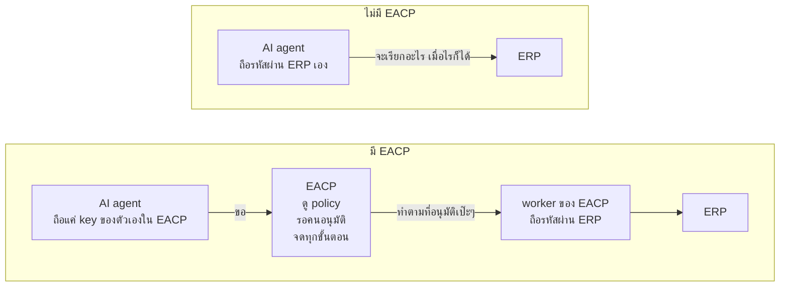

agent ยังขออะไรก็ได้เหมือนเดิม แต่จะ *ได้* เฉพาะสิ่งที่ policy และคนอนุมัติยอมให้ และไม่มีทางแตะรหัสผ่านที่จะใช้ข้ามด่านนี้ไปได้

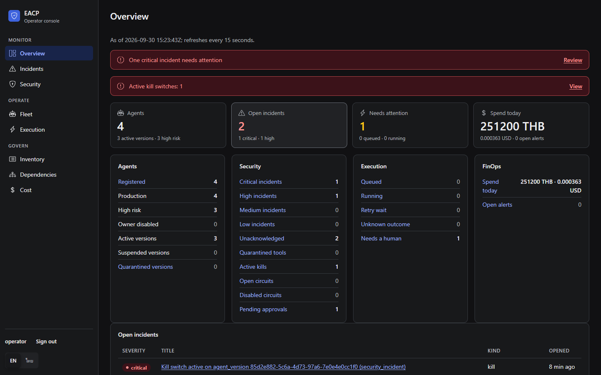

## สิ่งที่รับประกัน และรับประกันได้แค่ไหน

EACP ส่วนแรก (slice A) สร้างขึ้นมาเพื่อทำให้ประโยคนี้เป็นจริง:

> Privileged agent actions cannot bypass the control plane, approvals are durable, retries cannot casually duplicate
> irreversible side effects, and ambiguous execution outcomes are handled explicitly rather than guessed.

แปลง่ายๆ คือ งานสำคัญของ agent อ้อม EACP ไม่ได้ การอนุมัติไม่หายไปกลางทาง การ retry ไม่ทำให้ของที่ย้อนไม่ได้เกิดซ้ำ
และคำสั่งที่ไม่รู้ผลต้องมีคนจัดการชัดเจน ไม่ใช่เดา ทุกข้อมี test คุมอยู่ ดูได้ใน [INVARIANTS.md](docs/INVARIANTS.md)

แต่มีเงื่อนไขว่าต้องติดตั้งแบบ **conforming deployment**
([ADR-001](docs/adr/ADR-001-product-boundary-and-enforcement-point.md) §3a) คือระบบปลายทางยอมรับคำสั่งสำคัญจาก worker ของ EACP
เท่านั้น agent ต้องไม่มีทางต่อเน็ตเวิร์กไปหาระบบปลายทางตรงๆ และ key ที่ agent ใช้กับ EACP ต้องเอาไปใช้กับระบบปลายทางไม่ได้
ถ้าระบบปลายทางเปิดช่องให้เรียกตรงอยู่ EACP ก็ปิดช่องนั้นให้ไม่ได้ ทำได้แค่ไม่เป็นจุดรั่วเสียเอง

EACP ไม่เคลมว่าทำงานแบบ exactly-once ถ้าระบบปลายทางรองรับ idempotency ผลจะเป็น idempotent ถ้าตรวจย้อนหลังได้จะเป็น
effectively-once และถ้า retry ไม่ปลอดภัยจะเป็น at-most-once ส่วนเรื่องที่ EACP ยังกันไม่ได้ เช่น prompt injection
(EACP จำกัดความเสียหายได้ แต่กันไม่ให้เกิดไม่ได้) เขียนไว้ใน [threat model](docs/security/THREAT_MODEL.th.md)

## สถาปัตยกรรม

EACP คั่นอยู่ระหว่างสองฝั่งที่ต้องแยกกันให้ขาด คือฝั่งที่ agent รันอยู่ กับฝั่งระบบที่ agent จะไปทำงานด้วย ในภาพเขียนไว้ว่าแต่ละส่วน
ถือ key อะไรอยู่

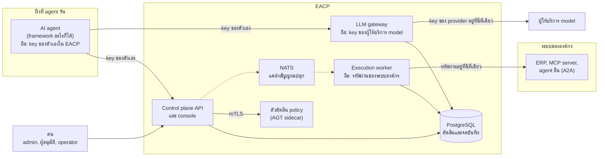

- **Control plane API** ([`cmd/controlplane-api`](cmd/controlplane-api)) เป็นตัวให้บริการ API `/v1` และ console
  ตรวจตัวตนทั้ง agent และคน ถาม policy จัดการการอนุมัติ แล้วปล่อยงานไปทำ งานเบื้องหลังของมันคอยเก็บกวาดงานที่หมดเวลา
  ส่งสัญญาณ และเปิด incident
- **Execution worker** ([`cmd/execution-worker`](cmd/execution-worker)) เป็นตัวเดียวที่ถือรหัสผ่านของระบบปลายทาง มันรับงานที่ถูกปล่อยแล้ว
  โดยจองงานไว้ (lease) จดบันทึกก่อนเรียกทุกครั้ง แล้วค่อยเรียกระบบปลายทาง ถ้าไม่รู้ผลก็ไปตรวจย้อนให้
- **LLM gateway** ([`cmd/llm-gateway`](cmd/llm-gateway)) ให้ agent เรียก model ด้วย SDK ตัวเดิมที่ใช้อยู่ ก่อนส่งทุกครั้งจะเช็กใน
  PostgreSQL ว่า model นี้อยู่ใน allowlist ไหม มีใครกด kill ไว้ไหม งบพอไหม และเป็นตัวเดียวที่ถือ key ของผู้ให้บริการ model
- **PostgreSQL** คือคนตัดสิน กฎทั้งหมด ทั้งกฎของ registry การเปลี่ยนสถานะ การแบ่งหน้าที่ งบประมาณ และ kill switch เขียนเป็น trigger
  กับ function ในฐานข้อมูล ทุกตารางของ tenant เปิด Row-Level Security และ audit log ต่อกันเป็น hash chain
- **ตัวตัดสิน policy** (policy decision point) ตอบว่าคำขอนี้ผ่านไหม จะใช้ Microsoft Agent Governance Toolkit กับ ACS และ OPA
  ที่รันเป็น sidecar คุยกันผ่าน mutual TLS หรือจะใช้ตัวตัดสินในตัวก็ได้ ทั้งสองแบบผ่านชุดทดสอบ conformance ชุดเดียวกัน
- **NATS JetStream** มีหน้าที่แค่ปลุกให้ตื่น ไม่มีงานไหนถูกรับ สั่งทำ หรือยกเลิกเพราะ message ถ้า NATS ล่ม EACP จะช้าลงเท่านั้น
  ไม่มีอะไรผิดไป

รายละเอียดเรื่องเน็ตเวิร์ก ขอบเขตความเชื่อใจ การสั่งงาน และ high availability อยู่ใน [ARCHITECTURE.th.md](docs/ARCHITECTURE.th.md)

## เส้นทางของคำขอหนึ่งรายการ

คำขอที่ agent ส่งเข้ามา สุดท้ายจะไปจบที่ใดที่หนึ่งในภาพนี้ ในวงเล็บคือชื่อสถานะจริงในระบบ:

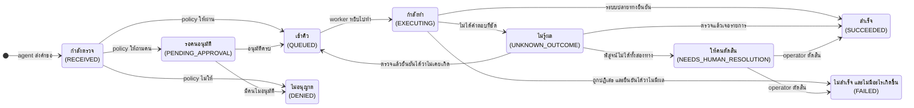

ทางเดียวที่ EACP ไม่มีทางเลือกคือการเดา ผลที่ไม่มีใครพิสูจน์ได้จะไปถึงมือคนพร้อมหลักฐานเสมอ ภาพถัดไปไล่ทีละขั้นของการสั่งซื้อ
ที่ต้องมีคนอนุมัติสองคน

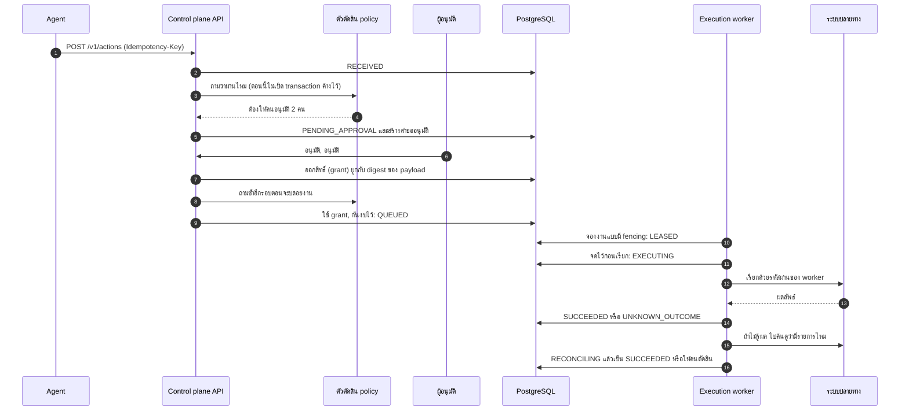

1. **ส่งคำขอ** agent ส่งคำขอด้วย key ของตัวเองพร้อม `Idempotency-Key` ถ้า key กับเนื้อหาเหมือนเดิม จะได้คำขอเดิมกลับไปทุกครั้ง
   retry กี่รอบก็ไม่เกิดรายการใหม่
2. **ตรวจ** EACP เช็ก registry ก่อน (version ของ agent ต้อง active, tool ต้องอยู่ใน allowlist และมี contract ที่รับรองแล้ว) แล้วถาม policy
   คำตอบมีสามแบบ คือ ผ่าน ไม่ผ่าน หรือต้องให้คนอนุมัติ ถ้าตัวตัดสิน policy ล่ม คำขอจะรออยู่เฉยๆ ไม่มีอะไรถูกสั่งทำ
3. **อนุมัติ** คนที่มีสิทธิ์เข้ามาโหวต PostgreSQL คุมเรื่องการแบ่งหน้าที่เอง คนที่เป็นเจ้าของเรื่องและเจ้าของ agent อนุมัติไม่ได้ และโหวตซ้ำไม่ได้
   พอครบจำนวนก็ได้สิทธิ์ (grant) ที่ผูกกับ payload และ version ของ policy แบบตรงตัว
4. **ปล่อยงาน** ใน transaction เดียว EACP ตรวจทุกอย่างซ้ำกับ policy ปัจจุบัน ใช้ grant (ใช้ได้ครั้งเดียว) กันงบไว้
   และล็อก version ของ policy กับ contract ที่ใช้
5. **รับงาน** worker จองงานไว้ด้วย lease ที่มีเลขรุ่น (generation) ถ้า worker ตัวไหนเสีย lease ไปแล้ว มันจะเขียนอะไรลงฐานข้อมูลไม่ได้อีก
6. **จดก่อนเรียก** ก่อนออกไปเรียกระบบข้างนอก worker จดไว้ใน PostgreSQL ก่อน และเช็กอีกรอบว่าไม่มีอะไรเปลี่ยน ไม่มีใครกด kill
   ไม่มีใครยกเลิก ไม่มี circuit ที่เปิดอยู่ และ policy กับ contract ยังเป็นตัวเดิม
7. **ทำจริง** worker เรียกระบบปลายทางด้วยรหัสผ่านของมันเอง agent ไม่เคยเห็นรหัสนี้
8. **จบ หรือตรวจย้อน** ถ้าได้ผลชัดก็จดผลเลย ถ้าไม่ชัดจะเป็น `UNKNOWN_OUTCOME` แล้ว worker ไปค้นในระบบปลายทาง ถ้าเจอรายการก็จบ
   ถ้าไม่เจอ จะถือว่าไม่เคยเกิดได้ก็ต่อเมื่อ contract บอกว่าการค้นนั้นเชื่อถือได้ (authoritative) นอกนั้น operator เป็นคนตัดสินจากหลักฐาน

## พาดู console

operator console ที่ `/ui/` เป็นแค่หน้าเว็บที่เรียก API ชุดเดียวกัน ไม่มีสิทธิ์พิเศษอะไรของตัวเอง เก็บ key ไว้ในหน่วยความจำของแท็บเท่านั้น
และถามยืนยันก่อนเปลี่ยนแปลงอะไรทุกครั้ง ([ADR-028](docs/adr/ADR-028-operator-console.md))

### การอนุมัติ

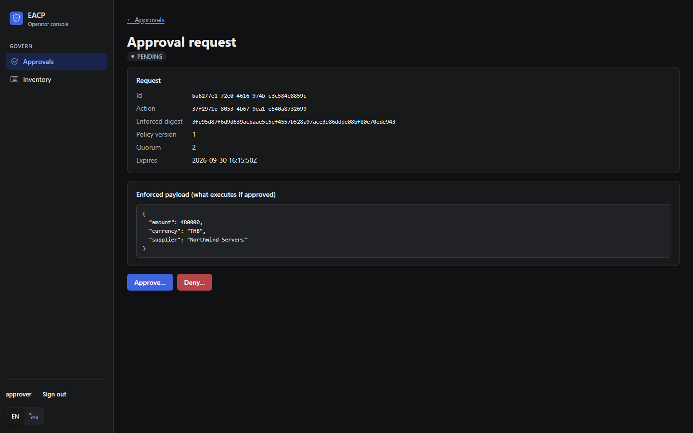

ผู้อนุมัติจะเห็นเฉพาะคำขอที่ตัวเองมีสิทธิ์โหวต พร้อม payload ตัวจริงที่ policy เห็น ส่วนคนที่อนุมัติคำขอนั้นไม่ได้
(เช่น เจ้าของเรื่อง หรือเจ้าของ agent) จะไม่เห็นคำขอนั้นในหน้านี้เลย

### การทำงานและหลักฐาน

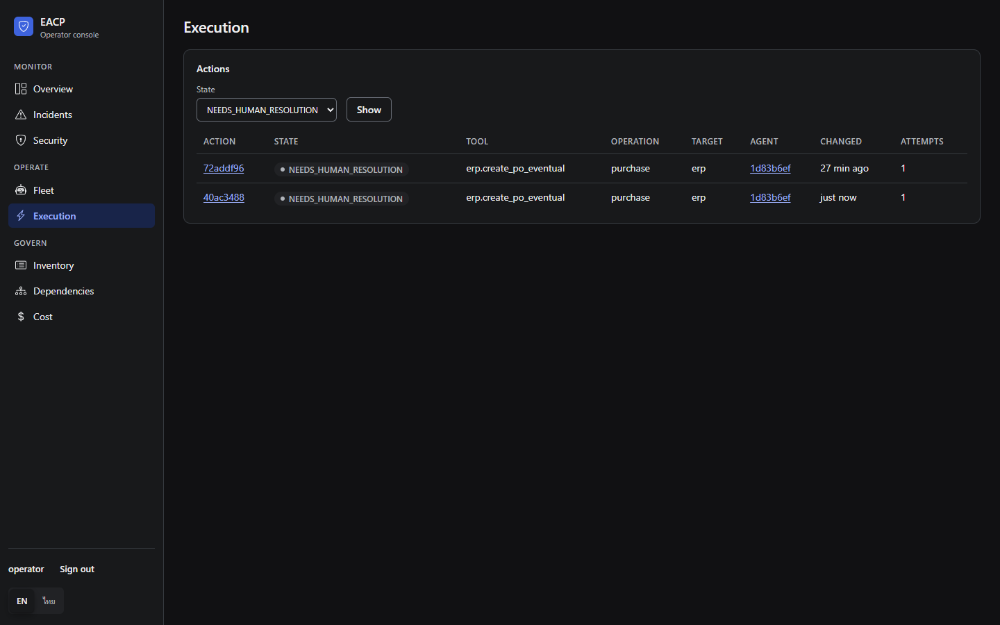

หน้านี้แสดงคำขอแยกตามสถานะ ในภาพเป็นคำขอที่อยู่ใน `NEEDS_HUMAN_RESOLUTION` คือ ERP รับใบสั่งซื้อไปแล้ว แต่ worker รอคำตอบไม่ทัน
และค้นย้อนหลังแล้วก็ยังพิสูจน์ไม่ได้ว่าเกิดอะไรขึ้น เรื่องแบบนี้ operator ต้องตัดสินจากหลักฐาน

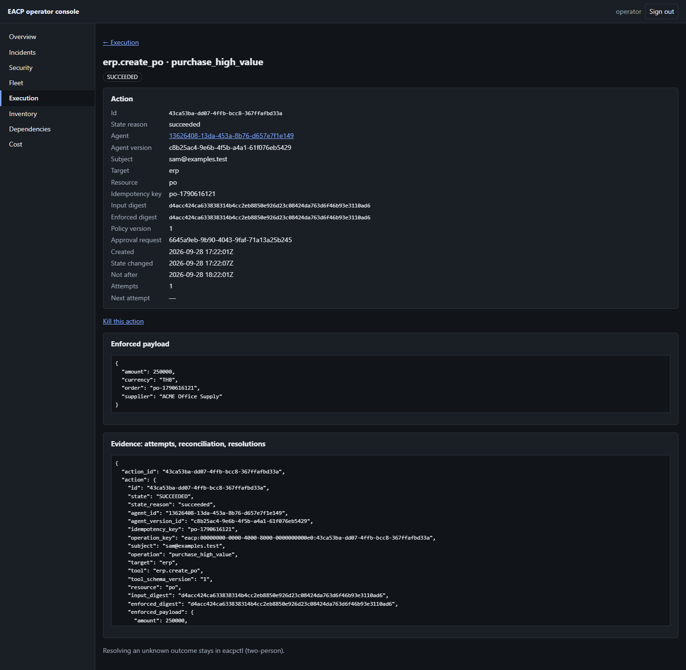

ทุกคำขอย้อนดูได้ครบจาก id ตัวเดียว หน้านี้แสดงข้อมูลคำขอ payload ที่ถูกทำจริง และเอกสารหลักฐานที่ API รวมไว้ให้
(`GET /v1/actions/{id}/evidence`) มีทั้งคำตัดสินของ policy การอนุมัติพร้อมโหวตและ grant ทุกครั้งที่ลองทำ ทุกครั้งที่ค้นตรวจ และ log ทุกบรรทัด
โดยตรวจ hash chain ให้ตอนอ่าน

### fleet

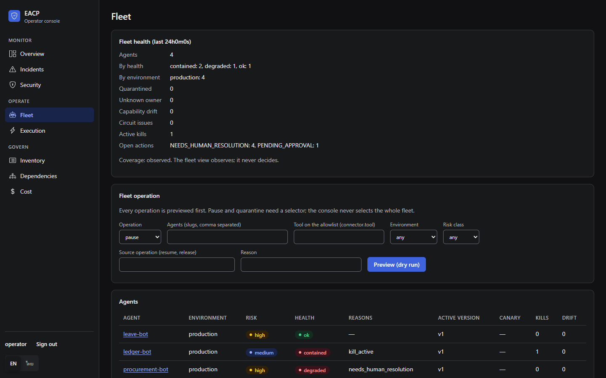

หน้า fleet แสดง version ที่ใช้อยู่และสุขภาพของ agent ทุกตัว ดูจาก kill ที่ค้างอยู่ circuit ที่เปิด และ tool ที่ฐานข้อมูลจะไม่ยอมให้ทำ
operator สั่งพักหรือกักกัน agent ทีละหลายตัวได้ในคำสั่งเดียว และดูตัวอย่างผลก่อนกดจริงได้

### incident

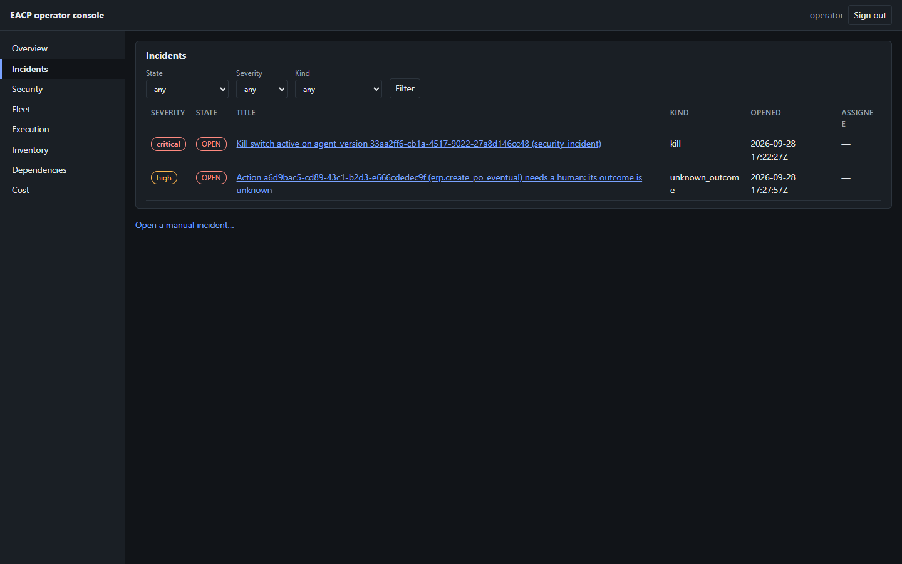

ระบบจะเปิด incident ให้เองหนึ่งเรื่องต่อหนึ่งสัญญาณ ในภาพคือมีคนกด kill switch กับ agent version หนึ่ง และมีคำขอที่รอคนตัดสิน
operator รับเรื่อง มอบหมาย จดโน้ต และปิดเรื่องได้ ถ้าเป็นเรื่องระดับ critical ต้องให้อีกคนเป็นคนปิด

### dependency

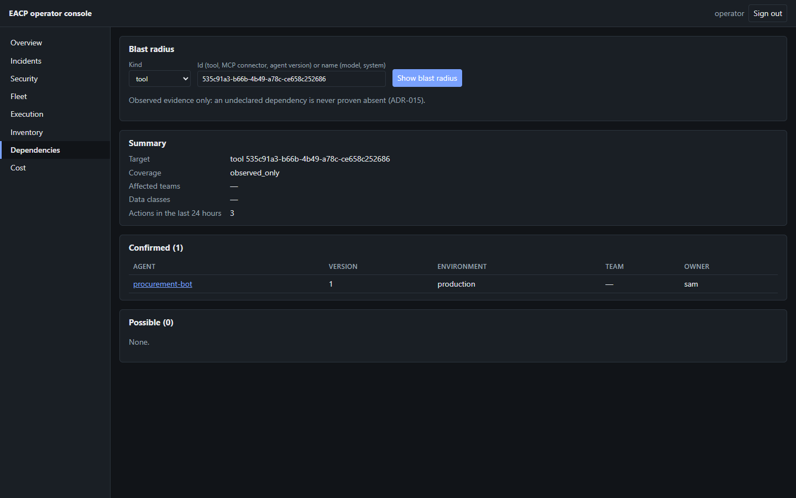

ใช้ดู blast radius ของ tool, MCP server, model หรือ agent version ว่าถ้าตัวนี้มีปัญหา agent ตัวไหนโดนแน่ๆ และตัวไหนอาจโดน
ถ้าข้อมูลเก่าหรือไม่รู้ ระบบจะตอบแบบกว้างไว้ก่อน ไม่ตอบแคบ

### ค่าใช้จ่าย

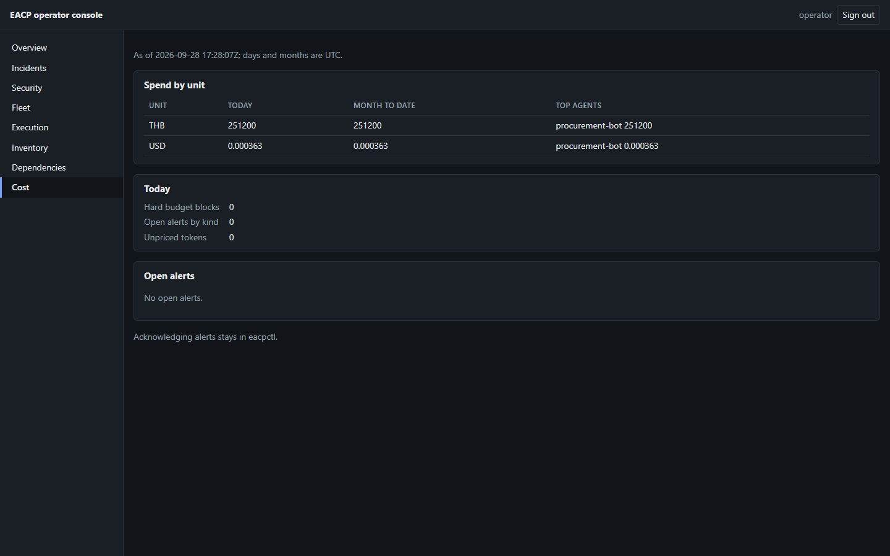

ยอดใช้วันนี้และเดือนนี้แยกตามหน่วยเงิน agent ที่ใช้เยอะที่สุด จำนวนครั้งที่ถูกงบแบบ hard limit ขวาง และ alert ที่ยังเปิดอยู่
ค่าใช้จ่ายคำนวณใน PostgreSQL จากตารางราคา ส่วน alert เรื่องค่าใช้จ่ายมีไว้เตือนอย่างเดียว ไม่ได้ขวางงาน

## ลองใช้เลย

ต้องมี Docker ที่มี Compose v2, Go, Python 3, Bash (บน Windows ใช้ Git Bash), `curl` และ `jq`

```bash
git clone https://github.com/atipongsena/eacp.git
cd eacp
python3 deployments/docker/secrets/prepare_fakeerp_token.py
docker compose up -d --build --wait
bash examples/setup.sh
bash examples/01-agent-action/run.sh
```

คำสั่งแรกสร้าง secret ในเครื่องให้ ERP ปลอมกับ LLM ปลอม ที่ stack ใช้แทนระบบจริง `setup.sh` สร้าง tenant พร้อมคน role policy
connector และ agent ให้ แล้วเขียน key ทั้งหมดลงไฟล์ `examples/.env` (git ไม่เก็บไฟล์นี้ และไม่พิมพ์ key ออกมาให้เห็น)
จากนั้นตัวอย่าง 01 จะเล่นเป็น agent ที่สั่งซื้อของ 250,000 บาท ซึ่งต้องมีคนอนุมัติสองคน:

```text
== 1. The agent submits a 250,000 THB purchase order
action e29da5e6-a871-4896-9446-3ea06e045711 is PENDING_APPROVAL: the policy escalates high-value purchases to two approvers

== 2. The agent retries the same request: EACP answers with the same action
same idempotency key → action e29da5e6-a871-4896-9446-3ea06e045711 again, nothing new is created

== 3. Two approvers vote
amy:  request PENDING
ben:  request GRANTED

== 4. EACP releases the action and the worker executes it against the Fake ERP
state: AUTHORIZED
state: SUCCEEDED

== 5. The evidence, as an operator sees it
approval: GRANTED, quorum 2, 2 votes, grant consumed by this action: true
attempt 1: succeeded, external reference PO-e29da5e6-a871-4896-9446-3ea06e045711
journal: RECEIVED → PENDING_APPROVAL → AUTHORIZED → QUEUED → LEASED → EXECUTING → SUCCEEDED
audit chain: 100 entries, verified: true
```

อยากดู console ให้เปิด `http://localhost:8080/ui/` แล้ว sign in ด้วย `OPERATOR_KEY` จาก `examples/.env` ใน
[examples/](examples/README.th.md) ยังมีตัวอย่างเรียก LLM ผ่าน gateway ด้วย Anthropic SDK ตัวทางการ และตัวอย่าง Governance-as-Code
ที่ต้องให้อีกคนอนุมัติ ส่วน demo ที่ยาวกว่านี้ เช่น worker ตายกลางทาง PDP หรือ NATS ล่ม MCP เปลี่ยนนิยาม tool เอง kill switch
และ credential แบบ just-in-time อยู่ใน [DEMO.th.md](docs/DEMO.th.md)

ถ้าจะเอา EACP ไปใช้กับ agent ของตัวเอง อ่าน[คู่มือการใช้งาน](docs/USER_GUIDE.th.md) ได้เลย แบ่งตามบทบาท admin ตั้งค่าคน ระบบ agent
policy และงบ นักพัฒนา agent ส่งคำขอและเรียก model ผู้อนุมัติโหวต operator ตัดสินผลที่ไม่แน่ชัด กด kill switch และดูแล incident

## สิบโมดูล

[master plan](docs/MASTER_PLAN.md) แบ่ง EACP เป็นสิบโมดูล แต่ละโมดูลมี ADR ของตัวเองที่บันทึกว่าตัดสินใจอะไรไว้

1. **Agent registry** ทะเบียนคน role agent version allowlist และ API key โดยกฎที่ต้องใช้สองคนเขียนเป็น trigger ใน PostgreSQL
   ([ADR-003](docs/adr/ADR-003-agent-registry-identity-and-capability.md))
2. **เชื่อมกับ governance** policy ที่มี version คำตัดสินพร้อมหลักฐาน จะใช้ตัวตัดสินในตัวหรือ AGT sidecar ก็ได้
   การอนุมัติที่ไม่หายกลางทาง และสิทธิ์ที่ใช้ได้ครั้งเดียว
   ([ADR-002](docs/adr/ADR-002-agt-integration-sidecar-pdp.md), [ADR-005](docs/adr/ADR-005-approval-ownership-and-atomic-execution-boundary.md))
3. **ระบบสั่งงานแบบกระจาย** ขั้นตอนสถานะของคำขอ lease, fencing, การจดก่อนเรียก การตรวจย้อน การแบ่งคิวให้ยุติธรรม งบประมาณ
   การชะลองานเมื่อระบบหนัก และรหัสผ่านที่มีแค่ worker ถือ
   ([ADR-004](docs/adr/ADR-004-action-state-machine-and-execution-semantics.md), [ADR-011](docs/adr/ADR-011-scheduler-fairness.md),
   [ADR-012](docs/adr/ADR-012-budget-reservation.md), [ADR-019](docs/adr/ADR-019-credential-custody.md),
   [ADR-022](docs/adr/ADR-022-backpressure-bulkheads-circuit-breakers-retry-budgets.md))
4. **ทะเบียน tool และ connector** HTTP connector ที่มี contract บอกว่า error แต่ละแบบแปลว่าอะไร MCP server ที่ระบบไปค้นหา tool
   และทำ fingerprint ให้เอง และ agent แบบ A2A
   ([ADR-023](docs/adr/ADR-023-mcp-registry-and-tool-fingerprint.md), [ADR-030](docs/adr/ADR-030-a2a-delegation.md))
5. **แผนผัง dependency** จดว่าอะไรพึ่งอะไร และคำนวณ blast radius แบบเผื่อไว้ก่อน
   ([ADR-015](docs/adr/ADR-015-dependency-graph.md))
6. **จัดการ agent ทีละหลายตัว** เปลี่ยนสถานะ agent จำนวนมากในคำสั่งเดียว และ kill switch
   ([ADR-024](docs/adr/ADR-024-fleet-operations.md), [ADR-016](docs/adr/ADR-016-distributed-kill-switch.md))
7. **Agent SRE และการมองเห็นระบบ** trace ของ OpenTelemetry ส่งต่อแบบ W3C หลักฐานรายคำขอ circuit breaker
   และ replica ที่ไม่ต้องมีตัวหัวหน้า ([ADR-022](docs/adr/ADR-022-backpressure-bulkheads-circuit-breakers-retry-budgets.md),
   [ADR-029](docs/adr/ADR-029-high-availability.md))
8. **Agent FinOps** รับข้อมูลการใช้งาน ตารางราคา แยกค่าใช้จ่ายตามหน่วยงาน soft limit และ alert รวมถึงการเรียก model ผ่าน LLM gateway
   ที่นับค่าใช้จ่ายให้ ([ADR-025](docs/adr/ADR-025-agent-finops.md), [ADR-031](docs/adr/ADR-031-llm-gateway.md))
9. **ปล่อย version และประเมินผล** ด่านประเมิน replay, shadow, canary ที่ PostgreSQL คุมกลุ่มผู้ใช้ให้ และ rollback
   ([ADR-018](docs/adr/ADR-018-release-and-evaluation.md)) รวมถึง bundle แบบ Governance-as-Code
   ([ADR-026](docs/adr/ADR-026-governance-as-code.md))
10. **ศูนย์ดูแลความปลอดภัยของ agent (SOC)** incident สรุปภาพรวม SOC และ operator console
    ([ADR-027](docs/adr/ADR-027-incidents-and-agent-soc.md), [ADR-028](docs/adr/ADR-028-operator-console.md))

ความสามารถทั้งหมดแยกทีละ phase พร้อม test และ API route อยู่ใน [FEATURES.th.md](docs/FEATURES.th.md)

## ทำไมถึงเชื่อได้

- **invariant** การรับประกันทุกข้อใน MASTER_PLAN §103 มี test ที่ผ่านอยู่ รวมไว้ใน [INVARIANTS.md](docs/INVARIANTS.md)
  และ `test/invariants` จะล้มทันทีถ้าข้อไหนไม่มี test กฎในฐานข้อมูลทดสอบด้วย SQL ตรงๆ ในนาม role ของแอป ไม่ได้ทดสอบผ่าน Go อย่างเดียว
- **งานพร้อมกัน** test รันด้วย race detector กับ PostgreSQL ตัวจริง มีทั้งกรณี worker แย่ง lease กัน ปล่อย grant ใบเดียวพร้อมกันหลายทาง
  สั่งซื้อร้อยรายการแย่งงบก้อนเดียว และ worker ถูกฆ่าระหว่างเรียกระบบปลายทาง
- **test ด้านความปลอดภัย** [`test/security`](test/security) ตรวจ stack ที่รันอยู่จริงว่า agent ต่อไปหา ERP ฐานข้อมูล PDP NATS
  หรือผู้ให้บริการ model ไม่ได้ และมีแค่ worker กับ gateway ที่ถือ credential ส่วน [threat model](docs/security/THREAT_MODEL.th.md)
  จับคู่ภัยแต่ละข้อกับตัวป้องกันและ test ที่พิสูจน์
- **conformance** ตัวตัดสินในตัวกับ AGT sidecar ต้องให้คำตอบตรงกับชุดอ้างอิงเดียวกัน ([`test/conformance`](test/conformance))
- **benchmark** load test แบบ open loop ทั้ง stack ([BENCHMARKS.md](docs/BENCHMARKS.md)) รันบนเครื่อง dev เครื่องเดียว
  กับระบบปลายทางปลอม ไม่ได้เป็นตัวเลขรับประกันสำหรับ production:

  | เส้นทาง | agent 100 ถึง 5,000 ตัว | agent 10,000 ตัว |
  |---|---|---|
  | คำขอ, ตัวตัดสินในตัว | 40 requests/s | 35 requests/s |
  | คำขอ, AGT sidecar | 35 requests/s | 30 requests/s |
  | LLM gateway, provider ปลอม | 200 calls/s | |

- **CI** ทุก pull request รัน lint ชุด test แบบเปิด race detector (แบ่งเป็นสองชุด) test ของ Helm chart ชุด test ของ sidecar
  กับ conformance และ `govulncheck` ทุกคืนรัน test ความปลอดภัยบน compose, demo, ตัวอย่าง และ benchmark แบบย่อ
  ([`.github/workflows`](.github/workflows))

## ตอนนี้อยู่ตรงไหน และอะไรที่ยังไม่มี

EACP ยังพัฒนาอยู่ ทุกอย่างที่เล่ามาข้างบนมีอยู่จริงและผ่าน test แล้ว แต่ยังไม่เคยออก release ส่วนที่ยังไม่ได้ทำ:

- **รับงานจาก A2A ขาเข้า** ตอนนี้ EACP ส่งงานต่อให้ agent อื่นได้ แต่ยังไม่รับงานที่ agent อื่นส่งเข้ามา
- **สั่งรัน MCP tool** tool ถูกค้นเจอ รับรอง และกักกันได้แล้ว แต่ยังไม่มี worker ตัวไหนเรียก `tools/call`
- **kill แบบ global และแบบ run** ยังรอเรื่องสิทธิ์ระดับ platform และการผูก run ที่ยืนยันตัวตนได้ ส่วน kill ระดับ tenant, team, agent,
  version, คำขอ, connector, tool และ model ใช้ได้แล้ว
- **หลาย region** ตอนนี้ PostgreSQL ตัวเดียวเป็นคนตัดสิน replica ทุกตัวใช้ร่วมกัน
- **จับการเรียกอ้อม** เช่น อ่าน audit log ของระบบปลายทางเพื่อหาคำสั่งที่ไม่ได้ผ่าน EACP
- **แยกแยะข้อมูลส่วนบุคคล** ใน payload ของคำขอ

## สร้างขึ้นมาอย่างไร

EACP สร้างทีละ phase ตามวิธีทำงานที่เขียนไว้ชัดเจน และทุกอย่างที่ได้จากวิธีนั้นเก็บไว้ใน repository นี้:

- **ตัดสินใจก่อนเขียนโค้ด** ทางเลือกสำคัญทุกเรื่องเป็น [ADR](docs/adr/README.md) ที่เขียนก่อนลงมือ และแก้เมื่อโค้ดสอนอะไรใหม่
  ถ้า ADR กับแผนขัดกัน ถือ ADR เป็นหลัก
- **ทุก phase มี spec และแผน** design spec กับแผนการลงมือของแต่ละ phase อยู่ใน [`docs/superpowers/`](docs/superpowers)
  และตกลงกันก่อนเริ่มเขียนโค้ด
- **เขียน test ก่อน และรันด้วย `-race`** ทุกพฤติกรรมเริ่มจาก test ที่ล้มก่อน เห็นมันล้มจริง แล้วค่อยทำให้ผ่าน ไม่มีการลดความเข้มของ test
  หรือพฤติกรรม fail closed เพื่อให้ CI เขียว
- **ให้คนอื่นรีวิว** ทุก phase ปิดท้ายด้วยการรีวิวงานทั้งหมดโดยคนที่ไม่ได้เขียนเอง สิ่งที่รีวิวเจอต้องแก้หรือบันทึกไว้ก่อนปิด phase
  รีวิวหลายฉบับอยู่ใน [`docs/reviews/`](docs/reviews)
- **ใช้ AI ช่วยเขียน** โค้ด test และเอกสารเขียนด้วย AI coding assistant ภายใต้กติกาเหล่านี้ ใช้ Claude Code ตลอดทั้งโครงการ
  และใช้ OpenAI Codex ในช่วงแรกสำหรับงานเขียนโค้ดและรีวิวบางส่วน กติกาที่ assistant ต้องทำตามอยู่ใน [AGENTS.md](AGENTS.md)
  เจ้าของโครงการเป็นคนกำหนดทิศทาง ตัดสินใจ และอนุมัติทุก phase

## ร่วมพัฒนา ความปลอดภัย และสัญญาอนุญาต

- วิธีเตรียมเครื่อง กติกา และระดับของ test อยู่ใน [CONTRIBUTING.th.md](CONTRIBUTING.th.md) เอกสารมีทั้งภาษาอังกฤษและภาษาไทย
  แก้ที่ไหนต้องแก้ทั้งสองภาษา
- เจอช่องโหว่ให้แจ้งแบบส่วนตัวตามที่เขียนไว้ใน [SECURITY.th.md](SECURITY.th.md) ทุกคนที่เข้ามาร่วมต้องทำตาม
  [code of conduct](CODE_OF_CONDUCT.md)
- EACP ใช้สัญญาอนุญาต [Apache License 2.0](LICENSE) ส่วนประกอบจากที่อื่นดูได้ใน [NOTICE](NOTICE) และ
  [THIRD_PARTY_NOTICES.md](THIRD_PARTY_NOTICES.md) ขั้นตอนออก release อยู่ใน [RELEASING.th.md](docs/RELEASING.th.md)
  และ [CHANGELOG.md](CHANGELOG.md)
