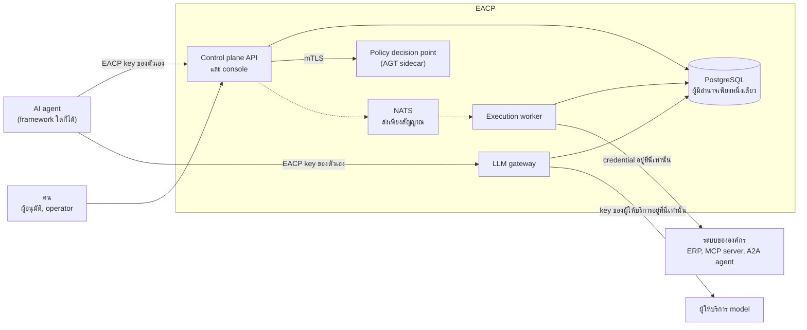
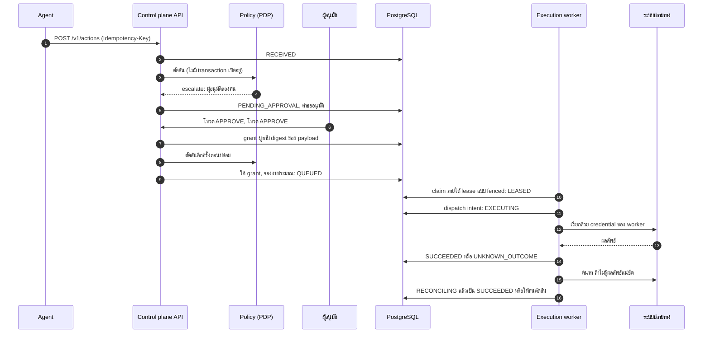

[English](README.md) | [ไทย](README.th.md)

# EACP: Enterprise Agent Control Plane

[](https://github.com/atipongsena/eacp/actions/workflows/ci.yml)
[](LICENSE)
[](go.mod)

EACP คือ control plane สำหรับ AI agent ที่ลงมือทำงานกับระบบขององค์กร agent จะสร้างด้วย framework ใดและรันที่ไหนก็ได้ แต่เมื่อ agent
ต้องการทำสิ่งที่มีผลจริง (ออกใบสั่งซื้อ ลงบัญชี ส่งงานต่อให้ agent อื่น หรือเรียก model ที่มีค่าใช้จ่าย) คำขอต้องผ่าน EACP ซึ่งจะตรวจว่าใครขอ
และทำอะไรได้บ้าง ถาม policy รอคนที่ต้องอนุมัติ สั่งทำ action ตามที่อนุมัติแบบตรงตัว และเก็บหลักฐานของทุกขั้นไว้ใน PostgreSQL

## EACP คืออะไรและแก้ปัญหาอะไร

การให้ AI agent เข้าถึงระบบขององค์กรผิดพลาดได้หลายแบบที่ API gateway ทั่วไปไม่ได้ถูกสร้างมารับมือ:

- **เรียกซ้ำแล้วสั่งซื้อสองครั้ง** agent retry หลัง timeout และหลังรีสตาร์ต ถ้าไม่ระวัง ครั้งที่สองจะออกใบสั่งซื้อใบที่สอง
- **อนุมัติอย่างหนึ่ง ได้อีกอย่างหนึ่ง** ผู้จัดการอนุมัติ "250,000 บาทให้ ACME" แต่ payload ที่ทำงานจริงต่างออกไป เพราะมีบางอย่างเปลี่ยนระหว่าง
  การอนุมัติกับการทำงาน
- **agent ถือ credential เอง** agent ที่มีรหัสผ่านของ ERP ใช้ทำอะไรก็ได้ และไม่มีการควบคุมใดมองเห็น
- **ไม่มีใครรู้ว่าเกิดอะไรขึ้น** การเรียก timeout หลังส่งไปแล้ว ใบสั่งซื้อผ่านหรือไม่ ถ้าเดาว่า "ไม่" แล้ว retry อาจได้รายการซ้ำ ถ้าเดาว่า "ใช่"
  อาจทำรายการหาย

EACP ตอบปัญหาเหล่านี้ด้วยโครงสร้าง agent ไม่เคยได้รับ credential ขององค์กร มีเพียง execution worker ของ EACP ที่ถือ ทุก action ผ่าน
state machine เดียวใน PostgreSQL การอนุมัติผูกกับ payload แบบตรงตัวและใช้ได้ครั้งเดียว ผลลัพธ์ที่ไม่รู้แน่ชัดจะถูก reconcile กับระบบปลายทาง
หรือส่งให้คนตัดสินพร้อมหลักฐาน ไม่มีการเดา


## การรับประกันและขอบเขตของมัน

slice แรกของ EACP ถูกสร้างขึ้นเพื่อทำให้ข้อความนี้เป็นจริง:

> Privileged agent actions cannot bypass the control plane, approvals are durable, retries cannot casually duplicate
> irreversible side effects, and ambiguous execution outcomes are handled explicitly rather than guessed.

คือ action ที่มีอภิสิทธิ์ของ agent ข้าม control plane ไม่ได้, การอนุมัติคงทน, การ retry ทำให้ผลที่ย้อนไม่ได้เกิดซ้ำโดยง่ายไม่ได้ และผลลัพธ์ที่กำกวม
ถูกจัดการอย่างชัดแจ้ง ไม่ใช่เดา แต่ละส่วนเป็น invariant ที่มี test ([INVARIANTS.md](docs/INVARIANTS.md)) ข้อความนี้เป็นจริงสำหรับ
**conforming deployment** ([ADR-001](docs/adr/ADR-001-product-boundary-and-enforcement-point.md) §3a) คือระบบปลายทางรับการเรียกที่มีอภิสิทธิ์
จาก worker ของ EACP เท่านั้น, agent ไม่มีเส้นทางเครือข่ายไปถึง และ EACP key ของ agent ไม่ให้สิทธิ์ใดๆ ที่ระบบปลายทาง EACP ทำให้ระบบใดๆ
conform ไม่ได้ ทำได้เพียงไม่เป็นจุดอ่อนเสียเอง

EACP ไม่เคยอ้างว่าทำงานแบบ exactly-once ผลลัพธ์เป็น idempotent เมื่อระบบปลายทางรองรับ, effectively-once เมื่อ reconcile ได้ และ
at-most-once เมื่อการ retry ไม่ปลอดภัย [threat model](docs/security/THREAT_MODEL.th.md) ระบุสิ่งที่ยังอยู่นอกเหนือการควบคุม เช่น prompt
injection ซึ่ง EACP จำกัดขอบเขตได้แต่ป้องกันไม่ได้

## สถาปัตยกรรม



- **Control plane API** ([`cmd/controlplane-api`](cmd/controlplane-api)) ให้บริการ API `/v1` และ operator console ยืนยันตัวตนของ agent และคน
  ดำเนินการ governance และการอนุมัติ และปล่อย action loop เบื้องหลังของมันเก็บกวาดงานที่หมดอายุ ส่งต่อสัญญาณ และเปิด incident
- **Execution worker** ([`cmd/execution-worker`](cmd/execution-worker)) เป็น process เดียวที่ถือ credential ของ connector claim action ที่ถูก
  ปล่อยภายใต้ lease แบบ fenced บันทึก dispatch intent ก่อนการเรียกทุกครั้ง เรียกระบบปลายทาง และ reconcile ผลลัพธ์ที่สังเกตไม่ได้
- **LLM gateway** ([`cmd/llm-gateway`](cmd/llm-gateway)) ให้ agent เรียก model ด้วย SDK ที่ใช้อยู่ตามปกติ admit แต่ละการเรียกใน PostgreSQL
  (allowlist, kill switch, งบประมาณ) ก่อนส่ง และเป็นผู้ถือ key ของผู้ให้บริการแต่เพียงผู้เดียว
- **PostgreSQL** คือผู้มีอำนาจ กฎของ registry, การเปลี่ยนสถานะ, การแบ่งแยกหน้าที่, งบประมาณ และสถานะ kill เป็น trigger และ function ทุกตาราง
  ของ tenant มี Row-Level Security และ audit journal เป็น hash chain
- **policy decision point** ตอบคำถามด้าน governance โดยรัน Microsoft Agent Governance Toolkit, ACS และ OPA ใน sidecar หลัง mutual TLS หรือใช้
  ตัวประเมินภายใน process ทั้งสองผ่านชุด conformance เดียวกัน
- **NATS JetStream** มีหน้าที่แค่ปลุก ไม่มีสิ่งใดถูก claim ทำงาน หรือยกเลิกเพราะ message การเสีย NATS จึงทำให้ EACP ช้าลงเท่านั้น ไม่เปลี่ยน
  อย่างอื่น

[ARCHITECTURE.th.md](docs/ARCHITECTURE.th.md) อธิบายเครือข่าย ขอบเขตความเชื่อถือ execution fabric และ high availability โดยละเอียด

## ชีวิตของ action



1. **ส่งคำขอ** agent ส่ง action ด้วย key ของตัวเองพร้อม `Idempotency-Key` key และ body เดิมได้ action เดิมเสมอ การ retry จึงไม่มีทางสร้าง
   รายการที่สอง
2. **governance** EACP ตรวจ registry (agent version ต้อง active, tool อยู่ใน allowlist และมี contract ที่รับรองแล้ว) แล้วถาม PDP คำตัดสินคือ
   อนุญาต ปฏิเสธ หรือ escalate ถ้า PDP ล่ม action จะรอและไม่มีอะไรทำงาน
3. **อนุมัติ** คนที่มีสิทธิ์โหวต PostgreSQL บังคับการแบ่งแยกหน้าที่ คือ subject และเจ้าของ agent อนุมัติไม่ได้ และไม่มีใครโหวตซ้ำได้ เมื่อครบ quorum
   จะได้ grant ที่ผูกกับ payload แบบตรงตัวและเวอร์ชันของ policy
4. **ปล่อย** transaction เดียวตรวจทุกอย่างซ้ำภายใต้ policy ปัจจุบัน ใช้ grant ครั้งเดียว จองงบประมาณ และ pin เวอร์ชันของ policy และ contract
5. **claim** worker หยิบ action ภายใต้ lease ที่มีเลข generation worker ที่เสีย lease ไปแล้วจะเขียนอะไรไม่ได้อีก
6. **dispatch intent** ก่อนเรียกภายนอกใดๆ worker บันทึก attempt ใน PostgreSQL หลังตรวจอีกครั้งว่าไม่มีอะไรเปลี่ยน คือไม่มี kill, ไม่มี cancel,
   circuit ไม่ได้เปิด และ policy กับ contract ยังเป็นตัวเดิม
7. **ทำงาน** worker เรียกระบบปลายทางด้วย credential ของตัวเอง agent ไม่เคยเห็น credential นั้น
8. **จบหรือ reconcile** ผลลัพธ์ที่ชัดเจนถูกบันทึกทันที ผลที่กำกวมกลายเป็น `UNKNOWN_OUTCOME` และ reconciler ค้นหา operation ในระบบปลายทาง
   ถ้าพบรายการก็ยุติได้ "ไม่พบ" จะยุติได้ก็ต่อเมื่อ contract ระบุว่าการค้นหานั้น authoritative นอกนั้น operator เป็นผู้ตัดสินพร้อมหลักฐาน

## ทัวร์ console

operator console ที่ `/ui/` เป็น client ของ API ชุดเดียวกัน ไม่มีอำนาจของตัวเอง เก็บ key ไว้ในหน่วยความจำของแท็บเท่านั้น และขอการยืนยันก่อน
ทุกการเปลี่ยนแปลง ([ADR-028](docs/adr/ADR-028-operator-console.md))

### การอนุมัติ


ผู้อนุมัติเห็นคำขอที่ตนมีสิทธิ์โหวต พร้อม payload แบบตรงตัวที่ policy เห็น คนที่อนุมัติคำขอนั้นไม่ได้ (subject หรือเจ้าของ agent) จะไม่เห็นคำขอ
ในหน้านี้เลย

### การทำงานและหลักฐาน


หน้าการทำงานแสดง action ตามสถานะ ภาพนี้แสดง action ที่อยู่ใน `NEEDS_HUMAN_RESOLUTION` คือ ERP รับใบสั่งซื้อไปแล้ว การเรียก timeout และการ
ค้นหาพิสูจน์ไม่ได้ว่าเกิดอะไรขึ้น operator เป็นผู้ตัดสินพร้อมหลักฐาน


ทุก action สร้างคืนได้จาก id ของมัน หน้านี้แสดงข้อมูลของ action, payload ที่ถูกบังคับใช้และทำงานจริง และเอกสารหลักฐานที่ API รวบรวมให้
(`GET /v1/actions/{id}/evidence`) ได้แก่ คำตัดสินของ policy, การอนุมัติพร้อมโหวตและ grant, ทุก attempt, ทุกการตรวจเพื่อ reconcile และรายการ journal
โดยตรวจสอบ hash chain ระหว่างอ่าน

### fleet


หน้า fleet แสดง version ที่ active และสุขภาพของ agent ทุกตัว ซึ่งคำนวณจาก kill, circuit ที่เปิดอยู่ และ tool ที่ฐานข้อมูลจะไม่ยอมให้ทำงาน operator
pause หรือกักกัน agent จำนวนมากได้ใน operation เดียวแบบ atomic โดยดูตัวอย่างก่อน

### incident


ตัวประเมิน incident เปิด incident หนึ่งรายการต่อสัญญาณ ในภาพคือ kill switch บน agent version และ action ที่ต้องให้คนตัดสิน operator รับทราบ
มอบหมาย จดบันทึก และปิด incident ได้ ส่วน incident ระดับ critical ต้องใช้คนที่สองในการปิด

### dependency


blast radius ของ tool, MCP server, model หรือ agent version คือ agent ใดได้รับผลกระทบแบบยืนยันแล้วหรืออาจได้รับผลถ้าสิ่งนั้นทำงานผิดปกติ
หลักฐานที่เก่าหรือไม่รู้ทำให้คำตอบกว้างขึ้น ไม่ใช่แคบลง

### ค่าใช้จ่าย


ค่าใช้จ่ายวันนี้และเดือนนี้ตามหน่วย, agent ที่ใช้มากที่สุด, การถูกขวางด้วยงบประมาณแบบแข็ง และ alert ที่เปิดอยู่ ค่าใช้จ่ายคำนวณใน PostgreSQL
จากตารางราคา และ alert ด้านค่าใช้จ่ายมีหน้าที่สังเกต ไม่เคยปิดกั้น

## เริ่มต้นใช้งาน

ต้องมี Docker พร้อม Compose v2, Go, Python 3, Bash (บน Windows ใช้ Git Bash), `curl` และ `jq`

```bash
git clone https://github.com/atipongsena/eacp.git
cd eacp
python3 deployments/docker/secrets/prepare_fakeerp_token.py
docker compose up -d --build --wait
bash examples/setup.sh
bash examples/01-agent-action/run.sh
```

คำสั่งแรกสร้าง secret บนเครื่องสำหรับ ERP ปลอมและ LLM ปลอมที่ stack ใช้แทนระบบจริง `setup.sh` สร้าง tenant พร้อมคน, role, policy, connector
และ agent แล้วเขียน key ของทั้งหมดลง `examples/.env` ซึ่ง git ไม่ติดตาม โดยไม่พิมพ์ key ออกมา จากนั้นตัวอย่าง 01 จะเล่นเป็น agent ที่ออกใบสั่งซื้อ
250,000 บาทซึ่งต้องได้รับการอนุมัติสองคน:

```text
== 1. The agent submits a 250,000 THB purchase order
action e29da5e6-a871-4896-9446-3ea06e045711 is PENDING_APPROVAL: the policy escalates high-value purchases to two approvers

== 2. The agent retries the same request: EACP answers with the same action
same idempotency key → action e29da5e6-a871-4896-9446-3ea06e045711 again, nothing new is created

== 3. Two approvers vote
amy:  request PENDING
ben:  request GRANTED

== 4. EACP releases the action and the worker executes it against the Fake ERP
state: AUTHORIZED
state: SUCCEEDED

== 5. The evidence, as an operator sees it
approval: GRANTED, quorum 2, 2 votes, grant consumed by this action: true
attempt 1: succeeded, external reference PO-e29da5e6-a871-4896-9446-3ea06e045711
journal: RECEIVED → PENDING_APPROVAL → AUTHORIZED → QUEUED → LEASED → EXECUTING → SUCCEEDED
audit chain: 100 entries, verified: true
```

ถ้าต้องการดู console ให้เปิด `http://localhost:8080/ui/` แล้ว sign in ด้วย `OPERATOR_KEY` จาก `examples/.env` ใน [examples/](examples/README.th.md)
ยังมีการเรียก LLM ผ่าน gateway ด้วย Anthropic SDK ตัวทางการ และ bundle ของ Governance-as-Code ที่คนที่สองเป็นผู้อนุมัติ ส่วน
[DEMO.th.md](docs/DEMO.th.md) อธิบาย demo ที่ยาวกว่า ได้แก่ worker ที่ถูก kill, PDP และ NATS ล่ม, MCP drift, kill switch และ credential แบบ
just-in-time

## สิบโมดูล

[master plan](docs/MASTER_PLAN.md) แบ่ง EACP ออกเป็นสิบโมดูล แต่ละโมดูลถูกสร้างและตัดสินใจไว้ใน ADR ของตัวเอง

1. **Agent registry** principal, role, agent, version, allowlist และ API key พร้อมกฎสองคนที่บังคับด้วย trigger ของ PostgreSQL
   ([ADR-003](docs/adr/ADR-003-agent-registry-identity-and-capability.md))
2. **Governance integration** policy ที่มีเวอร์ชันและคำตัดสินที่มีหลักฐาน จากตัวประเมินภายใน process หรือ AGT sidecar การอนุมัติที่คงทน
   และ grant ที่ใช้ได้ครั้งเดียว
   ([ADR-002](docs/adr/ADR-002-agt-integration-sidecar-pdp.md), [ADR-005](docs/adr/ADR-005-approval-ownership-and-atomic-execution-boundary.md))
3. **Distributed execution fabric** state machine ของ action, lease, fencing, dispatch intent, reconciliation, การจัดคิวที่เป็นธรรม, งบประมาณ,
   backpressure และ credential ที่มีเพียง worker ถือ
   ([ADR-004](docs/adr/ADR-004-action-state-machine-and-execution-semantics.md), [ADR-011](docs/adr/ADR-011-scheduler-fairness.md),
   [ADR-012](docs/adr/ADR-012-budget-reservation.md), [ADR-019](docs/adr/ADR-019-credential-custody.md),
   [ADR-022](docs/adr/ADR-022-backpressure-bulkheads-circuit-breakers-retry-budgets.md))
4. **Tool and connector registry** HTTP connector ที่มี contract ระบุว่าความล้มเหลวแต่ละแบบหมายถึงอะไร, MCP server ที่ tool ถูกค้นพบและทำ
   fingerprint และ A2A agent
   ([ADR-023](docs/adr/ADR-023-mcp-registry-and-tool-fingerprint.md), [ADR-030](docs/adr/ADR-030-a2a-delegation.md))
5. **Dependency graph** dependency ที่บันทึกไว้และ blast radius แบบระมัดระวัง
   ([ADR-015](docs/adr/ADR-015-dependency-graph.md))
6. **Fleet operations** การเปลี่ยน lifecycle ของ agent จำนวนมากแบบ atomic และ kill switch
   ([ADR-024](docs/adr/ADR-024-fleet-operations.md), [ADR-016](docs/adr/ADR-016-distributed-kill-switch.md))
7. **Agent SRE and observability** trace ของ OpenTelemetry พร้อม W3C propagation, หลักฐานราย action, circuit breaker และ replica ที่ไม่มี leader
   ([ADR-022](docs/adr/ADR-022-backpressure-bulkheads-circuit-breakers-retry-budgets.md), [ADR-029](docs/adr/ADR-029-high-availability.md))
8. **Agent FinOps** การรับข้อมูล usage, ตารางราคา, chargeback, soft limit และ alert รวมถึงการเรียกที่ถูกวัดโดย LLM gateway
   ([ADR-025](docs/adr/ADR-025-agent-finops.md), [ADR-031](docs/adr/ADR-031-llm-gateway.md))
9. **Release and evaluation** ด่านการประเมิน, replay, shadow, canary cohort ที่ PostgreSQL บังคับ และ rollback
   ([ADR-018](docs/adr/ADR-018-release-and-evaluation.md)) รวมถึง bundle ของ Governance-as-Code
   ([ADR-026](docs/adr/ADR-026-governance-as-code.md))
10. **Agent security operations center** incident, SOC summary และ operator console
    ([ADR-027](docs/adr/ADR-027-incidents-and-agent-soc.md), [ADR-028](docs/adr/ADR-028-operator-console.md))

[FEATURES.th.md](docs/FEATURES.th.md) รวบรวมทุกความสามารถทีละ phase พร้อม test และ API route

## หลักฐานของคุณภาพ

- **invariant** การรับประกันทุกข้อใน MASTER_PLAN §103 มี test ที่ผ่าน รวบรวมไว้ใน [INVARIANTS.md](docs/INVARIANTS.md) และ `test/invariants`
  จะล้มถ้าข้อใดไม่มี test กฎในฐานข้อมูลถูกทดสอบด้วย SQL ดิบในนาม role ของแอป ไม่ใช่แค่ผ่าน Go
- **การทำงานพร้อมกัน** test รันด้วย race detector กับ PostgreSQL จริง รวมถึง lease race, การปล่อย grant เดียวแบบขนาน, การซื้อร้อยรายการที่แย่ง
  งบเดียวกัน และ worker ที่ถูก kill กลางการเรียก
- **test ด้านความปลอดภัย** [`test/security`](test/security) ตรวจ stack ของ compose ที่รันอยู่ คือ agent เข้าถึง ERP, ฐานข้อมูล, PDP, NATS หรือ
  ผู้ให้บริการ model ไม่ได้ และมีเพียง worker กับ gateway ที่ถือ credential ส่วน [threat model](docs/security/THREAT_MODEL.th.md) จับคู่แต่ละ
  ภัยคุกคามกับการควบคุมและ test
- **conformance** PDP ภายใน process และ AGT sidecar ต้องให้คำตัดสินตรงกับชุดอ้างอิงเดียวกัน ([`test/conformance`](test/conformance))
- **benchmark** load test แบบ open loop ของทั้ง stack ([BENCHMARKS.md](docs/BENCHMARKS.md) บนเครื่อง development เครื่องเดียว กับระบบปลายทาง
  ปลอม ไม่ใช่การอ้างความจุสำหรับ production):

  | เส้นทาง | 100 ถึง 5,000 agent | 10,000 agent |
  |---|---|---|
  | action, PDP ภายใน process | 40 requests/s | 35 requests/s |
  | action, AGT sidecar PDP | 35 requests/s | 30 requests/s |
  | LLM gateway, ผู้ให้บริการปลอม | 200 calls/s | |

- **CI** ทุก pull request รัน lint, ชุด test ที่เปิด race detector แบ่งเป็นสองส่วน, test ของ Helm chart, ชุด test ของ sidecar และ conformance และ
  `govulncheck` ทุกคืนรัน test ความปลอดภัยของ compose, demo, ตัวอย่าง และ benchmark แบบย่อ ([`.github/workflows`](.github/workflows))

## สถานะและสิ่งที่ยังไม่ได้สร้าง

EACP อยู่ระหว่างการพัฒนาอย่างต่อเนื่อง ทุกอย่างที่อธิบายข้างต้นมีอยู่จริงและผ่านการทดสอบแล้ว และยังไม่เคยออก release สิ่งที่ยังไม่ได้สร้าง:

- **inbound A2A** EACP ส่งงานต่อให้ agent ระยะไกลได้ แต่ยังไม่รับงานที่ agent อื่นส่งมา
- **การเรียกใช้ MCP tool** tool ถูกค้นพบ รับรอง และกักกันได้ แต่ยังไม่มี worker ใดเรียก `tools/call`
- **kill scope แบบ global และ run** ต้องรอ platform authority และการผูก run ที่ยืนยันตัวตนแล้ว ส่วน kill ระดับ tenant, team, agent, version,
  action, connector, tool และ model ใช้งานได้
- **หลาย region** PostgreSQL หนึ่งตัวคือผู้มีอำนาจ และ replica ใช้ร่วมกัน
- **การตรวจจับการ bypass** การอ่าน audit log ของระบบปลายทางเพื่อหาการเรียกที่อ้อม EACP
- **การจำแนกข้อมูลส่วนบุคคล** ใน payload ของ action

## สร้างขึ้นมาอย่างไร

EACP ถูกสร้างทีละ phase ตามวิธีการที่เขียนไว้ และผลงานของวิธีการนั้นเป็นส่วนหนึ่งของ repository:

- **การตัดสินใจมาก่อน** ทุกทางเลือกเชิงบรรทัดฐานคือ [ADR](docs/adr/README.md) ที่เขียนก่อนโค้ด และแก้ไขเมื่อโค้ดสอนอะไรใหม่ ADR มีน้ำหนัก
  เหนือแผน
- **spec และแผนต่อ phase** แต่ละ phase มี design spec และแผนการ implement ใน [`docs/superpowers/`](docs/superpowers) ที่ตกลงกันก่อนเริ่มลงมือ
- **test มาก่อน พร้อม `-race`** แต่ละพฤติกรรมเขียนเป็น test ที่ล้มก่อน ดูให้เห็นว่าล้ม แล้วจึงทำให้ผ่าน พฤติกรรม fail closed และ test
  ไม่เคยถูกลดความเข้มเพื่อให้ CI ผ่าน
- **การรีวิวอย่างอิสระ** ทุก phase จบด้วยการรีวิวการเปลี่ยนแปลงทั้งหมดโดยผู้รีวิวที่ไม่ได้เขียนโค้ดนั้น และข้อค้นพบถูกแก้หรือบันทึกไว้ก่อนปิด phase
  การรีวิวจำนวนมากอยู่ใน [`docs/reviews/`](docs/reviews)
- **AI assistant** โค้ด test และเอกสารเขียนด้วย AI coding assistant ภายใต้กฎเหล่านี้ คือ Claude Code ตลอดทั้งโครงการ และ OpenAI Codex
  ในงาน implement และการรีวิวช่วงแรกบางส่วน คำสั่งที่ assistant ทำงานภายใต้คือ [AGENTS.md](AGENTS.md) เจ้าของโครงการเป็นผู้กำหนดทิศทาง
  ตัดสินใจ และอนุมัติทุก phase

## การมีส่วนร่วม ความปลอดภัย และสัญญาอนุญาต

- [CONTRIBUTING.th.md](CONTRIBUTING.th.md) อธิบายการเตรียมเครื่อง กฎ และระดับของ test เอกสารมีทั้งภาษาอังกฤษและภาษาไทย การเปลี่ยนแปลงต้อง
  แก้ทั้งสองภาษา
- รายงานช่องโหว่แบบส่วนตัวตามที่ [SECURITY.th.md](SECURITY.th.md) อธิบาย ทุกคนที่มีส่วนร่วมต้องทำตาม [code of conduct](CODE_OF_CONDUCT.md)
- EACP ใช้ [Apache License 2.0](LICENSE) ส่วน [NOTICE](NOTICE) และ [THIRD_PARTY_NOTICES.md](THIRD_PARTY_NOTICES.md) ครอบคลุมส่วนประกอบของ
  บุคคลที่สาม การออก release อธิบายไว้ใน [RELEASING.th.md](docs/RELEASING.th.md) และ [CHANGELOG.md](CHANGELOG.md)
