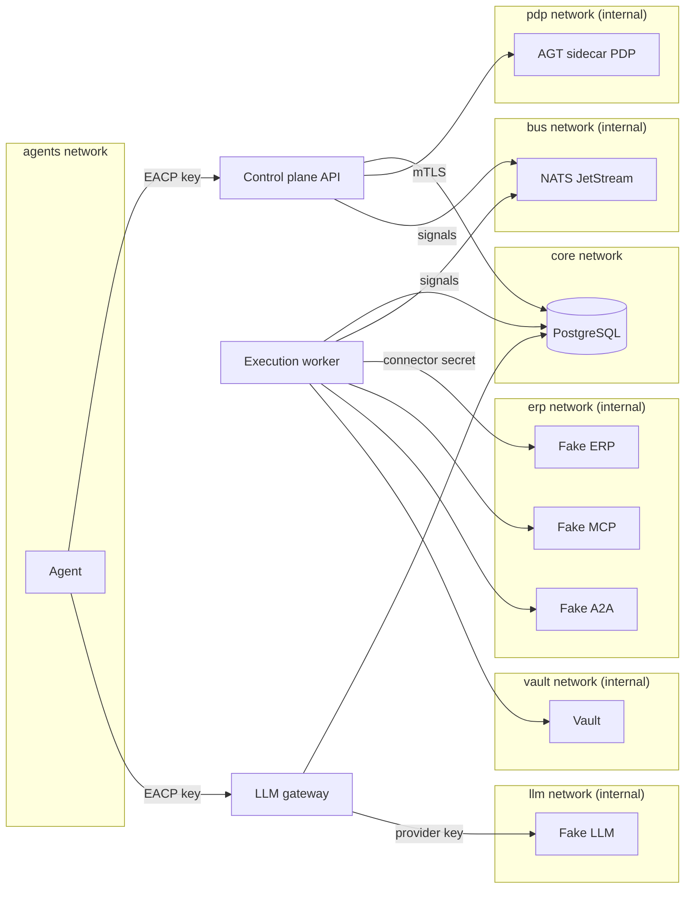
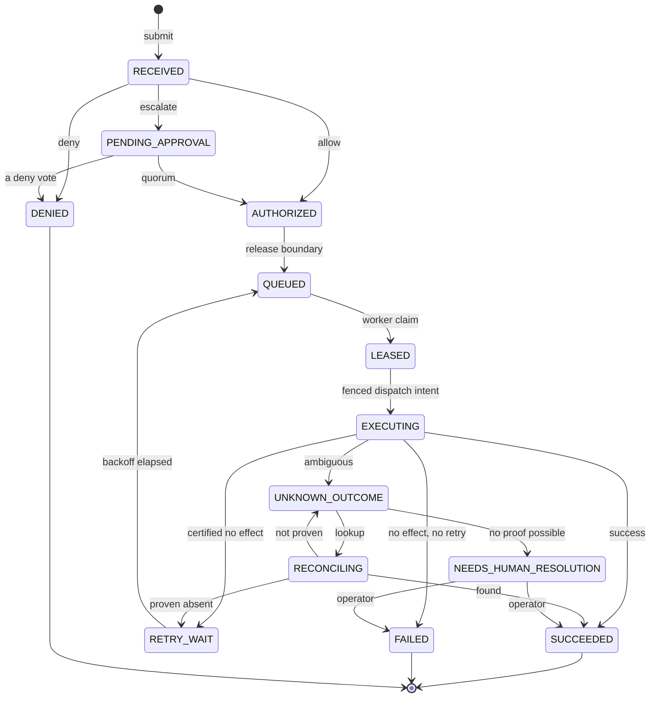

[English](ARCHITECTURE.md) | [ไทย](ARCHITECTURE.th.md)

# Architecture

This document explains how EACP is built and why. It describes the shape of the system. The decisions themselves,
with their alternatives and consequences, are the [ADRs](adr/README.md); where this page and an ADR differ, the ADR
wins.

## The problem the architecture answers

An AI agent that acts on enterprise systems creates four risks that ordinary API gateways do not handle:

- **Duplicates.** Agents retry. A retried call that places an order twice is a real loss.
- **Approvals that drift.** A person approves one thing, and a different payload executes.
- **Credentials in the wrong place.** An agent that holds an ERP credential can use it for anything, outside any
  control.
- **Unknown outcomes.** A call that times out after it was sent may or may not have taken effect. Guessing either
  way is wrong.

EACP is an enforcement point between agents and the systems they act on ([ADR-001](adr/ADR-001-product-boundary-and-enforcement-point.md)).
Agents never receive enterprise credentials, and every action passes one state machine whose every step is decided
and recorded in PostgreSQL.

## Components

| Component | Code | Responsibility |
|---|---|---|
| Control plane API | [`cmd/controlplane-api`](../cmd/controlplane-api), [`internal/api`](../internal/api) | The `/v1` API and the console: registry, policies, approvals, actions, kill switches, releases, fleet, bundles, incidents, FinOps. It also runs the background loops: the action sweeper, the outbox relay and pruner, and the FinOps, release and incident evaluators. |
| Execution worker | [`cmd/execution-worker`](../cmd/execution-worker), [`internal/worker`](../internal/worker) | Claims released actions, writes a fenced dispatch intent, calls the connector, records the result; reconciles unknown outcomes; scans MCP servers and A2A agents. The only process that holds connector credentials. |
| LLM gateway | [`cmd/llm-gateway`](../cmd/llm-gateway), [`internal/llmgateway`](../internal/llmgateway) | Accepts the Anthropic Messages and OpenAI Chat Completions APIs from agents, admits each call in PostgreSQL, forwards it once, and settles its cost. The only process that holds model provider keys. |
| PostgreSQL | [`migrations/`](../migrations) | The only authority. Registry rules, state transitions, budgets, kill states and separation of duties are triggers and functions, and every tenant table has Row-Level Security. |
| AGT sidecar PDP | [`sidecars/agt-pdp`](../sidecars/agt-pdp), [`integrations/governance/microsoftagt`](../integrations/governance/microsoftagt) | A policy decision point built on the Microsoft Agent Governance Toolkit, called over mutual TLS. It answers a governance question and never resolves an approval ([ADR-002](adr/ADR-002-agt-integration-sidecar-pdp.md)). |
| NATS JetStream | [`internal/messaging`](../internal/messaging) | Carries wake-up signals only: work hints and kill signals ([ADR-014](adr/ADR-014-postgresql-authority-nats-signals.md)). |
| `eacpctl` | [`cmd/eacpctl`](../cmd/eacpctl) | The command-line client: tenant bootstrap, registry, actions, kill switches, releases, fleet operations, bundles. |
| Operator console | [`internal/ui`](../internal/ui) | A static web client served at `/ui/`. It holds no authority and calls only existing routes ([ADR-028](adr/ADR-028-operator-console.md)). |

The Fake ERP, Fake LLM, Fake MCP and Fake A2A services ([`cmd/`](../cmd)) stand in for real systems in tests and
demos. They are not part of a release.

## Networks and trust boundaries

The compose stack ([`docker-compose.yml`](../docker-compose.yml)) turns the boundary into networks. Agents share a
network with the API and the gateway only. The enterprise systems sit on an internal network that only the
execution worker joins. The model provider sits on an internal network that only the gateway joins.

| Network | Members | Why |
|---|---|---|
| `agents` | agent, API, LLM gateway | The only way an agent reaches anything. |
| `core` | PostgreSQL, API, worker, gateway, migrations | The authority. No agent is here. |
| `pdp` (internal) | API, AGT sidecar | Governance questions, over mutual TLS. |
| `bus` (internal) | API, worker, NATS | Signals. Each role has its own NATS user ([`deployments/docker/nats`](../deployments/docker)). |
| `erp` (internal) | worker, Fake ERP, Fake MCP, Fake A2A | Enterprise systems: only the worker reaches them, with its secret. |
| `vault` (internal) | worker, Vault | Credential source for the worker ([ADR-019](adr/ADR-019-credential-custody.md)). |
| `llm` (internal) | gateway, Fake LLM | The model provider: only the gateway reaches it, with its key. |

In the compose stack the gateway uses the in-process policy evaluator (the default `EACP_GOVERNANCE_PROVIDER=local`),
so it needs no route to the sidecar. [`test/security`](../test/security) checks these boundaries against the
running stack, for example that the agent container cannot reach the Fake ERP. The Helm chart keeps the same
boundaries as NetworkPolicies ([ADR-029](adr/ADR-029-high-availability.md), [KUBERNETES.md](KUBERNETES.md)).

## PostgreSQL is the authority, NATS carries signals

Every decision that matters is a row change in PostgreSQL, made in one transaction with its audit event
([ADR-014](adr/ADR-014-postgresql-authority-nats-signals.md), [ADR-003](adr/ADR-003-agent-registry-identity-and-capability.md) §8):

- Services connect as `eacp_app`, a role that cannot bypass Row-Level Security, and refuse to start with one that
  can ([`internal/storage`](../internal/storage)).
- Registry rules (who may create, approve or activate what) are triggers. Each privileged write binds its actor
  with `storage.SetActor` and the trigger records it, so the rule holds for every client, not only the Go code.
- The audit journal is a hash chain, appended in the same transaction as the change it records, and verifiable at
  any time ([`internal/audit`](../internal/audit)).

NATS only wakes things up. A work hint tells a worker to claim now instead of at its next poll, and a kill signal
tells a running call to check PostgreSQL now. Messages carry ids, states and epochs, never a reason, a payload or a
secret. Nothing is claimed, executed or cancelled because of a message, and polling stays on, so losing NATS slows
the system down and changes nothing else.

## The life of an action

The action state machine is [ADR-004](adr/ADR-004-action-state-machine-and-execution-semantics.md). Its main
states:

`EXPIRED` and `CANCELLED` are reachable from every state before execution, and are left out of the diagram for
clarity. The ADR's transition table (T1–T37) is the complete list.

- **Submit (T1).** The agent authenticates with its own key and sends an `Idempotency-Key`. The same key with the
  same body returns the existing action; with a different body it is refused.
- **Govern (T2–T4).** The registry check (the agent version is `ACTIVE`, the tool is on its allowlist and has an
  active certified contract) and the PDP's verdict decide `DENIED`, `AUTHORIZED` or `PENDING_APPROVAL`. The PDP is
  never called with a transaction open. A PDP failure leaves the action `RECEIVED`, which is not executable.
- **Approve (T6–T7).** Votes are checked in PostgreSQL for separation of duties. A quorum creates a one-time grant
  bound to the tenant, the action, the enforced payload's digest and the policy version
  ([ADR-005](adr/ADR-005-approval-ownership-and-atomic-execution-boundary.md)).
- **Release (T10–T12).** One transaction revalidates everything under the current policy version, consumes the
  grant, reserves the budget ([ADR-012](adr/ADR-012-budget-reservation.md)) and pins the policy and contract
  versions.

## The execution fabric

The worker path is built so that no call is made twice by accident and no outcome is guessed
([ADR-004](adr/ADR-004-action-state-machine-and-execution-semantics.md), [ADR-011](adr/ADR-011-scheduler-fairness.md),
[ADR-022](adr/ADR-022-backpressure-bulkheads-circuit-breakers-retry-budgets.md)):

- **Lease and fencing.** A claim (T14) takes the row with `FOR UPDATE SKIP LOCKED` and increments its lease
  generation. Every later write by that worker checks the worker id and generation in the database
  (`eacp.assert_lease_holder`), so a worker that lost its lease cannot write.
- **Dispatch intent (T16).** Before any external call, one transaction checks that the lease is still held, the
  agent version, allowlist, contract and policy are unchanged, no cancel or kill is pending and the circuit is
  closed, and then records the attempt. Nothing is dispatched without it.
- **Result.** A success with an external reference is final. An error the contract certifies as having no effect
  may be retried. Anything else, such as a timeout after sending, becomes `UNKNOWN_OUTCOME`.
- **Reconciliation.** The reconciler looks the operation up in the target system. Positive evidence settles it.
  Negative evidence counts only under an `AUTHORITATIVE` contract once every call has settled. Otherwise a person
  decides, with evidence (T29–T37).
- **Scheduling and protection.** Claims are fair across tenants, then teams. Circuit breakers, bulkheads and retry
  budgets only hold work back; they never decide an outcome.

## Governance

Each tenant has versioned policies. A decision records its evidence (verdict, reasons, the input and enforced
digests, the provider) in PostgreSQL ([`internal/governance`](../internal/governance)). The provider is either the
in-process evaluator or the AGT sidecar, which runs the pinned AGT policy layer, ACS and OPA behind mutual TLS
([ADR-002](adr/ADR-002-agt-integration-sidecar-pdp.md)). Both answer the same reference set
([`test/conformance`](../test/conformance)). A decision can allow, deny, escalate to people, warn, or transform the
payload; approvals and grants stay in EACP.

## Credentials

Connector credentials exist only in the execution worker ([ADR-001](adr/ADR-001-product-boundary-and-enforcement-point.md),
[ADR-019](adr/ADR-019-credential-custody.md)). They can be static secrets or minted just in time: OAuth 2.0 client
credentials, `private_key_jwt`, workload identity federation, Vault KV v2, SPIFFE JWT-SVIDs, token exchange and AWS
STS with SigV4. A credential must outlive the whole call, is bound to its host and is redacted from every log.
Provider keys for models exist only in the LLM gateway.

## The LLM gateway

The gateway is another way in to the same core, not a new authority ([ADR-031](adr/ADR-031-llm-gateway.md)). An
agent calls it with its own EACP key. The PDP sees only metadata: the model, whether the call streams, the output
cap and the request size. PostgreSQL admits the call (allowlisted model, no kill switch, a budget reservation at
its own estimate) before anything is sent. The call reaches the provider at most once and is settled with the
provider's reported usage; if the usage is unknown, the full reservation is charged. No prompt, response, header
or key is ever stored.

## Agents and their lifecycle

- **Registry.** Principals, roles, agents, versions, allowlists, connectors, tools and contracts
  ([ADR-003](adr/ADR-003-agent-registry-identity-and-capability.md)).
- **MCP tools** are discovered by the worker's scanner, never declared; a risky change quarantines the tool
  ([ADR-023](adr/ADR-023-mcp-registry-and-tool-fingerprint.md)).
- **A2A delegation** treats a remote agent as a connector with one tool, `delegate`
  ([ADR-030](adr/ADR-030-a2a-delegation.md)).
- **Releases** move a candidate version through evaluation, replay, shadow and canary, with automatic rollback of a
  breached canary ([ADR-018](adr/ADR-018-release-and-evaluation.md)).
- **Fleet operations** make many lifecycle transitions at once and atomically
  ([ADR-024](adr/ADR-024-fleet-operations.md)).
- **Governance-as-Code** plans a YAML bundle into a change set that a second person approves
  ([ADR-026](adr/ADR-026-governance-as-code.md)).

## Operations

- **Kill switches** are PostgreSQL states with epochs, scoped to a tenant, team, agent, version, action, connector,
  tool or model. Clearing one takes a second operator. A running call is cut when the epoch changes
  ([ADR-016](adr/ADR-016-distributed-kill-switch.md)).
- **Dependencies and blast radius.** Recorded evidence and allowlists form a graph. The blast radius of a node
  widens when evidence is stale or unknown ([ADR-015](adr/ADR-015-dependency-graph.md)).
- **FinOps.** Usage and costs are computed in PostgreSQL from a forward-only price card. Chargeback, soft limits
  and alerts observe and never block ([ADR-025](adr/ADR-025-agent-finops.md)).
- **Incidents.** An evaluator opens one incident per signal occurrence (a kill, an open circuit, an outcome that
  needs a person, a quarantined tool, a rollback, a cost alert). Operators handle them in a journaled timeline
  ([ADR-027](adr/ADR-027-incidents-and-agent-soc.md)).

## High availability and Kubernetes

Replicas share nothing that decides ([ADR-029](adr/ADR-029-high-availability.md)). There is no leader election. A
loop that evaluates per tenant takes an advisory lock and skips a tenant another replica holds; a loop that moves
rows relies on row locks and compare-and-set. The lock only avoids duplicated work, and a test shows the outcome
is the same without it. On shutdown a service fails `/readyz`, stops its loops and keeps serving for a grace
period. The Helm chart ([`deployments/helm`](../deployments/helm)) deploys the services with NetworkPolicies;
PostgreSQL and NATS stay outside the chart.

## Where to read next

- [ADR index](adr/README.md): the normative decisions.
- [Threat model](security/THREAT_MODEL.md): assets, boundaries and threats.
- [INVARIANTS.md](INVARIANTS.md): each guarantee and the test that enforces it.
- [MASTER_PLAN.md](MASTER_PLAN.md): scope, slices and phases.
