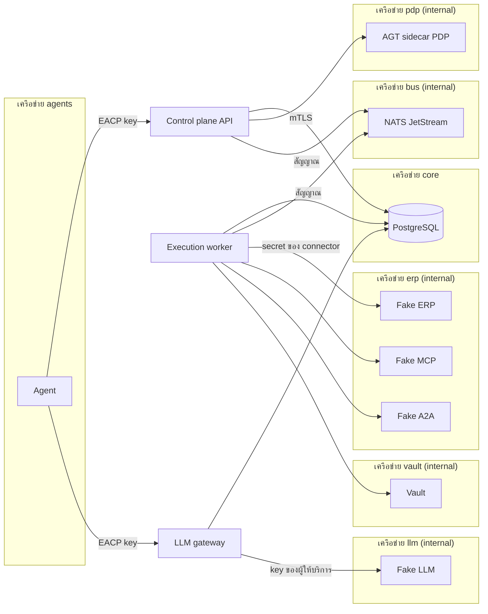
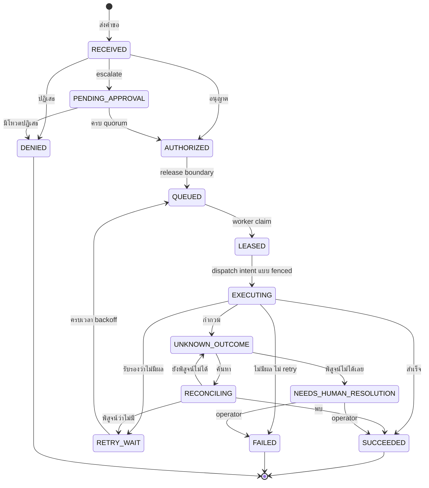

[English](ARCHITECTURE.md) | [ไทย](ARCHITECTURE.th.md)

# สถาปัตยกรรม

เอกสารนี้อธิบายว่า EACP ถูกสร้างขึ้นอย่างไรและเพราะอะไร โดยบรรยายรูปร่างของระบบ ส่วนการตัดสินใจจริงพร้อมทางเลือกอื่นและผลที่ตามมา
อยู่ใน [ADR](adr/README.md) ถ้าหน้านี้กับ ADR ขัดกัน ให้ถือ ADR เป็นหลัก

## ปัญหาที่สถาปัตยกรรมนี้ตอบ

AI agent ที่ลงมือทำงานกับระบบขององค์กรสร้างความเสี่ยงสี่อย่างที่ API gateway ทั่วไปไม่ได้รับมือ:

- **รายการซ้ำ** agent retry เป็นเรื่องปกติ การเรียกซ้ำที่ทำให้สั่งซื้อสองครั้งคือความเสียหายจริง
- **การอนุมัติที่คลาดเคลื่อน** คนอนุมัติสิ่งหนึ่ง แต่ payload ที่ถูกทำงานจริงเป็นอีกสิ่งหนึ่ง
- **credential อยู่ผิดที่** agent ที่ถือ credential ของ ERP เอาไปใช้ทำอะไรก็ได้ โดยไม่มีการควบคุมใดๆ
- **ผลลัพธ์ที่ไม่มีใครรู้** การเรียกที่ timeout หลังส่งไปแล้วอาจมีผลหรือไม่มีผลก็ได้ การเดาไม่ว่าทางไหนก็ผิด

EACP เป็น enforcement point ที่อยู่ระหว่าง agent กับระบบที่ agent ไปทำงานด้วย ([ADR-001](adr/ADR-001-product-boundary-and-enforcement-point.md))
agent ไม่เคยได้รับ credential ขององค์กร และทุก action ต้องผ่าน state machine เดียวกัน ซึ่งทุกขั้นถูกตัดสินและบันทึกไว้ใน PostgreSQL

## องค์ประกอบ

| องค์ประกอบ | โค้ด | หน้าที่ |
|---|---|---|
| Control plane API | [`cmd/controlplane-api`](../cmd/controlplane-api), [`internal/api`](../internal/api) | API `/v1` และ console: registry, policy, การอนุมัติ, action, kill switch, release, fleet, bundle, incident และ FinOps และยังรัน loop เบื้องหลัง ได้แก่ action sweeper, outbox relay และ pruner รวมถึงตัวประเมินของ FinOps, release และ incident |
| Execution worker | [`cmd/execution-worker`](../cmd/execution-worker), [`internal/worker`](../internal/worker) | claim action ที่ถูกปล่อยแล้ว เขียน dispatch intent แบบ fenced เรียก connector และบันทึกผล, reconcile ผลลัพธ์ที่ไม่รู้แน่ชัด และ scan MCP server กับ A2A agent เป็น process เดียวที่ถือ credential ของ connector |
| LLM gateway | [`cmd/llm-gateway`](../cmd/llm-gateway), [`internal/llmgateway`](../internal/llmgateway) | รับ Anthropic Messages API และ OpenAI Chat Completions API จาก agent, admit แต่ละการเรียกใน PostgreSQL, ส่งต่อครั้งเดียว แล้วปิดยอดค่าใช้จ่าย เป็น process เดียวที่ถือ key ของผู้ให้บริการ model |
| PostgreSQL | [`migrations/`](../migrations) | ผู้มีอำนาจเพียงหนึ่งเดียว กฎของ registry, การเปลี่ยนสถานะ, งบประมาณ, สถานะ kill และการแบ่งแยกหน้าที่เป็น trigger และ function ทั้งหมด และทุกตารางของ tenant มี Row-Level Security |
| AGT sidecar PDP | [`sidecars/agt-pdp`](../sidecars/agt-pdp), [`integrations/governance/microsoftagt`](../integrations/governance/microsoftagt) | policy decision point ที่สร้างบน Microsoft Agent Governance Toolkit เรียกผ่าน mutual TLS ทำหน้าที่ตอบคำถามด้าน governance และไม่เคยตัดสินการอนุมัติ ([ADR-002](adr/ADR-002-agt-integration-sidecar-pdp.md)) |
| NATS JetStream | [`internal/messaging`](../internal/messaging) | ส่งเพียงสัญญาณปลุก คือ work hint และ kill signal ([ADR-014](adr/ADR-014-postgresql-authority-nats-signals.md)) |
| `eacpctl` | [`cmd/eacpctl`](../cmd/eacpctl) | command-line client สำหรับ bootstrap tenant, registry, action, kill switch, release, fleet operation และ bundle |
| Operator console | [`internal/ui`](../internal/ui) | web client แบบ static ที่ให้บริการที่ `/ui/` ไม่มีอำนาจใดๆ และเรียกเฉพาะ route ที่มีอยู่แล้ว ([ADR-028](adr/ADR-028-operator-console.md)) |

Fake ERP, Fake LLM, Fake MCP และ Fake A2A ([`cmd/`](../cmd)) ใช้แทนระบบจริงใน test และ demo และไม่รวมอยู่ใน release

## เครือข่ายและขอบเขตความเชื่อถือ

stack ของ compose ([`docker-compose.yml`](../docker-compose.yml)) แปลงขอบเขตให้เป็นเครือข่าย agent อยู่ในเครือข่ายเดียวกับ API และ gateway
เท่านั้น ระบบขององค์กรอยู่ในเครือข่าย internal ที่มีเพียง execution worker เข้าร่วม และผู้ให้บริการ model อยู่ในเครือข่าย internal ที่มีเพียง
gateway เข้าร่วม

| เครือข่าย | สมาชิก | เหตุผล |
|---|---|---|
| `agents` | agent, API, LLM gateway | ช่องทางเดียวที่ agent เข้าถึงสิ่งใดได้ |
| `core` | PostgreSQL, API, worker, gateway, migration | ผู้มีอำนาจ ไม่มี agent อยู่ที่นี่ |
| `pdp` (internal) | API, AGT sidecar | คำถามด้าน governance ผ่าน mutual TLS |
| `bus` (internal) | API, worker, NATS | สัญญาณ แต่ละบทบาทมีผู้ใช้ NATS ของตัวเอง ([`deployments/docker/nats`](../deployments/docker)) |
| `erp` (internal) | worker, Fake ERP, Fake MCP, Fake A2A | ระบบขององค์กร มีเพียง worker ที่เข้าถึงได้ด้วย secret ของตัวเอง |
| `vault` (internal) | worker, Vault | แหล่ง credential ของ worker ([ADR-019](adr/ADR-019-credential-custody.md)) |
| `llm` (internal) | gateway, Fake LLM | ผู้ให้บริการ model มีเพียง gateway ที่เข้าถึงได้ด้วย key ของตัวเอง |

ใน stack ของ compose gateway ใช้ตัวประเมิน policy ภายใน process (ค่าเริ่มต้น `EACP_GOVERNANCE_PROVIDER=local`) จึงไม่ต้องมีเส้นทางไปยัง
sidecar [`test/security`](../test/security) ตรวจขอบเขตเหล่านี้กับ stack ที่รันอยู่จริง เช่น container ของ agent ต้องเข้าถึง Fake ERP ไม่ได้
ส่วน Helm chart รักษาขอบเขตเดียวกันด้วย NetworkPolicy ([ADR-029](adr/ADR-029-high-availability.md), [KUBERNETES.md](KUBERNETES.md))

## PostgreSQL คือผู้มีอำนาจ NATS แค่ส่งสัญญาณ

ทุกการตัดสินใจที่สำคัญคือการเปลี่ยนแถวใน PostgreSQL ซึ่งทำใน transaction เดียวกับ audit event ของมัน
([ADR-014](adr/ADR-014-postgresql-authority-nats-signals.md), [ADR-003](adr/ADR-003-agent-registry-identity-and-capability.md) §8):

- service เชื่อมต่อด้วย role `eacp_app` ซึ่ง bypass Row-Level Security ไม่ได้ และจะไม่ยอมเริ่มทำงานถ้าได้ role ที่ bypass ได้
  ([`internal/storage`](../internal/storage))
- กฎของ registry (ใครสร้าง อนุมัติ หรือเปิดใช้อะไรได้) เป็น trigger การเขียนที่ต้องใช้สิทธิ์ทุกครั้งผูก actor ด้วย `storage.SetActor`
  และ trigger เป็นผู้บันทึก กฎจึงมีผลกับทุก client ไม่ใช่แค่โค้ด Go
- audit journal เป็น hash chain ที่ต่อท้ายใน transaction เดียวกับการเปลี่ยนแปลงที่บันทึก และตรวจสอบได้ทุกเมื่อ
  ([`internal/audit`](../internal/audit))

NATS มีหน้าที่แค่ปลุก work hint บอกให้ worker claim ทันทีแทนที่จะรอรอบ poll ถัดไป และ kill signal บอกให้การเรียกที่กำลังทำงาน
ตรวจ PostgreSQL ทันที message มีเพียง id, สถานะ และ epoch ไม่มีเหตุผล payload หรือ secret ไม่มีสิ่งใดถูก claim ทำงาน หรือยกเลิกเพราะ
message และการ poll ยังเปิดอยู่เสมอ การเสีย NATS จึงทำให้ระบบช้าลงเท่านั้น ไม่เปลี่ยนอย่างอื่น

## ชีวิตของ action

state machine ของ action คือ [ADR-004](adr/ADR-004-action-state-machine-and-execution-semantics.md) สถานะหลักมีดังนี้:

`EXPIRED` และ `CANCELLED` เข้าถึงได้จากทุกสถานะก่อนการทำงาน และถูกละไว้จากแผนภาพเพื่อให้อ่านง่าย ตาราง transition ใน ADR
(T1–T37) คือรายการที่ครบถ้วน

- **ส่งคำขอ (T1)** agent ยืนยันตัวตนด้วย key ของตัวเองและส่ง `Idempotency-Key` key เดิมกับ body เดิมได้ action เดิมกลับไป
  ถ้า body ต่างไปจะถูกปฏิเสธ
- **governance (T2–T4)** การตรวจ registry (agent version เป็น `ACTIVE`, tool อยู่ใน allowlist และมี contract ที่รับรองแล้วและ active)
  กับคำตัดสินของ PDP กำหนดว่าจะเป็น `DENIED`, `AUTHORIZED` หรือ `PENDING_APPROVAL` PDP ไม่เคยถูกเรียกขณะที่มี transaction เปิดอยู่
  ถ้า PDP ล้ม action จะค้างที่ `RECEIVED` ซึ่งทำงานไม่ได้
- **อนุมัติ (T6–T7)** โหวตถูกตรวจการแบ่งแยกหน้าที่ใน PostgreSQL เมื่อครบ quorum จะสร้าง grant ที่ใช้ได้ครั้งเดียว ผูกกับ tenant, action,
  digest ของ payload ที่บังคับใช้ และเวอร์ชันของ policy ([ADR-005](adr/ADR-005-approval-ownership-and-atomic-execution-boundary.md))
- **ปล่อย (T10–T12)** transaction เดียวตรวจทุกอย่างซ้ำภายใต้ policy เวอร์ชันปัจจุบัน ใช้ grant จองงบประมาณ
  ([ADR-012](adr/ADR-012-budget-reservation.md)) และตรึง (pin) เวอร์ชันของ policy และ contract

## execution fabric

เส้นทางของ worker ถูกออกแบบให้ไม่มีการเรียกซ้ำโดยไม่ตั้งใจ และไม่มีผลลัพธ์ใดถูกเดา
([ADR-004](adr/ADR-004-action-state-machine-and-execution-semantics.md), [ADR-011](adr/ADR-011-scheduler-fairness.md),
[ADR-022](adr/ADR-022-backpressure-bulkheads-circuit-breakers-retry-budgets.md)):

- **lease และ fencing** การ claim (T14) หยิบแถวด้วย `FOR UPDATE SKIP LOCKED` และเพิ่ม lease generation การเขียนหลังจากนั้นของ worker
  ทุกครั้งถูกตรวจ worker id และ generation ในฐานข้อมูล (`eacp.assert_lease_holder`) worker ที่เสีย lease ไปแล้วจึงเขียนไม่ได้
- **dispatch intent (T16)** ก่อนเรียกภายนอกใดๆ transaction เดียวตรวจว่ายังถือ lease อยู่, agent version, allowlist, contract และ policy
  ไม่เปลี่ยน, ไม่มี cancel หรือ kill ค้างอยู่ และ circuit ปิดอยู่ แล้วจึงบันทึก attempt ไม่มีการ dispatch ใดที่ไม่มี intent
- **ผลลัพธ์** ความสำเร็จที่มี external reference ถือเป็นที่สุด error ที่ contract รับรองว่าไม่มีผลอาจ retry ได้ ส่วนอย่างอื่น เช่น timeout
  หลังส่งไปแล้ว จะกลายเป็น `UNKNOWN_OUTCOME`
- **reconciliation** reconciler ค้นหา operation ในระบบปลายทาง หลักฐานเชิงบวกยุติเรื่องได้ หลักฐานเชิงลบนับเฉพาะเมื่อ contract เป็น
  `AUTHORITATIVE` และทุกการเรียกได้ยุติแล้ว นอกนั้นคนเป็นผู้ตัดสินพร้อมหลักฐาน (T29–T37)
- **การจัดคิวและการป้องกัน** การ claim เป็นธรรมระหว่าง tenant แล้วจึงระหว่าง team circuit breaker, bulkhead และ retry budget
  มีหน้าที่แค่หน่วงงานไว้ ไม่เคยตัดสินผลลัพธ์

## governance

แต่ละ tenant มี policy ที่มีเวอร์ชัน การตัดสินแต่ละครั้งบันทึกหลักฐาน (คำตัดสิน, เหตุผล, digest ของ input และของ payload ที่บังคับใช้
และผู้ให้คำตัดสิน) ไว้ใน PostgreSQL ([`internal/governance`](../internal/governance)) ผู้ให้คำตัดสินคือตัวประเมินภายใน process หรือ
AGT sidecar ซึ่งรัน AGT policy layer, ACS และ OPA ตามเวอร์ชันที่ pin ไว้หลัง mutual TLS ([ADR-002](adr/ADR-002-agt-integration-sidecar-pdp.md))
ทั้งสองตอบชุดอ้างอิงเดียวกัน ([`test/conformance`](../test/conformance)) คำตัดสินอาจเป็น allow, deny, escalate ให้คนตัดสิน, warn
หรือ transform payload ส่วนการอนุมัติและ grant ยังอยู่ใน EACP

## credential

credential ของ connector มีอยู่เฉพาะใน execution worker ([ADR-001](adr/ADR-001-product-boundary-and-enforcement-point.md),
[ADR-019](adr/ADR-019-credential-custody.md)) อาจเป็น secret แบบคงที่ หรือสร้างขึ้นตอนที่ต้องใช้ (just in time) ได้แก่ OAuth 2.0 client
credentials, `private_key_jwt`, workload identity federation, Vault KV v2, SPIFFE JWT-SVID, token exchange และ AWS STS พร้อม SigV4
credential ต้องมีอายุครอบคลุมการเรียกทั้งหมด ผูกกับ host และถูกปิดบังจากทุก log ส่วน key ของผู้ให้บริการ model มีอยู่เฉพาะใน LLM gateway

## LLM gateway

gateway เป็นอีกทางเข้าสู่แกนกลางเดียวกัน ไม่ใช่อำนาจใหม่ ([ADR-031](adr/ADR-031-llm-gateway.md)) agent เรียกด้วย EACP key ของตัวเอง
PDP เห็นเพียง metadata คือ model, เป็น stream หรือไม่, เพดาน output และขนาดคำขอ PostgreSQL admit การเรียก (model อยู่ใน allowlist,
ไม่มี kill switch, จองงบประมาณตามการประเมินของตัวเอง) ก่อนจะมีอะไรถูกส่งออกไป การเรียกไปถึงผู้ให้บริการไม่เกินหนึ่งครั้ง และปิดยอดตาม
usage ที่ผู้ให้บริการรายงาน ถ้าไม่รู้ usage จะคิดเต็มจำนวนที่จองไว้ ไม่มีการเก็บ prompt, คำตอบ, header หรือ key ใดๆ
ข้อยกเว้นเฉพาะ Studio ใน ADR-031 เก็บ JSON ที่ตรวจแล้วและมีขอบเขตสำหรับ lease runtime ที่ยังอยู่ พร้อม settlement
ใน transaction เดียว และล้างเมื่อจบ/เลย deadline ไม่เก็บ envelope provider หรือ prompt

## agent และวงจรชีวิต

- **registry** principal, role, agent, version, allowlist, connector, tool และ contract
  ([ADR-003](adr/ADR-003-agent-registry-identity-and-capability.md))
- **MCP tool** ถูกค้นพบโดย scanner ของ worker ไม่ได้ถูกประกาศ การเปลี่ยนแปลงที่เสี่ยงจะกักกัน (quarantine) tool นั้น
  ([ADR-023](adr/ADR-023-mcp-registry-and-tool-fingerprint.md))
- **A2A delegation** มอง agent ระยะไกลเป็น connector ที่มี tool เดียวคือ `delegate`
  ([ADR-030](adr/ADR-030-a2a-delegation.md))
- **release** พา version ที่เป็น candidate ผ่านการประเมิน, replay, shadow และ canary พร้อม rollback อัตโนมัติเมื่อ canary ละเมิด guardrail
  ([ADR-018](adr/ADR-018-release-and-evaluation.md))
- **fleet operation** ทำ lifecycle transition หลายรายการพร้อมกันแบบ atomic
  ([ADR-024](adr/ADR-024-fleet-operations.md))
- **Governance-as-Code** วางแผน bundle YAML ให้เป็น change set ที่คนที่สองต้องอนุมัติ
  ([ADR-026](adr/ADR-026-governance-as-code.md))

## การปฏิบัติการ

- **kill switch** เป็นสถานะใน PostgreSQL ที่มี epoch ครอบคลุมได้ทั้ง tenant, team, agent, version, action, connector, tool หรือ model
  การยกเลิกต้องใช้ operator คนที่สอง การเรียกที่กำลังทำงานถูกตัดเมื่อ epoch เปลี่ยน
  ([ADR-016](adr/ADR-016-distributed-kill-switch.md))
- **dependency และ blast radius** หลักฐานที่บันทึกไว้และ allowlist รวมกันเป็นกราฟ blast radius ของ node หนึ่งจะกว้างขึ้นเมื่อหลักฐานเก่า
  หรือไม่รู้ ([ADR-015](adr/ADR-015-dependency-graph.md))
- **FinOps** usage และค่าใช้จ่ายคำนวณใน PostgreSQL จากตารางราคาที่เปลี่ยนได้เฉพาะไปข้างหน้า chargeback, soft limit และ alert
  มีหน้าที่สังเกต ไม่เคยปิดกั้น ([ADR-025](adr/ADR-025-agent-finops.md))
- **incident** ตัวประเมินเปิด incident หนึ่งรายการต่อการเกิดสัญญาณแต่ละครั้ง (kill, circuit ที่เปิด, ผลลัพธ์ที่ต้องให้คนตัดสิน,
  tool ที่ถูกกักกัน, rollback, alert ด้านค่าใช้จ่าย) operator จัดการใน timeline ที่ถูกบันทึกลง journal
  ([ADR-027](adr/ADR-027-incidents-and-agent-soc.md))

## high availability และ Kubernetes

replica ไม่แชร์สิ่งใดที่ใช้ตัดสินใจ ([ADR-029](adr/ADR-029-high-availability.md)) ไม่มี leader election loop ที่ประเมินราย tenant
ใช้ advisory lock และข้าม tenant ที่ replica อื่นถืออยู่ ส่วน loop ที่ย้ายแถวอาศัย row lock และ compare-and-set lock มีไว้เพียงเลี่ยงงานซ้ำ
และมี test แสดงว่าผลลัพธ์เหมือนเดิมเมื่อไม่มี lock เมื่อจะปิด service จะให้ `/readyz` ล้ม หยุด loop และยังให้บริการต่อช่วงหนึ่ง Helm chart
([`deployments/helm`](../deployments/helm)) deploy service พร้อม NetworkPolicy ส่วน PostgreSQL และ NATS อยู่นอก chart

## Studio builder เต็มรูปแบบ

Studio schema v2 เป็น graph ไปข้างหน้าที่มีขอบเขต PostgreSQL ตรวจทุกเส้นทาง คำนวณชุด model/tool ที่ตรง
ถือ cursor และใช้ intent ของ model ที่มี fence เพียงครั้งเดียว runtime เรียก tool ผ่าน action API และ model
ผ่าน gateway เดิมด้วย key ของ agent ที่ derive ไว้ โดยเข้า database หรือ provider โดยตรงไม่ได้ การกู้คืนรอ
action/call ที่บันทึกแล้ว branch มีปลายทางตายตัวและเปรียบเทียบตัวเลข JSON อย่างแม่นยำ v1 ใช้เส้นทางเดิม

เก็บเฉพาะ JSON model ที่ตรวจแล้วและมีขอบเขตแบบส่วนตัวพร้อม settlement ใน transaction เดียว ให้อ่านเฉพาะ
runtime ที่ถือ lease อยู่ ล้างเมื่อจบหรือเลย deadline และไม่แสดงใน metadata หรือ audit preview ของเวอร์ชัน
ที่อนุมัติมี mode เปลี่ยนไม่ได้และใช้ตัวอย่างผล tool เป็นส่วนตัว PostgreSQL จึงปฏิเสธ action ของ tool การทดสอบ draft
ในหน้าเว็บไม่เรียกอะไร Helm gateway ที่เปิดตามต้องการรักษาขอบเขต API/gateway ของ runtime และการถือ credential
provider ดู [ADR-033 Rev 1.4](adr/ADR-033-agent-studio-and-runtime-credentials.md) และ [ADR-031](adr/ADR-031-llm-gateway.md)

## Inbound A2A

transport `/a2a` และ static Agent Card แบบเปิดเลือกใช้ของ Phase 29 อยู่ใน controlplane-api ([ADR-030 Rev 1.1](adr/ADR-030-a2a-delegation.md)) ทุก call ผูกกับ agent authentication ที่อนุมัติแล้ว `SendMessage` เรียก action engine ร่วม; action UUID เป็น task ID และ constraint idempotency เดิมจัดการ replay Get/Cancel ใช้ ownership และ core transitions ปกติ ไม่เพิ่มตาราง task store, lease, database role, service หรือ network boundary

PostgreSQL ยังคงเป็น authority ของ capability, lifecycle, approval, budget, kill และ dispatch ผลที่ไม่แน่ชัดยังไม่เป็น terminal และอ่าน output ผ่าน ADR-034 เท่านั้น discovery ไม่มี capability catalogue ของ tenant; request history และ private content ไม่อยู่ใน task metadata หรือ ingress logs Compose ปิดโดย default; `api.a2aPublicURL` ของ Helm เปิดแบบ opt-in และไม่เปลี่ยน network policy demo development แยกเปิดใช้งานอย่างชัดเจน

## อ่านต่อ

- [ดัชนี ADR](adr/README.md): การตัดสินใจเชิงบรรทัดฐาน
- [Threat model](security/THREAT_MODEL.th.md): ทรัพย์สิน ขอบเขต และภัยคุกคาม
- [INVARIANTS.md](INVARIANTS.md): การรับประกันแต่ละข้อและ test ที่บังคับใช้
- [MASTER_PLAN.md](MASTER_PLAN.md): ขอบเขต slice และ phase
