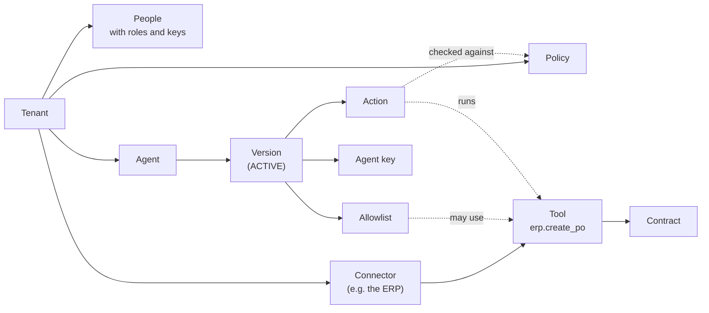
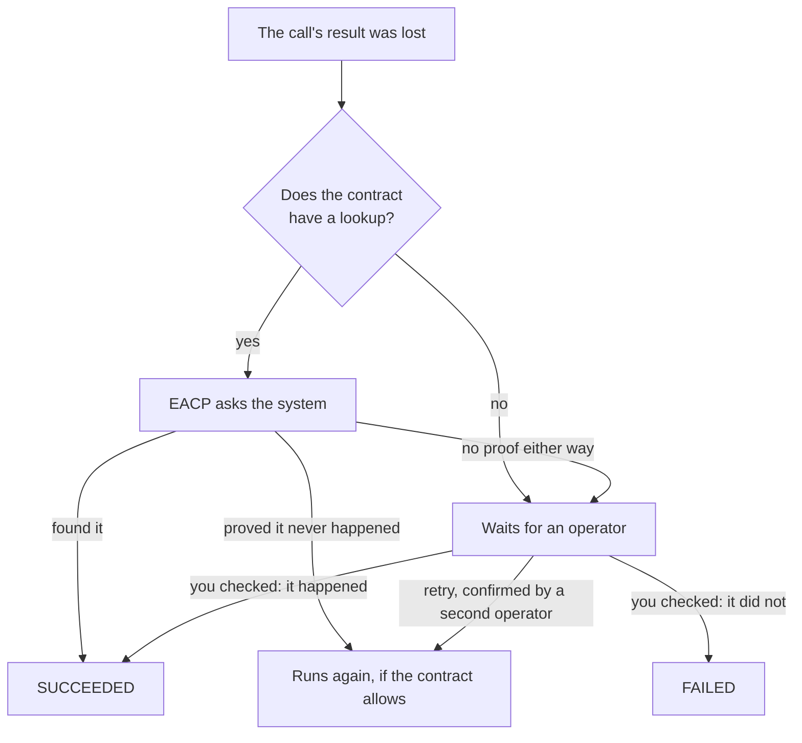

[English](USER_GUIDE.md) | [ไทย](USER_GUIDE.th.md)

# EACP user guide

This guide is for the people who use EACP day to day. It is organised by role, so read the part for your job:

| You are | You will | Read |
|---|---|---|
| An administrator or platform engineer | Set up people, systems, agents, policies and budgets | [For administrators](#for-administrators) |
| An agent developer | Send actions from an agent and call models | [For agent developers](#for-agent-developers) |
| An employee building an agent for their team | Save, get approved and run an Agent Studio agent | [For employees: Agent Studio](#for-employees-agent-studio) |
| An approver | Vote on requests that need a person | [For approvers](#for-approvers) |
| An operator or on-call engineer | Settle unknown outcomes, stop things and work incidents | [For operators](#for-operators) |

Everyone should read [Before you start](#before-you-start) first. If you only want to see EACP work, the
[README's quick start](../README.md#quick-start) and the [examples](../examples/README.md) are shorter.

Every command below uses the local `docker compose` stack: the API on `http://127.0.0.1:8080` and the LLM gateway on
`http://127.0.0.1:8083`. On Windows, run them in Git Bash after `export MSYS_NO_PATHCONV=1`; otherwise Git Bash rewrites
arguments such as `/v1/me` and `/eacpctl` into Windows paths.

## Before you start

### The main ideas

| Word | What it means |
|---|---|
| Tenant | One organisation. Nothing is shared between tenants. |
| Principal | A person (or a service account) with a key and roles. |
| Agent | An AI program you register. It has *versions*; only an `ACTIVE` version can act. |
| Key | How anyone signs in: `Authorization: Bearer <key>`. Agents get their own EACP key, never a system password. |
| Connector | A system EACP can reach, such as your ERP. Its password lives only in the execution worker. |
| Tool | One thing a connector can do, such as `erp.create_po`. |
| Contract | The rules for a tool: what kind of effect it has, how to retry it safely and how to check afterwards whether it happened. |
| Allowlist | The tools and models one agent version may use. |
| Policy | Rules that say, for each request: allow, deny, or ask people first. |
| Action | One request from an agent to use a tool. It moves through states until it ends. |
| Evidence | Everything recorded about an action: the decision, the votes, each attempt and a hash-chained audit trail. |

How they fit together:



### Who does what

EACP has six roles. One person can hold several, but many steps need **two different people**, so no single person
can grant themselves power or approve their own work.

| Role | Can |
|---|---|
| `admin` | Add people, propose and approve role grants, write policies, manage budgets. A tenant always has at least two. |
| `registry_editor` | Register agents, versions, connectors, tools and contracts; propose allowlists and keys. |
| `registry_approver` | Activate what an editor proposed: allowlists, contracts, agent versions and agent keys. |
| `operator` | Read actions and evidence, settle unknown outcomes, use the kill switch, open and close circuits, work incidents. |
| `approver` | Vote on actions that a policy sent to people. |
| `auditor` | Read actions and evidence, and verify the audit chain. |

The two-person rules you will meet most often:

| Step | Who does the second half |
|---|---|
| Giving someone a role | A second admin approves the grant. |
| Issuing a key | A second person approves it (for an agent key, a `registry_approver`). |
| Activating an allowlist, a contract or an agent version | A `registry_approver` who did not write it. |
| Resuming agents after a fleet pause or quarantine | A `registry_approver`. |
| Activating a policy | A second admin. |
| Raising a budget limit | A second admin. |
| Clearing a kill switch | A second operator. |
| Retrying an action whose outcome was unknown | A second operator confirms it. |
| Applying a Governance-as-Code change set | A second person approves it. |

EACP enforces these in the database, so a script or a direct API call cannot skip them.

### Start EACP

You need Docker with Compose v2 and Go (the version in `go.mod`). From the repository root:

```bash
python3 deployments/docker/secrets/prepare_fakeerp_token.py
docker compose up -d --build --wait
curl -s http://127.0.0.1:8080/readyz
```

This stack is for development: it includes a Fake ERP, a fake LLM and development secrets. For a real cluster, use the
Helm chart in [KUBERNETES.md](KUBERNETES.md).

To try every role without setting anything up yourself, run `bash examples/setup.sh` once. It creates a tenant called
`examples`, with a person for each role, and writes their keys to `examples/.env` (git-ignored, never printed). The
rest of this guide uses those people and their keys' names in `.env`: alice and bob (admins, `ADMIN_KEY` and
`ADMIN2_KEY`), erin (editor, `EDITOR_KEY`), rita (registry approver, `REGISTRY_APPROVER_KEY`), amy and ben (approvers,
`APPROVER_KEY` and `APPROVER2_KEY`), otto and olga (operators, `OPERATOR_KEY` and `OPERATOR2_KEY`), and the agent
`procurement-bot` (`AGENT_KEY`).

### Get eacpctl

`eacpctl` is the command-line client. Build it once:

```bash
go build -o bin/eacpctl ./cmd/eacpctl
export EACP_API_URL=http://127.0.0.1:8080
export EACP_API_KEY="$OPERATOR_KEY"   # the key of whoever is acting
bin/eacpctl agent list
```

`eacpctl` sends the key in `EACP_API_KEY` and prints the API's JSON. Anything it has no command for is still one call
away: `bin/eacpctl api GET /v1/me`. To load the examples' keys into your shell without printing them, run
`set -a; . examples/.env; set +a`.

## For administrators

The steps below are what `examples/setup.sh` does. Read [its source](../examples/setup/main.go) for a complete,
working version.

### Create a tenant

A new tenant is the one step that does not go through the API: it creates the first two admins, so there is nobody yet
to approve anything. It needs the database owner's connection, which the stack's `migrate` container has.

First generate a key for each admin. Pick the tenant's id yourself, because a key belongs to one tenant:

```bash
TENANT=$(python3 -c 'import uuid; print(uuid.uuid4())')
docker compose run --rm migrate /eacpctl key generate --kind principal --tenant "$TENANT"
docker compose run --rm migrate /eacpctl key generate --kind principal --tenant "$TENANT"
```

Each run prints a `key`, a `credential_id` and a `hash`. Give each key to its admin privately; EACP stores only the
hash. Then create the tenant with both admins:

```bash
docker compose run --rm migrate /eacpctl tenant create --id "$TENANT" --slug acme --name "Acme" \
  --admin "name=alice,subject=alice@acme.example,credential=<alice's credential_id>,hash=<alice's hash>" \
  --admin "name=bob,subject=bob@acme.example,credential=<bob's credential_id>,hash=<bob's hash>"
```

### Add people and give them roles

Every step is one admin proposing and the other approving. As alice, add a person and propose a role:

```bash
EACP_API_KEY=$ADMIN_KEY bin/eacpctl api POST /v1/principals \
  '{"kind":"human","name":"erin","subject":"erin@acme.example","display_name":"Erin"}'
EACP_API_KEY=$ADMIN_KEY bin/eacpctl api POST /v1/role-grants \
  '{"principal_id":"<erin id>","role":"registry_editor"}'
```

Then bob approves the grant: `EACP_API_KEY=$ADMIN2_KEY bin/eacpctl api POST /v1/role-grants/<grant id>/approve`.

A person's key works the same way. Generate one with `eacpctl key generate --kind principal`, register its
`credential_id` and `hash` with `POST /v1/credentials` (`{"id", "kind":"pk", "principal_id", "hash",
"expires_in_days"}`, at most 90 days), and have a second admin approve it with `POST /v1/credentials/<id>/approve`.

### Connect a system

A connector is a system EACP can call. As a `registry_editor`, register it, then add each tool it offers:

```bash
export EACP_API_KEY=$EDITOR_KEY
bin/eacpctl connector register --name erp --endpoint http://fakeerp:8090 --secret-ref fakeerp
bin/eacpctl api POST /v1/connectors/<connector id>/tools '{"name":"create_po"}'
```

The system's password never goes through the API. `--secret-ref` names an entry in the execution worker's secrets file
(`EACP_CONNECTOR_SECRETS_FILE`), which gives the value for your tenant, that reference and one host. The worker is the
only service that reads it. It can also fetch short-lived tokens (OAuth 2.0, Vault, SPIFFE, AWS and GCP); see
[ADR-019](adr/ADR-019-credential-custody.md).

Next, the tool needs a contract. The contract is where you tell EACP the truth about the tool, because EACP uses it to
decide whether a retry is safe:

```json
{
  "side_effects": ["IRREVERSIBLE_WRITE", "FINANCIAL"],
  "idempotency_mode": "native",
  "idempotency_key_field": "Idempotency-Key",
  "reconciliation_lookup": "by_operation_key",
  "reconciliation_consistency": "strong",
  "proof_standard": "authoritative",
  "no_effect_errors": ["validation"],
  "max_attempts": 2,
  "timeout_ms": 3000,
  "cost_unit": "THB",
  "cost_amount_field": "amount",
  "cost_unit_field": "currency"
}
```

| Field | What to put |
|---|---|
| `side_effects` | `READ_ONLY` (alone), or any of `REVERSIBLE_WRITE`, `IRREVERSIBLE_WRITE`, `EXTERNAL_COMMUNICATION`, `FINANCIAL`, `ADMINISTRATIVE`. |
| `idempotency_mode` | `native` if the system accepts an idempotency key header (name it in `idempotency_key_field`), `correlation_only` if it only stores a reference you send in a body field (`correlation_field`), otherwise `none`. |
| `reconciliation_lookup` | `by_operation_key` if EACP can ask the system later whether the operation happened, otherwise `none`. |
| `reconciliation_consistency` | `strong` if that answer is up to date at once, `eventual` if it can lag, `none` without a lookup. |
| `proof_standard` | `authoritative` only when "not found" really proves it never happened (needs a strong lookup); `best_effort` if not; `none` without a lookup. |
| `no_effect_errors` | The error classes the system returns only when it did nothing. |
| `max_attempts` | 1 to 10. A write with idempotency `none` must be 1. |

Propose it as the editor, and activate it as a `registry_approver` who is not its author:

```bash
bin/eacpctl api POST /v1/tools/<tool id>/contracts "$(cat contract.json)"
EACP_API_KEY=$REGISTRY_APPROVER_KEY bin/eacpctl api POST /v1/tools/<tool id>/contract '{"contract_id":"<contract id>"}'
```

If you write the connector yourself, the wire format is small. The worker sends `POST {endpoint}/v1/execute` with
`{"tool": ..., "payload": ...}`, the header `X-EACP-Tenant-ID`, the credential, and the idempotency key when the
mode is `native`. Answer 2xx with a non-empty `external_reference` for success, or a non-2xx with `error_class` set.
For a lookup, answer `GET {endpoint}/v1/operations/{operation key}` with 200 and the reference, or 404 with
`{"error_class":"not_found"}`.

### Register an agent

As the editor, register the agent and a version, and propose what that version may use. An allowlist can name models
as well as tools, and a model must be registered first: the first command registers `sonnet`, here backed by the
development stack's fake LLM. The provider's key goes in the LLM gateway's secrets file (`EACP_LLM_SECRETS_FILE`),
never through the API.

```bash
bin/eacpctl llm-model register --name sonnet --provider anthropic --base-url http://fakellm:8093   --upstream claude-fake --secret-ref fakellm --max-output-tokens 4096
bin/eacpctl agent register --name procurement-bot --display-name "Procurement bot" \
  --env production --risk high --owner-principal <owner id>
bin/eacpctl api POST /v1/agents/<agent id>/versions '{"runtime":"python","code_ref":"git:abc123"}'
bin/eacpctl api POST /v1/agent-versions/<version id>/allowlists '{"tools":["erp.create_po"],"models":["sonnet"]}'
```

A `registry_approver` who did not write the allowlist activates it and then the version:

```bash
EACP_API_KEY=$REGISTRY_APPROVER_KEY bin/eacpctl api POST /v1/agent-versions/<version id>/allowlist '{"allowlist_id":"<allowlist id>"}'
EACP_API_KEY=$REGISTRY_APPROVER_KEY bin/eacpctl api POST /v1/agent-versions/<version id>/transitions '{"to":"ACTIVE","reason":"reviewed"}'
```

Finally the agent needs a key. Generate one with `eacpctl key generate --kind agent`, register it with
`POST /v1/credentials` (`"kind":"ak"` and `"agent_version_id"`), and have a `registry_approver` approve it. Give the
key to the agent's runtime as a secret. It is the only credential the agent ever holds.

To move an agent to a new version safely, open a release (`eacpctl release open`) instead of activating the new
version beside the old one. A release records evaluations, runs a canary on part of the traffic and rolls back by itself
if the canary breaches its guardrails; [ADR-018](adr/ADR-018-release-and-evaluation.md) explains the stages.

### Write the policy

A policy is a list of rules. For each action EACP takes the **first rule that matches**; if none matches, the action is
denied. This one sends big purchases to two approvers and allows the rest:

```json
{"format_version": 1, "rules": [
  {"id": "high-value", "match": {"operation": "purchase_high_value"}, "verdict": "escalate",
   "reason": "a high-value purchase needs two approvers",
   "approval": {"quorum": 2, "eligible_roles": ["approver"], "ttl_seconds": 3600}},
  {"id": "routine", "match": {"target": "erp"}, "verdict": "allow", "reason": "a routine purchase"},
  {"id": "llm", "match": {"operation": "llm.generate"}, "verdict": "allow", "reason": "model use"}]}
```

A rule can match on `subject`, `operation`, `target`, `tool`, `risk_class` and `side_effect_class`. The verdicts are
`allow`, `warn`, `deny`, `escalate` (ask people; give a quorum of 1 to 5 and how long they have) and `transform`. Keep
the last `llm` rule if agents call models through the gateway, because model calls are checked by the same policy.

One admin saves the policy, and a second admin activates it:

```bash
EACP_API_KEY=$ADMIN_KEY bin/eacpctl api POST /v1/policies "{\"content\": $(cat policy.json)}"
EACP_API_KEY=$ADMIN2_KEY bin/eacpctl api POST /v1/policies/<policy id>/activate '{"reason":"quarterly review"}'
```

A new policy applies from the moment it is active. An action that was allowed under the old policy but has not run
yet is checked again under the new one before it runs.

### Set a budget

A budget caps what an agent can spend, in one unit (such as THB for purchases or USD for models). The cost of each
action comes from the fields the contract names. EACP reserves the cost before anything runs and refuses the action
with `exceeded` when the limit would be passed.

```bash
EACP_API_KEY=$ADMIN_KEY bin/eacpctl api POST /v1/budgets '{"name":"procurement-thb","unit":"THB","agent_id":"<agent id>"}'
EACP_API_KEY=$ADMIN_KEY bin/eacpctl api POST /v1/budgets/<budget id>/limit '{"limit":"10000000","reason":"FY budget"}'
EACP_API_KEY=$ADMIN2_KEY bin/eacpctl api POST /v1/budget-limit-changes/<change id>/approve '{"reason":"agreed"}'
```

If a contract names a cost but the agent has no budget in that unit, its actions are denied with `no_account`.

### Keep it all in Git

Instead of calling the API step by step, you can describe connectors, agents, policies, budgets and people in a YAML
bundle, review it like code and let EACP plan the changes. [Example 03](../examples/03-governance-as-code/README.md)
shows a whole bundle. The cycle is:

```bash
bin/eacpctl bundle validate -C ./bundle
bin/eacpctl bundle plan -C ./bundle --dry-run
bin/eacpctl bundle deploy -C ./bundle
EACP_API_KEY=$REGISTRY_APPROVER_KEY bin/eacpctl bundle approve <change set id>
bin/eacpctl bundle drift -C ./bundle
```

`plan --dry-run` shows what would change and records nothing. `deploy` submits a change set, and nothing changes until
a second person approves it. If the tenant changed in
between, the change set is stale and runs nothing. A bundle never holds a secret value and never deletes anything:
`--prune` only retires versions that are not active, revokes contracts and role grants, and removes group memberships. `drift` shows where the tenant no longer
matches the bundle.

## For agent developers

Your agent gets one EACP key. It never holds a password for the ERP or a model provider, and it can only ask: EACP
decides, and the worker does the work.

### Send an action

Send `POST /v1/actions` with the agent's key and an `Idempotency-Key` header:

```bash
curl -sS -X POST "http://127.0.0.1:8080/v1/actions?wait=2s" \
  -H "Authorization: Bearer $AGENT_KEY" \
  -H "Idempotency-Key: po-2026-0042" \
  -H "Content-Type: application/json" \
  -d '{"subject": "sam@examples.test", "operation": "purchase_high_value", "target": "erp",
       "tool": "erp.create_po", "tool_schema_version": "1", "resource": "po",
       "payload": {"amount": 250000, "currency": "THB", "supplier": "ACME Office Supply", "order": "po-2026-0042"}}'
```

| Field | Meaning |
|---|---|
| `subject` | Who the agent is acting for. |
| `operation`, `target`, `resource` | What kind of request this is. The policy matches on them. |
| `tool`, `tool_schema_version` | The tool to run, as `connector.tool`. It must be in the version's allowlist. |
| `payload` | The data for the tool. Approvers see exactly this, and exactly this is sent. |
| `lifetime_seconds` | Optional. How long the action may wait before it expires. |

`?wait=2s` holds the answer for up to that long (at most a minute) so that a quick decision comes back in the same
call. EACP answers 200 when the action has already ended and 202 while it is still moving. Either way you get the
action's `id` and `state`.

### Read the answer

Follow the action with `GET /v1/actions/<id>` and the same key. These are the states you will see:

| State | What it means for you |
|---|---|
| `RECEIVED` | EACP is checking the policy. |
| `PENDING_APPROVAL` | People must vote. `approval_request_id` names the request. |
| `AUTHORIZED`, `QUEUED` | Allowed; waiting for a worker. |
| `LEASED`, `EXECUTING` | A worker is running it now. |
| `RETRY_WAIT` | The system refused with an error that proves nothing happened; the worker will try again. |
| `UNKNOWN_OUTCOME`, `RECONCILING` | The call may or may not have taken effect. EACP is checking with the system. |
| `NEEDS_HUMAN_RESOLUTION` | EACP could not prove either way. An operator decides. |
| `SUCCEEDED` | Done. `external_reference` is the system's reference, such as the order number. |
| `FAILED` | It did not happen, or an operator decided so. |
| `DENIED` | Refused before anything ran. `state_reason` says why. |
| `CANCELLED`, `EXPIRED` | Stopped by someone, or it waited longer than its lifetime. |

The common reasons for `DENIED` are a policy rule (its `reason`), `tool_not_in_allowlist`, `unknown_tool`,
`no_active_contract`, `agent_version_not_active`, `tool_quarantined` and `exceeded` (over budget).

To stop an action, send `POST /v1/actions/<id>/cancel` with `{"reason": "..."}`. Before the worker has started, the
action is cancelled. After that, the worker is asked to stop, and the result is whatever really happened.

### Retrying safely

Send a retry with **the same `Idempotency-Key` and the same body**. EACP answers with the same action instead of
creating another, so a network error on your side can never buy two of something.

| Answer | What to do |
|---|---|
| 409 `idempotency_conflict` | You reused a key with a different body. Use a new key for a new request. |
| 429 `admission_limit` | Too many actions at once. Wait for `Retry-After`, then send the same request again. |
| 503 `governance_unavailable` | The policy engine is down. The action is kept; send the same request again after `Retry-After`. |
| 401 | The key is wrong, expired or revoked. |

Do not retry an action that has ended, and never retry by sending a new key: that is a new request. Retries of the
call to the system are the worker's job, and it follows the contract.

### Call a model through the gateway

Point your SDK at the gateway and give it the agent's EACP key instead of a provider key. The model name is the name an
administrator registered (with `eacpctl llm-model register`), and it must be in the agent's allowlist:

```python
import anthropic

client = anthropic.Anthropic(api_key=AGENT_KEY, base_url="http://127.0.0.1:8083")
message = client.messages.create(
    model="sonnet", max_tokens=256,
    messages=[{"role": "user", "content": "Summarise purchase order po-1042 in one line."}],
)
```

The gateway speaks the Anthropic Messages API (`/v1/messages`) and the OpenAI Chat Completions API
(`/v1/chat/completions`), with streaming. Before it sends anything it checks the allowlist, the policy (it sees the
model name and sizes, never your prompt), the kill switch and the budget. A refused call gets a 403 and never reaches
the provider. The gateway never stores a prompt or a response. [Example 02](../examples/02-llm-gateway/README.md) runs
this end to end.

## For employees: Agent Studio

### Build an agent from a template

Agent Studio lets you make a small agent for your team without writing code. Open `http://127.0.0.1:8080/studio/` and
sign in with your own key; you need the `studio_author` role and a group for your department (an administrator sets
both up). Choose **New agent**. The leave-balance template fills in the form: an input (`employee_id`), one step that
calls the HR system's read-only `get_leave_balance` tool, and the answer.


Each step names a tool, what it does (`operation`, `target`, `resource`) and the data it sends. Use `{{inputs.NAME}}`
for what the person running the agent gives and `{{steps.ID.output...}}` for an earlier step's result. **Save** makes
an unchangeable version; to change it later, save a new version.

### Get it approved, then run it

After you save, the agent's page shows where it is and who acts next: a registry approver who is not you approves the
tools it asks for, the agent runtime proposes the agent's key within a minute, and a registry approver approves that
key. Then it is ready and shows a form with its inputs.


A run goes through the same path as any agent's action: the policy, approvals, budgets and kill switches all apply.
Its page shows each step's action and the answer, which only you can read, for an hour. When a run fails it says why
in plain words: for example the agent has no approved key yet, or a step's outcome is unknown and an operator must
check the system first.


Registry approvers decide in the same page under **Requests**: each agent waiting for a decision, with the tools it
asks for in plain words, and each key the agent runtime proposed. You cannot decide an agent you saved yourself.


### Share it in the Hub

Until it is published, only you run your agent. To share it, open the agent and use **Publish to the Hub…**: choose
your department or the whole organisation, and add a few tags. A lead of your department publishes it to the
department; an admin or a registry approver publishes it to the organisation. Nobody publishes their own agent.

Everyone it reaches finds it under **Hub**, searches by name, tag or department, and runs it as themselves, with the
same policy, approvals, budgets and kill switches as any action. An author can also copy it into their own department:
the copy starts with no permission and waits for a registry approver like a new agent. The owner, an admin or the
listing's approver can deprecate it (it still runs) or withdraw it (it starts no new run).


An administrator makes someone a department lead when adding them to the group (`"lead": true` on
`POST /v1/groups/{id}/members`); to change it, remove the membership and add it again. A lead decides the department's
listings under **Requests**.

## For approvers

### Vote on a request

When a policy says `escalate`, the action waits in `PENDING_APPROVAL` until enough approvers agree. Open the console at
`http://127.0.0.1:8080/ui/`, sign in with your key and go to **Approvals**, or use the API:

```bash
bin/eacpctl api GET /v1/approvals
bin/eacpctl api GET /v1/approvals/<request id>
bin/eacpctl api POST /v1/approvals/<request id>/votes '{"decision":"APPROVE","reason":"within budget"}'
```

The first call lists the requests you may vote on. The second shows `enforced_payload`: this is exactly what will be
sent to the system if the request is approved, so read it rather than the agent's description. The vote's answer
carries `request_state`, which becomes `GRANTED` once the quorum is reached. One `DENY` denies the action.

EACP will not let you vote if you are the person the agent is acting for, the agent's owner or in its owner group, or
you set up the agent version. An approval is used once: it lets exactly this payload run one time, and it expires after
the policy's `ttl_seconds`.

## For operators

### Look around

```bash
bin/eacpctl soc summary
bin/eacpctl action list --state NEEDS_HUMAN_RESOLUTION
bin/eacpctl action evidence <action id>
bin/eacpctl fleet status
```

`soc summary` is the one-screen view: agents by state, open incidents, active kills, open circuits, pending approvals,
actions queued, running or waiting for a person, and today's spend. The console at `/ui/` shows the same things with links between them. `action evidence` returns an
action's whole story: the policy decision, the votes, each attempt, the journal and whether the audit chain verifies.

### Settle an unknown outcome

Sometimes a call's result is lost: a timeout, a dropped connection, a crash. EACP never guesses. It asks the system
(if the contract has a lookup), and only when that cannot prove anything does the action wait for you in
`NEEDS_HUMAN_RESOLUTION`.



Check in the real system first (the ERP, the bank portal). Then record what you found:

```bash
bin/eacpctl action resolve <action id> --outcome succeeded --reason "PO 7731 exists in the ERP" \
  --external-reference PO-7731 --evidence "checked in the ERP UI"
bin/eacpctl action resolve <action id> --outcome failed --reason "no PO for this key in the ERP"
bin/eacpctl action resolve <action id> --outcome retry --reason "the ERP has no record; safe to send again"
```

`succeeded` and `failed` apply at once. `retry` can send the request again, so it waits until a second operator runs
`bin/eacpctl action confirm <action id> <resolution id> --reason ...` (or `withdraw` to drop it).

### Stop something now: the kill switch

The kill switch stops new work at once. It can target a `tenant`, `team`, `agent`, `agent_version`, `action`,
`connector` or `tool` (and a `model`, for the gateway):

```bash
bin/eacpctl kill activate agent <agent id> --reason "sending odd purchase orders" --code security_incident
bin/eacpctl kill list
EACP_API_KEY=$OPERATOR2_KEY bin/eacpctl kill resume agent <agent id> --reason "fixed and reviewed"
```

The codes are `operator_request` (the default), `policy_violation`, `security_incident` and
`error_budget_exhausted`. Nothing new starts under an active kill. A call already running is cut off, and because EACP
cannot know how far it got, it becomes an unknown outcome and is settled as above. Clearing a kill needs a second
operator.

### Work an incident

EACP opens incidents by itself when something needs attention: a kill, an open circuit, an unknown outcome, a changed
MCP tool, a rolled-back canary or a spend alert. You can open one too, with `incident open`.

```bash
bin/eacpctl incident list --state OPEN
bin/eacpctl incident ack <incident id> --reason "looking"
bin/eacpctl incident note <incident id> --text "the ERP was down 10:02 to 10:09"
bin/eacpctl incident resolve <incident id> --code contained --reason "circuit closed, backlog drained"
```

The resolution codes are `contained`, `false_positive`, `accepted_risk` and `duplicate`. A `critical` incident must be
resolved by someone other than the person who acknowledged it. Incidents only record and inform; they never stop or
start anything. Use the kill switch or a fleet operation for that.

### Act on many agents at once

A fleet operation pauses, quarantines or rolls back many agents in one step. Always preview first:

```bash
bin/eacpctl fleet pause --environment production --risk high --reason "vendor incident" --dry-run
bin/eacpctl fleet pause --environment production --risk high --reason "vendor incident"
EACP_API_KEY=$REGISTRY_APPROVER_KEY bin/eacpctl fleet resume <operation id> --reason "vendor fixed"
```

Putting agents back is a `registry_approver`'s call: `resume` (and `release`, after a quarantine) needs one, and
undoes only what that operation changed. `fleet rollback <agent>` moves
an agent back to an earlier version (`--to` picks which).

### Circuits and quarantined tools

When a system keeps failing, the worker opens its connector's circuit for up to ten minutes, and new work waits. You can
also hold a connector yourself, or block a single tool:

```bash
bin/eacpctl connector circuit <connector id>
bin/eacpctl connector disable <connector id> --reason "ERP maintenance window"
bin/eacpctl connector enable <connector id> --reason "maintenance over"
bin/eacpctl tool quarantine <tool id> --reason "under review"
```

A tool also goes into quarantine by itself when an MCP server changes it in a risky way. Lifting a quarantine
(`tool release`) needs a `registry_approver` other than whoever put it there.

### Watch the cost

```bash
bin/eacpctl finops dashboard
bin/eacpctl finops chargeback --by team
bin/eacpctl finops alerts --open
bin/eacpctl llm-calls list --state DENIED
```

Costs come from the rate card that admins keep (`finops price add`); usage with no price stays unpriced rather than
zero. Soft limits and spend alerts only warn. The hard stop is the budget, set by admins.

## When something goes wrong

| Symptom | Likely cause and fix |
|---|---|
| `401` on every call | The key is wrong, expired (keys last at most 90 days) or revoked, or it belongs to another tenant. Issue a new one. |
| `403` | Your roles do not allow this step, or it is a two-person step and you did the first half. Ask someone else. |
| `/v1/me` answers 401 for the agent | Agents use `/v1/agent/self`. `/v1/me` is for people. |
| `DENIED` with `tool_not_in_allowlist` | Add the tool to a new allowlist for the version and have it activated. |
| `DENIED` with `no_matching_rule` | No policy rule matched. Add a rule; EACP denies by default. |
| Stuck in `RECEIVED`, 503 on submit | The policy engine (PDP) is unreachable. Check `docker compose ps`; the action is decided once it is back. |
| Stuck in `QUEUED` | Is the worker up? Is the connector's circuit open (`connector circuit`)? Is there an active kill (`kill list`)? Does the worker have a credential for this tenant's `secret_ref`? |
| Stuck in `PENDING_APPROVAL` | Not enough eligible approvers have voted. Check that approvers exist who are not the subject or owner. |
| `NEEDS_HUMAN_RESOLUTION` | Expected when EACP cannot prove the outcome. See [Settle an unknown outcome](#settle-an-unknown-outcome). |
| The examples say a key is not accepted | The stack was reset. Run `docker compose down -v`, delete `examples/.env` and run `bash examples/setup.sh` again. |

For how EACP works inside, read [ARCHITECTURE.md](ARCHITECTURE.md). For what it defends against, read
[THREAT_MODEL.md](security/THREAT_MODEL.md). The decisions behind each rule are in [docs/adr](adr/).
