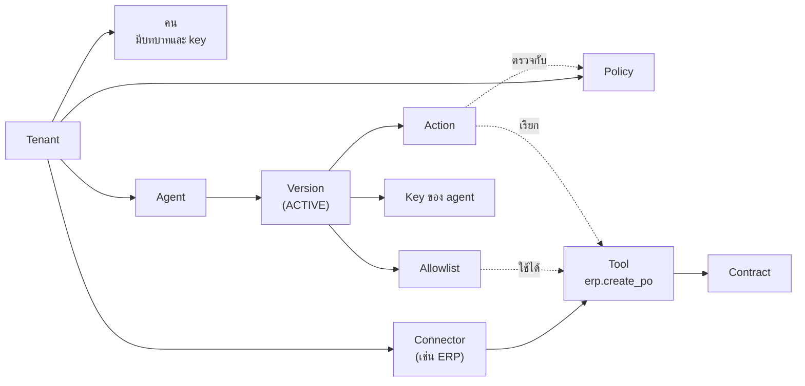
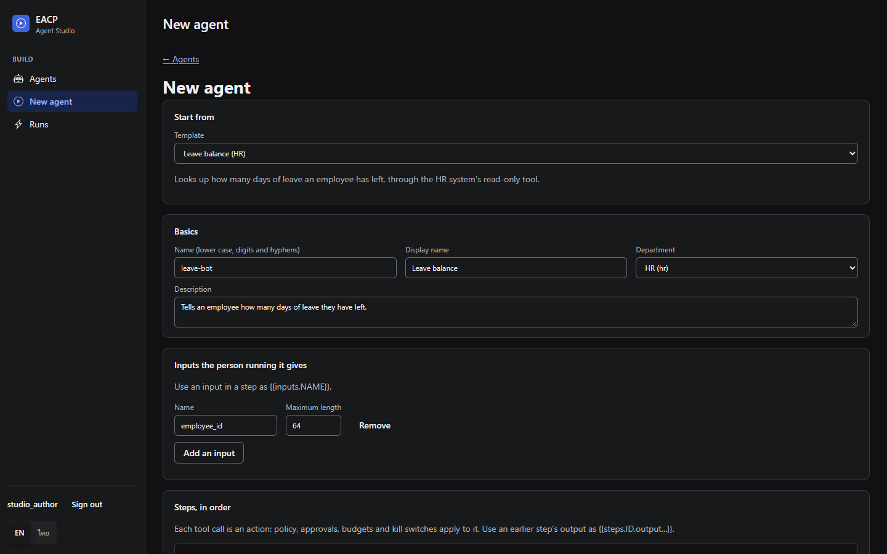
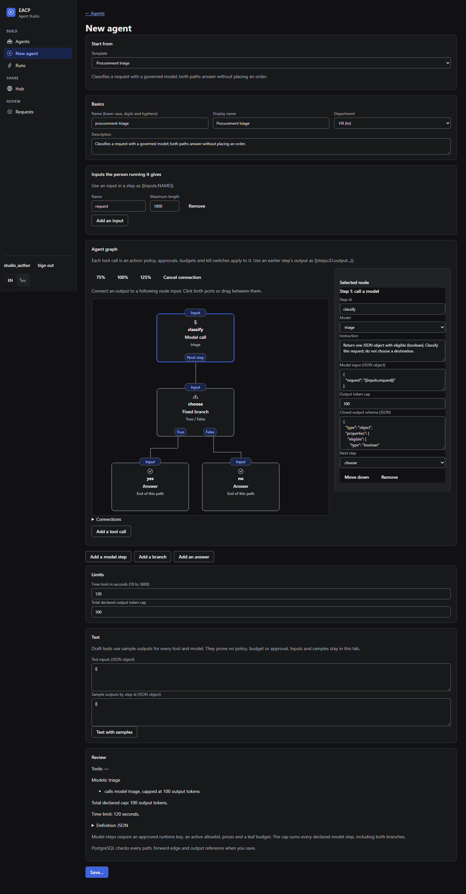
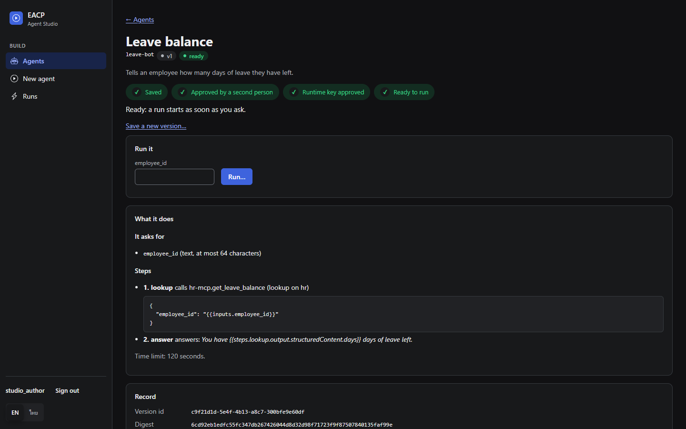
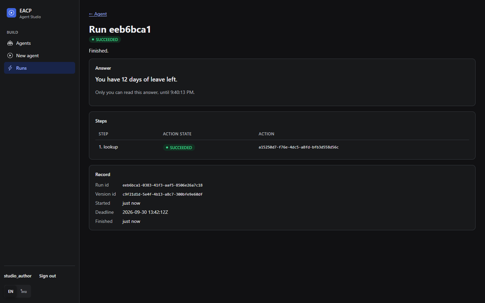
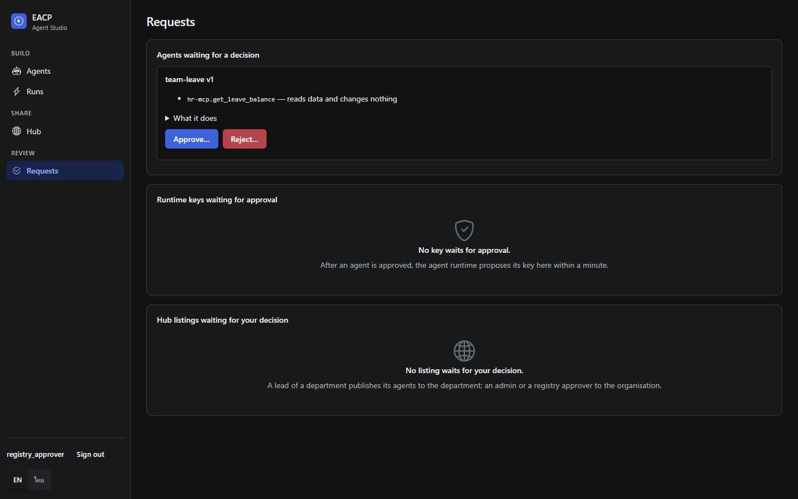
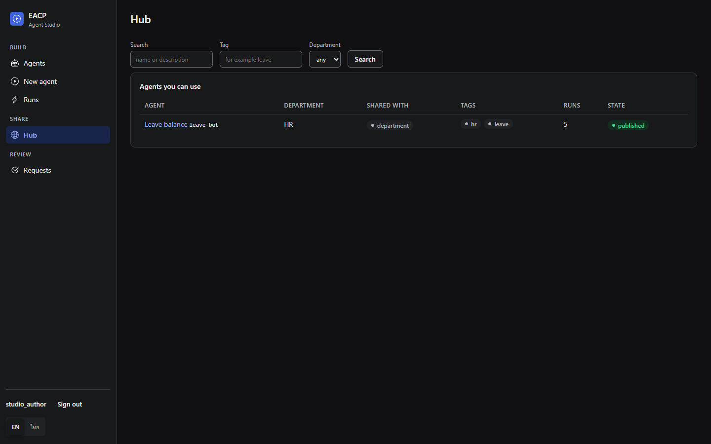
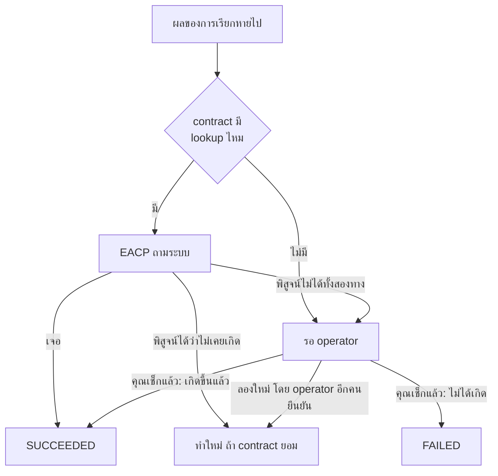

[English](USER_GUIDE.md) | [ไทย](USER_GUIDE.th.md)

# คู่มือการใช้งาน EACP

คู่มือนี้เขียนให้คนที่ใช้ EACP ทุกวัน แบ่งตามหน้าที่ อ่านเฉพาะส่วนของงานคุณก็พอ

| คุณคือ | งานที่ทำ | อ่านส่วนนี้ |
|---|---|---|
| ผู้ดูแลระบบ หรือทีม platform | ตั้งค่าคน ระบบ agent policy และงบ | [สำหรับผู้ดูแลระบบ](#สำหรับผู้ดูแลระบบ) |
| นักพัฒนา agent | ให้ agent ส่งคำขอและเรียกใช้โมเดล | [สำหรับนักพัฒนา-agent](#สำหรับนักพัฒนา-agent) |
| พนักงานที่สร้าง agent ให้ทีม | บันทึก ขออนุมัติ และรัน agent ของ Agent Studio | [สำหรับพนักงาน: Agent Studio](#สำหรับพนักงาน-agent-studio) |
| ผู้อนุมัติ | โหวตคำขอที่ต้องให้คนตัดสิน | [สำหรับผู้อนุมัติ](#สำหรับผู้อนุมัติ) |
| operator หรือคนเข้าเวร | ปิดเรื่องที่ไม่รู้ผล หยุดสิ่งที่ผิดปกติ และดูแล incident | [สำหรับ-operator](#สำหรับ-operator) |

ทุกคนควรอ่าน[ก่อนเริ่ม](#ก่อนเริ่ม)ก่อน ถ้าแค่อยากเห็น EACP ทำงาน ไปที่
[ลองใช้เลยใน README](../README.th.md) หรือ[ตัวอย่าง](../examples/README.th.md) จะเร็วกว่า

ทุกคำสั่งในคู่มือนี้ใช้ stack `docker compose` บนเครื่อง API อยู่ที่ `http://127.0.0.1:8080` และ LLM gateway อยู่ที่
`http://127.0.0.1:8083` ถ้าใช้ Windows ให้รันใน Git Bash และรัน `export MSYS_NO_PATHCONV=1` ก่อน ไม่อย่างนั้น Git Bash
จะแปลงค่าอย่าง `/v1/me` หรือ `/eacpctl` เป็น path ของ Windows

## ก่อนเริ่ม

### คำที่ต้องรู้

| คำ | หมายถึง |
|---|---|
| Tenant | องค์กรหนึ่งองค์กร แต่ละ tenant ไม่เห็นข้อมูลของกันและกัน |
| Principal | คน (หรือ service account) ที่มี key และมีบทบาท |
| Agent | โปรแกรม AI ที่ลงทะเบียนไว้ มีหลาย *version* และมีแค่ version ที่ `ACTIVE` เท่านั้นที่สั่งงานได้ |
| Key | สิ่งที่ใช้ยืนยันตัวตน ส่งมาเป็น `Authorization: Bearer <key>` agent ได้ key ของ EACP เป็นของตัวเอง ไม่เคยได้รหัสผ่านของระบบจริง |
| Connector | ระบบที่ EACP ไปเรียกได้ เช่น ERP รหัสผ่านของมันอยู่ใน execution worker ที่เดียว |
| Tool | งานหนึ่งอย่างที่ connector ทำได้ เช่น `erp.create_po` |
| Contract | กติกาของ tool แต่ละตัว ว่ามีผลแบบไหน ลองซ้ำได้อย่างไรให้ปลอดภัย และตามเช็กทีหลังได้ไหมว่าทำไปแล้วหรือยัง |
| Allowlist | รายการ tool และโมเดลที่ agent version หนึ่งใช้ได้ |
| Policy | กฎที่ตัดสินคำขอแต่ละรายการ ว่าให้ผ่าน ไม่ให้ผ่าน หรือต้องถามคนก่อน |
| Action | คำขอหนึ่งรายการจาก agent ที่จะใช้ tool มันจะเปลี่ยนสถานะไปเรื่อยๆ จนจบ |
| Evidence | ทุกอย่างที่บันทึกไว้ของ action หนึ่งรายการ ทั้งผลตัดสิน คะแนนโหวต แต่ละครั้งที่ลองทำ และ audit trail ที่ร้อยต่อกันด้วย hash |

ภาพรวมว่าแต่ละอย่างเชื่อมกันอย่างไร



### ใครทำอะไร

EACP มีหกบทบาท คนหนึ่งถือได้หลายบทบาท แต่หลายขั้นตอนต้องใช้**คนสองคนที่ไม่ใช่คนเดียวกัน**
จะได้ไม่มีใครให้สิทธิ์ตัวเอง หรืออนุมัติงานที่ตัวเองทำได้

| บทบาท | ทำอะไรได้ |
|---|---|
| `admin` | เพิ่มคน เสนอและอนุมัติการให้บทบาท เขียน policy จัดการงบ ทุก tenant มี admin อย่างน้อยสองคน |
| `registry_editor` | ลงทะเบียน agent, version, connector, tool และ contract เสนอ allowlist และ key |
| `registry_approver` | เปิดใช้สิ่งที่ editor เสนอ ทั้ง allowlist, contract, agent version และ key ของ agent |
| `operator` | ดู action และ evidence ปิดเรื่องที่ไม่รู้ผล ใช้ kill switch เปิดปิด circuit และดูแล incident |
| `approver` | โหวตคำขอที่ policy ส่งมาให้คนตัดสิน |
| `auditor` | ดู action และ evidence และตรวจ audit chain |

กฎสองคนที่จะเจอบ่อย

| ขั้นตอน | ใครทำครึ่งหลัง |
|---|---|
| ให้บทบาทกับใครสักคน | admin อีกคนอนุมัติ |
| ออก key | อีกคนอนุมัติ (ถ้าเป็น key ของ agent ต้องเป็น `registry_approver`) |
| เปิดใช้ allowlist, contract หรือ agent version | `registry_approver` ที่ไม่ได้เป็นคนเขียน |
| พา agent กลับมาหลัง fleet pause หรือการกักกัน | `registry_approver` |
| เปิดใช้ policy | admin อีกคน |
| เพิ่มวงเงินงบ | admin อีกคน |
| ยกเลิก kill switch | operator อีกคน |
| สั่งลองใหม่กับ action ที่ไม่รู้ผล | operator อีกคนยืนยัน |
| ใช้ change set ของ Governance-as-Code | อีกคนอนุมัติ |

กฎพวกนี้บังคับอยู่ในฐานข้อมูล สคริปต์หรือการเรียก API ตรงๆ ก็ข้ามไม่ได้

### เปิด EACP

ต้องมี Docker ที่มี Compose v2 และ Go (เวอร์ชันตาม `go.mod`) แล้วรันจากโฟลเดอร์หลักของ repo

```bash
python3 deployments/docker/secrets/prepare_fakeerp_token.py
docker compose up -d --build --wait
curl -s http://127.0.0.1:8080/readyz
```

stack นี้มีไว้พัฒนา มี Fake ERP, LLM ปลอม และ secret สำหรับทดสอบ ถ้าจะขึ้น cluster จริงให้ใช้ Helm chart ตาม
[KUBERNETES.md](KUBERNETES.md)

ถ้าอยากลองทุกบทบาทโดยไม่ต้องตั้งค่าเอง ให้รัน `bash examples/setup.sh` ครั้งเดียว มันจะสร้าง tenant ชื่อ `examples`
มีคนครบทุกบทบาท และเขียน key ของทุกคนลง `examples/.env` (ไฟล์นี้ git ไม่เก็บ และไม่มีการพิมพ์ key ออกมา)
คู่มือที่เหลือใช้ชื่อคนและชื่อตัวแปร key ใน `.env` ชุดนี้ คือ alice กับ bob (admin, `ADMIN_KEY` และ `ADMIN2_KEY`)
erin (editor, `EDITOR_KEY`) rita (registry approver, `REGISTRY_APPROVER_KEY`) amy กับ ben (ผู้อนุมัติ, `APPROVER_KEY`
และ `APPROVER2_KEY`) otto กับ olga (operator, `OPERATOR_KEY` และ `OPERATOR2_KEY`) และ agent ชื่อ `procurement-bot`
(`AGENT_KEY`)

### ติดตั้ง eacpctl

`eacpctl` คือเครื่องมือ command line ของ EACP build ครั้งเดียวพอ

```bash
go build -o bin/eacpctl ./cmd/eacpctl
export EACP_API_URL=http://127.0.0.1:8080
export EACP_API_KEY="$OPERATOR_KEY"   # key ของคนที่กำลังทำงาน
bin/eacpctl agent list
```

`eacpctl` ส่ง key จาก `EACP_API_KEY` ไปให้ API แล้วพิมพ์ JSON ที่ได้กลับมา อะไรที่ไม่มีคำสั่งเฉพาะ ก็เรียกผ่าน
`bin/eacpctl api GET /v1/me` ได้เสมอ ถ้าจะโหลด key ของตัวอย่างเข้า shell โดยไม่ให้พิมพ์ออกมา ให้รัน
`set -a; . examples/.env; set +a`

## สำหรับผู้ดูแลระบบ

ขั้นตอนด้านล่างคือสิ่งที่ `examples/setup.sh` ทำ ถ้าอยากดูแบบครบและรันได้จริง อ่าน[โค้ดของมัน](../examples/setup/main.go)

### สร้าง tenant

การสร้าง tenant ใหม่เป็นขั้นตอนเดียวที่ไม่ผ่าน API เพราะมันสร้าง admin สองคนแรก ตอนนั้นยังไม่มีใครอนุมัติอะไรได้
ต้องใช้สิทธิ์เจ้าของฐานข้อมูล ซึ่ง container `migrate` ใน stack มีอยู่แล้ว

เริ่มจากสร้าง key ให้ admin ทีละคน กำหนด id ของ tenant เองก่อน เพราะ key หนึ่งผูกกับ tenant เดียว

```bash
TENANT=$(python3 -c 'import uuid; print(uuid.uuid4())')
docker compose run --rm migrate /eacpctl key generate --kind principal --tenant "$TENANT"
docker compose run --rm migrate /eacpctl key generate --kind principal --tenant "$TENANT"
```

แต่ละครั้งจะได้ `key`, `credential_id` และ `hash` ส่ง key ให้ admin แต่ละคนแบบส่วนตัว EACP เก็บแค่ hash
จากนั้นสร้าง tenant พร้อม admin ทั้งสองคน

```bash
docker compose run --rm migrate /eacpctl tenant create --id "$TENANT" --slug acme --name "Acme" \
  --admin "name=alice,subject=alice@acme.example,credential=<alice's credential_id>,hash=<alice's hash>" \
  --admin "name=bob,subject=bob@acme.example,credential=<bob's credential_id>,hash=<bob's hash>"
```

### เพิ่มคนและให้บทบาท

ทุกขั้นตอนคือ admin คนหนึ่งเสนอ อีกคนอนุมัติ ในฐานะ alice ให้เพิ่มคนแล้วเสนอบทบาท

```bash
EACP_API_KEY=$ADMIN_KEY bin/eacpctl api POST /v1/principals \
  '{"kind":"human","name":"erin","subject":"erin@acme.example","display_name":"Erin"}'
EACP_API_KEY=$ADMIN_KEY bin/eacpctl api POST /v1/role-grants \
  '{"principal_id":"<erin id>","role":"registry_editor"}'
```

แล้วให้ bob อนุมัติ: `EACP_API_KEY=$ADMIN2_KEY bin/eacpctl api POST /v1/role-grants/<grant id>/approve`

key ของคนก็ทำแบบเดียวกัน สร้างด้วย `eacpctl key generate --kind principal` เอา `credential_id` กับ `hash`
ไปลงทะเบียนที่ `POST /v1/credentials` (`{"id", "kind":"pk", "principal_id", "hash", "expires_in_days"}`
อายุไม่เกิน 90 วัน) แล้วให้ admin อีกคนอนุมัติที่ `POST /v1/credentials/<id>/approve`

### เชื่อมระบบ

connector คือระบบที่ EACP ไปเรียกได้ ในฐานะ `registry_editor` ให้ลงทะเบียนมัน แล้วเพิ่ม tool ที่มันมีทีละตัว

```bash
export EACP_API_KEY=$EDITOR_KEY
bin/eacpctl connector register --name erp --endpoint http://fakeerp:8090 --secret-ref fakeerp
bin/eacpctl api POST /v1/connectors/<connector id>/tools '{"name":"create_po"}'
```

รหัสผ่านของระบบไม่เคยผ่าน API `--secret-ref` เป็นแค่ชื่อที่ชี้ไปยังรายการในไฟล์ secret ของ execution worker
(`EACP_CONNECTOR_SECRETS_FILE`) รายการนั้นบอกค่าสำหรับ tenant นี้ ชื่อนี้ และ host เดียว มีแค่ worker ที่อ่านไฟล์นี้
worker ยังขอ token อายุสั้นเองได้ด้วย (OAuth 2.0, Vault, SPIFFE, AWS และ GCP) ดูรายละเอียดที่
[ADR-019](adr/ADR-019-credential-custody.md)

ต่อไป tool ต้องมี contract นี่คือที่ที่คุณบอก EACP ตามจริงว่า tool ทำงานอย่างไร เพราะ EACP ใช้ข้อมูลนี้ตัดสินว่า
ลองซ้ำได้หรือไม่

```json
{
  "side_effects": ["IRREVERSIBLE_WRITE", "FINANCIAL"],
  "idempotency_mode": "native",
  "idempotency_key_field": "Idempotency-Key",
  "reconciliation_lookup": "by_operation_key",
  "reconciliation_consistency": "strong",
  "proof_standard": "authoritative",
  "no_effect_errors": ["validation"],
  "max_attempts": 2,
  "timeout_ms": 3000,
  "cost_unit": "THB",
  "cost_amount_field": "amount",
  "cost_unit_field": "currency"
}
```

| ช่อง | ใส่อะไร |
|---|---|
| `side_effects` | `READ_ONLY` (ต้องอยู่ตัวเดียว) หรือเลือกจาก `REVERSIBLE_WRITE`, `IRREVERSIBLE_WRITE`, `EXTERNAL_COMMUNICATION`, `FINANCIAL`, `ADMINISTRATIVE` |
| `idempotency_mode` | `native` ถ้าระบบรับ idempotency key ทาง header (ใส่ชื่อ header ใน `idempotency_key_field`) `correlation_only` ถ้าระบบแค่เก็บเลขอ้างอิงที่ส่งไปใน body (`correlation_field`) นอกนั้นใส่ `none` |
| `reconciliation_lookup` | `by_operation_key` ถ้า EACP ถามระบบทีหลังได้ว่าทำไปแล้วหรือยัง ถ้าไม่ได้ใส่ `none` |
| `reconciliation_consistency` | `strong` ถ้าคำตอบนั้นเป็นปัจจุบันทันที `eventual` ถ้าอาจช้ากว่าความจริง `none` ถ้าไม่มี lookup |
| `proof_standard` | `authoritative` เฉพาะเมื่อ "ไม่พบ" แปลว่าไม่เคยเกิดขึ้นจริงๆ (ต้องมี lookup แบบ strong) ถ้าไม่ใช่ใส่ `best_effort` ถ้าไม่มี lookup ใส่ `none` |
| `no_effect_errors` | error class ที่ระบบตอบกลับมาเฉพาะตอนที่ยังไม่ได้ทำอะไรเลย |
| `max_attempts` | 1 ถึง 10 งานเขียนข้อมูลที่ idempotency เป็น `none` ต้องเป็น 1 |

ให้ editor เป็นคนเสนอ แล้วให้ `registry_approver` ที่ไม่ใช่คนเขียนเป็นคนเปิดใช้

```bash
bin/eacpctl api POST /v1/tools/<tool id>/contracts "$(cat contract.json)"
EACP_API_KEY=$REGISTRY_APPROVER_KEY bin/eacpctl api POST /v1/tools/<tool id>/contract '{"contract_id":"<contract id>"}'
```

ถ้าคุณเขียนฝั่งระบบที่ connector เรียกเอง รูปแบบที่ต้องรองรับมีไม่มาก worker จะส่ง `POST {endpoint}/v1/execute`
พร้อม `{"tool": ..., "payload": ...}` header `X-EACP-Tenant-ID` credential และ idempotency key ถ้าโหมดเป็น `native`
ถ้าสำเร็จให้ตอบ 2xx พร้อม `external_reference` ที่ไม่ว่าง ถ้าไม่สำเร็จให้ตอบ non-2xx พร้อม `error_class`
ส่วน lookup ให้ตอบ `GET {endpoint}/v1/operations/{operation key}` ด้วย 200 พร้อมเลขอ้างอิง หรือ 404 พร้อม
`{"error_class":"not_found"}`

### ลงทะเบียน agent

ในฐานะ editor ให้ลงทะเบียน agent กับ version แล้วเสนอว่า version นั้นใช้อะไรได้บ้าง allowlist ระบุได้ทั้ง tool และโมเดล
แต่โมเดลต้องลงทะเบียนก่อน คำสั่งแรกลงทะเบียน `sonnet` ซึ่งในตัวอย่างนี้ใช้ LLM ปลอมของ stack พัฒนา ส่วน key
ของผู้ให้บริการโมเดลใส่ในไฟล์ secret ของ LLM gateway (`EACP_LLM_SECRETS_FILE`) ไม่ส่งผ่าน API

```bash
bin/eacpctl llm-model register --name sonnet --provider anthropic --base-url http://fakellm:8093   --upstream claude-fake --secret-ref fakellm --max-output-tokens 4096
bin/eacpctl agent register --name procurement-bot --display-name "Procurement bot" \
  --env production --risk high --owner-principal <owner id>
bin/eacpctl api POST /v1/agents/<agent id>/versions '{"runtime":"python","code_ref":"git:abc123"}'
bin/eacpctl api POST /v1/agent-versions/<version id>/allowlists '{"tools":["erp.create_po"],"models":["sonnet"]}'
```

`registry_approver` ที่ไม่ได้เขียน allowlist นี้เป็นคนเปิดใช้มัน แล้วค่อยเปิดใช้ version

```bash
EACP_API_KEY=$REGISTRY_APPROVER_KEY bin/eacpctl api POST /v1/agent-versions/<version id>/allowlist '{"allowlist_id":"<allowlist id>"}'
EACP_API_KEY=$REGISTRY_APPROVER_KEY bin/eacpctl api POST /v1/agent-versions/<version id>/transitions '{"to":"ACTIVE","reason":"reviewed"}'
```

สุดท้าย agent ต้องมี key สร้างด้วย `eacpctl key generate --kind agent` ลงทะเบียนที่ `POST /v1/credentials`
(ใส่ `"kind":"ak"` และ `"agent_version_id"`) แล้วให้ `registry_approver` อนุมัติ ส่ง key ให้ runtime ของ agent
แบบ secret นี่คือ credential อย่างเดียวที่ agent จะมี

ถ้าจะเปลี่ยน agent ไปใช้ version ใหม่อย่างปลอดภัย ให้เปิด release (`eacpctl release open`) แทนการเปิด version ใหม่
คู่กับตัวเก่า release จะเก็บผลประเมิน ปล่อย canary ให้ traffic บางส่วนก่อน และถอยกลับเองถ้า canary หลุดเกณฑ์
แต่ละขั้นอธิบายไว้ใน [ADR-018](adr/ADR-018-release-and-evaluation.md)

### เขียน policy

policy คือรายการกฎ สำหรับแต่ละ action EACP ใช้**กฎแรกที่ตรง** ถ้าไม่มีกฎไหนตรงเลย action นั้นจะถูกปฏิเสธ
ตัวอย่างนี้ส่งการซื้อยอดสูงไปให้ผู้อนุมัติสองคน และปล่อยที่เหลือ

```json
{"format_version": 1, "rules": [
  {"id": "high-value", "match": {"operation": "purchase_high_value"}, "verdict": "escalate",
   "reason": "a high-value purchase needs two approvers",
   "approval": {"quorum": 2, "eligible_roles": ["approver"], "ttl_seconds": 3600}},
  {"id": "routine", "match": {"target": "erp"}, "verdict": "allow", "reason": "a routine purchase"},
  {"id": "llm", "match": {"operation": "llm.generate"}, "verdict": "allow", "reason": "model use"}]}
```

กฎหนึ่งข้อจับคู่ได้จาก `subject`, `operation`, `target`, `tool`, `risk_class` และ `side_effect_class`
ผลตัดสินมี `allow`, `warn`, `deny`, `escalate` (ถามคน กำหนด quorum ได้ 1 ถึง 5 และให้เวลาเท่าไร) และ `transform`
ถ้า agent เรียกโมเดลผ่าน gateway ให้เก็บกฎ `llm` ข้อสุดท้ายไว้ เพราะการเรียกโมเดลก็ใช้ policy ชุดเดียวกัน

admin คนหนึ่งบันทึก policy แล้วให้ admin อีกคนเปิดใช้

```bash
EACP_API_KEY=$ADMIN_KEY bin/eacpctl api POST /v1/policies "{\"content\": $(cat policy.json)}"
EACP_API_KEY=$ADMIN2_KEY bin/eacpctl api POST /v1/policies/<policy id>/activate '{"reason":"quarterly review"}'
```

policy ใหม่มีผลทันทีที่เปิดใช้ action ที่ผ่าน policy เก่าไปแล้วแต่ยังไม่ได้ทำ จะถูกตรวจใหม่กับ policy ใหม่ก่อนทำ

### ตั้งงบ

งบคือเพดานที่ agent ใช้จ่ายได้ในหน่วยหนึ่ง (เช่น THB สำหรับการซื้อ หรือ USD สำหรับโมเดล) ค่าใช้จ่ายของแต่ละ action
มาจากช่องที่ contract ระบุไว้ EACP จองยอดไว้ก่อนเริ่มทำ และปฏิเสธ action ด้วยเหตุผล `exceeded` ถ้าจะเกินเพดาน

```bash
EACP_API_KEY=$ADMIN_KEY bin/eacpctl api POST /v1/budgets '{"name":"procurement-thb","unit":"THB","agent_id":"<agent id>"}'
EACP_API_KEY=$ADMIN_KEY bin/eacpctl api POST /v1/budgets/<budget id>/limit '{"limit":"10000000","reason":"FY budget"}'
EACP_API_KEY=$ADMIN2_KEY bin/eacpctl api POST /v1/budget-limit-changes/<change id>/approve '{"reason":"agreed"}'
```

ถ้า contract ระบุค่าใช้จ่ายไว้ แต่ agent ไม่มีงบในหน่วยนั้น action ของมันจะถูกปฏิเสธด้วย `no_account`

### เก็บทุกอย่างไว้ใน Git

แทนที่จะเรียก API ทีละขั้น คุณเขียน connector, agent, policy, งบ และคน เป็น bundle แบบ YAML ได้ รีวิวเหมือนโค้ด
แล้วให้ EACP วางแผนการเปลี่ยนแปลงให้ ดู bundle ทั้งชุดได้ใน[ตัวอย่างที่ 03](../examples/03-governance-as-code/README.th.md)
รอบการทำงานเป็นแบบนี้

```bash
bin/eacpctl bundle validate -C ./bundle
bin/eacpctl bundle plan -C ./bundle --dry-run
bin/eacpctl bundle deploy -C ./bundle
EACP_API_KEY=$REGISTRY_APPROVER_KEY bin/eacpctl bundle approve <change set id>
bin/eacpctl bundle drift -C ./bundle
```

`plan --dry-run` แสดงว่าจะมีอะไรเปลี่ยนบ้างโดยไม่บันทึกอะไร `deploy` ส่ง change set เข้าไป แต่ยังไม่มีอะไรเปลี่ยนจนกว่าอีกคนจะอนุมัติ ถ้า tenant เปลี่ยนไประหว่างนั้น change set
จะหมดอายุและไม่ทำอะไรเลย bundle ไม่เก็บค่า secret และไม่ลบอะไรทิ้ง `--prune` ทำได้แค่ปลด version ที่ไม่ได้ใช้งาน
เพิกถอน contract และบทบาท และเอาคนออกจากกลุ่ม ส่วน `drift` บอกว่าตรงไหนของ tenant ไม่ตรงกับ bundle แล้ว

## สำหรับนักพัฒนา agent

agent ของคุณได้ key ของ EACP หนึ่งอัน ไม่ได้ถือรหัสผ่าน ERP หรือ key ของผู้ให้บริการโมเดล มันทำได้แค่ขอ
EACP เป็นคนตัดสิน และ worker เป็นคนลงมือทำ

### ส่งคำขอ

ส่ง `POST /v1/actions` ด้วย key ของ agent และใส่ header `Idempotency-Key`

```bash
curl -sS -X POST "http://127.0.0.1:8080/v1/actions?wait=2s" \
  -H "Authorization: Bearer $AGENT_KEY" \
  -H "Idempotency-Key: po-2026-0042" \
  -H "Content-Type: application/json" \
  -d '{"subject": "sam@examples.test", "operation": "purchase_high_value", "target": "erp",
       "tool": "erp.create_po", "tool_schema_version": "1", "resource": "po",
       "payload": {"amount": 250000, "currency": "THB", "supplier": "ACME Office Supply", "order": "po-2026-0042"}}'
```

| ช่อง | ความหมาย |
|---|---|
| `subject` | agent ทำงานนี้แทนใคร |
| `operation`, `target`, `resource` | คำขอนี้เป็นงานประเภทไหน policy ใช้ช่องพวกนี้จับคู่กฎ |
| `tool`, `tool_schema_version` | tool ที่จะใช้ เขียนเป็น `connector.tool` ต้องอยู่ใน allowlist ของ version นี้ |
| `payload` | ข้อมูลที่ส่งให้ tool ผู้อนุมัติเห็นข้อมูลนี้ตามตัวอักษร และระบบก็ได้รับข้อมูลนี้ตามตัวอักษร |
| `lifetime_seconds` | ไม่ใส่ก็ได้ ให้ action รอได้นานแค่ไหนก่อนหมดอายุ |

`?wait=2s` ให้ EACP ถือคำตอบไว้ได้นานสุดเท่านั้น (ไม่เกินหนึ่งนาที) ถ้าตัดสินได้เร็ว ก็ได้คำตอบในครั้งเดียว
EACP ตอบ 200 ถ้า action จบแล้ว และตอบ 202 ถ้ายังไม่จบ ทั้งสองแบบจะได้ `id` กับ `state` ของ action กลับมา

### อ่านผล

ตามดู action ด้วย `GET /v1/actions/<id>` และ key เดิม สถานะที่จะเจอมีดังนี้

| สถานะ | แปลว่าอะไรสำหรับคุณ |
|---|---|
| `RECEIVED` | EACP กำลังตรวจกับ policy |
| `PENDING_APPROVAL` | ต้องรอคนโหวต `approval_request_id` บอกว่าเป็นคำขออนุมัติรายการไหน |
| `AUTHORIZED`, `QUEUED` | ผ่านแล้ว รอ worker มารับ |
| `LEASED`, `EXECUTING` | worker กำลังทำอยู่ |
| `RETRY_WAIT` | ระบบปฏิเสธด้วย error ที่ยืนยันว่ายังไม่ได้ทำอะไร worker จะลองใหม่ |
| `UNKNOWN_OUTCOME`, `RECONCILING` | งานอาจเกิดขึ้นแล้วหรือยังไม่เกิดก็ได้ EACP กำลังถามระบบอยู่ |
| `NEEDS_HUMAN_RESOLUTION` | EACP พิสูจน์ไม่ได้ทั้งสองทาง operator จะเป็นคนตัดสิน |
| `SUCCEEDED` | เสร็จแล้ว `external_reference` คือเลขอ้างอิงจากระบบ เช่น เลขใบสั่งซื้อ |
| `FAILED` | ไม่ได้เกิดขึ้น หรือ operator ตัดสินว่าไม่ได้เกิดขึ้น |
| `DENIED` | ถูกปฏิเสธก่อนจะได้ทำอะไร `state_reason` บอกเหตุผล |
| `CANCELLED`, `EXPIRED` | มีคนยกเลิก หรือรอนานเกินอายุของมัน |

เหตุผลที่เจอบ่อยของ `DENIED` คือกฎใน policy (ตาม `reason` ของกฎ) `tool_not_in_allowlist`, `unknown_tool`,
`no_active_contract`, `agent_version_not_active`, `tool_quarantined` และ `exceeded` (เกินงบ)

ถ้าจะหยุด action ให้ส่ง `POST /v1/actions/<id>/cancel` พร้อม `{"reason": "..."}` ถ้า worker ยังไม่ได้เริ่ม action
จะถูกยกเลิกทันที ถ้าเริ่มไปแล้ว worker จะได้รับคำสั่งให้หยุด และผลที่ได้คือสิ่งที่เกิดขึ้นจริง

### ลองซ้ำอย่างปลอดภัย

ถ้าจะลองส่งซ้ำ ให้ใช้ **`Idempotency-Key` เดิมและ body เดิม** EACP จะตอบกลับด้วย action เดิม ไม่สร้างใหม่
เน็ตฝั่งคุณจะหลุดกี่ครั้งก็ไม่มีทางได้ของสองชิ้น

| คำตอบ | ต้องทำอะไร |
|---|---|
| 409 `idempotency_conflict` | คุณใช้ key เดิมกับ body ที่ต่างไป คำขอใหม่ต้องใช้ key ใหม่ |
| 429 `admission_limit` | มีคำขอพร้อมกันมากเกินไป รอตาม `Retry-After` แล้วส่งคำขอเดิมอีกครั้ง |
| 503 `governance_unavailable` | ตัวตัดสิน policy ล่มอยู่ action ยังถูกเก็บไว้ ส่งคำขอเดิมอีกครั้งหลัง `Retry-After` |
| 401 | key ผิด หมดอายุ หรือถูกเพิกถอน |

อย่าส่งซ้ำกับ action ที่จบไปแล้ว และอย่าส่งซ้ำด้วย key ใหม่ เพราะนั่นคือคำขอใหม่ การลองเรียกระบบซ้ำเป็นหน้าที่ของ
worker และ worker ทำตาม contract

### เรียกโมเดลผ่าน gateway

ชี้ SDK ไปที่ gateway และใส่ key ของ EACP ของ agent แทน key ของผู้ให้บริการ ชื่อโมเดลคือชื่อที่ผู้ดูแลระบบลงทะเบียนไว้
(ด้วย `eacpctl llm-model register`) และต้องอยู่ใน allowlist ของ agent

```python
import anthropic

client = anthropic.Anthropic(api_key=AGENT_KEY, base_url="http://127.0.0.1:8083")
message = client.messages.create(
    model="sonnet", max_tokens=256,
    messages=[{"role": "user", "content": "Summarise purchase order po-1042 in one line."}],
)
```

gateway รองรับ Anthropic Messages API (`/v1/messages`) และ OpenAI Chat Completions API (`/v1/chat/completions`)
รวมถึงแบบ streaming ก่อนส่งอะไรออกไป มันตรวจ allowlist, policy (policy เห็นแค่ชื่อโมเดลและขนาด ไม่เห็น prompt ของคุณ)
kill switch และงบ ถ้าถูกปฏิเสธจะได้ 403 และคำขอไม่ถึงผู้ให้บริการเลย gateway ไม่เก็บ prompt หรือคำตอบไว้
ลองดูตั้งแต่ต้นจนจบได้ใน[ตัวอย่างที่ 02](../examples/02-llm-gateway/README.th.md)

## สำหรับพนักงาน: Agent Studio

### สร้าง agent จาก template

Agent Studio ช่วยให้คุณสร้าง agent เล็กๆ ให้ทีมได้โดยไม่ต้องเขียนโค้ด เปิด `http://127.0.0.1:8080/studio/` แล้วใส่ key
ของคุณเอง คุณต้องมีบทบาท `studio_author` และอยู่ในกลุ่มของแผนก (ผู้ดูแลระบบตั้งค่าให้ทั้งสองอย่าง) เลือก **agent ใหม่**
template ยอดวันลาจะกรอกฟอร์มให้: ข้อมูลที่ต้องกรอก (`employee_id`) ขั้นที่เรียกเครื่องมือ `get_leave_balance` แบบอ่านอย่างเดียว
ของระบบ HR และคำตอบ



แต่ละขั้นระบุเครื่องมือ สิ่งที่มันทำ (`operation`, `target`, `resource`) และข้อมูลที่ส่ง ใช้ `{{inputs.NAME}}` แทนสิ่งที่คนรันกรอก
และ `{{steps.ID.output...}}` แทนผลของขั้นก่อนหน้า **บันทึก** จะสร้างเวอร์ชันที่แก้ไขไม่ได้ ถ้าจะเปลี่ยนภายหลัง ให้บันทึกเวอร์ชันใหม่

### Model, branch และการทดสอบ

เลือก template คัดกรองคำขอลาหรือคำขอจัดซื้อเพื่อใช้ builder เต็มรูปแบบ ฟอร์มมี **ข้อมูลพื้นฐาน**, **อินพุต**,
**ขั้นตอน**, **ทดสอบ** และ **ตรวจทาน** agent ยอดวันลาเดิมยังแก้ไขได้ และต้องเลือก **เปิดใช้ตัวสร้างเต็มรูปแบบ**
เพื่อแปลง draft เป็น schema v2 อย่างชัดเจน

Full builder แสดงโหนดที่เชื่อมต่อกันข้างแผงรายละเอียดของโหนดที่เลือก คลิกโหนดเพื่อแก้ไข แล้วคลิกจุดออกและจุดเข้าของโหนดถัดไป หรือลากระหว่างจุดเพื่อเชื่อมต่อ จุดออกของ branch ระบุ True และ False ใช้การซูมและเลื่อนเพื่อดูทั้งสองเส้นทาง เส้นเชื่อมต้องชี้ไปข้างหน้าสู่ ID ที่ไม่ซ้ำ ข้อผิดพลาดแสดงจนกว่าจะแก้ไข เวอร์ชันที่บันทึกแล้วแสดงกราฟสำหรับดูเท่านั้น Agent schema-v1 คงฟอร์มตามลำดับจนกว่าคุณจะเลือกเปิดใช้ full builder



ขั้น `llm` ระบุ model ที่ลงทะเบียน คำสั่ง อินพุต เพดาน token เอาต์พุต JSON schema แบบปิด และขั้นถัดไป
ขั้น `branch` เปรียบเทียบค่าคงที่หรือ reference ด้วย `eq`, `ne`, `lt`, `le`, `gt` หรือ `ge` แล้วไปยังปลายทาง
จริง/เท็จที่กำหนดไว้ ตัวเลขเปรียบเทียบอย่างแม่นยำ ค่า missing/null หรือชนิดที่ไม่ตรงกันทำให้ run ล้มเหลว model
ไม่เลือกปลายทางหรือ tool ทุกเส้นทางต้องจบด้วยคำตอบ และ reference ต้องมีค่าบนทุกเส้นทางที่มาถึงผู้ใช้ค่านั้น
ตรวจทานแสดง model/tool ทุกตัว รวมเส้นทางอื่น และเพดาน token ทั้งหมดที่ประกาศ

ใน **ทดสอบ** ใส่อินพุตและ JSON ตัวอย่างของ tool/model เพื่อลอง draft ในหน้าเว็บโดยไม่มีการเรียกจริง agent ของตน
ที่อนุมัติแล้วมี **ดูตัวอย่างเวอร์ชันที่อนุมัติแล้ว** ให้ยืนยันค่าใช้จ่าย model และใส่ตัวอย่างผล tool การดูตัวอย่างใช้
เวอร์ชันที่บันทึกและอนุมัติแล้ว เรียก model ผ่านการกำกับ และไม่ส่ง action ของ tool การแก้ draft ไม่เปลี่ยน preview
นี้ ตัวอย่างอยู่เฉพาะใน tab/run agent ที่ใช้ model ต้องมี key ที่อนุมัติแล้วและ leaf hard budget ที่มีวงเงินในหน่วยราคา
ของ model หากไม่มี budget จะปฏิเสธก่อนติดต่อ provider

หากมีการบันทึกอื่นทำให้ draft เก่า ฟอร์มจะเก็บ draft ไว้ ให้โหลดใหม่โดยตั้งใจ หรือเลือก **บันทึกเป็นสำเนา** แล้วยืนยัน
agent ใหม่ สำเนาต้องได้รับอนุมัติและมี key ของตัวเอง หน้า run แสดง node ที่ผ่านและ id ของ call/action ส่วน output
แบบมีชนิดของ model เป็นข้อมูลส่วนตัวของ runtime และล้างเมื่อ run จบ การกู้คืนรอ call ที่ admit แล้วโดยไม่ส่งใหม่
output ไม่ถูกต้องทำให้ล้มเหลวแบบปิด การ kill run/model ตัด call ที่กำลังทำงานและไม่ทำให้ run กลับมาทำต่อ

### ขออนุมัติ แล้วรัน

หลังบันทึก หน้าของ agent จะบอกว่าตอนนี้อยู่ขั้นไหนและใครต้องทำอะไรต่อ: ผู้อนุมัติทะเบียนที่ไม่ใช่คุณอนุมัติเครื่องมือที่มันขอใช้
agent runtime เสนอ key ของ agent ภายในหนึ่งนาที และผู้อนุมัติทะเบียนอนุมัติ key นั้น จากนั้นมันจะพร้อมและแสดงฟอร์มให้กรอกข้อมูล



การรันผ่านเส้นทางเดียวกับ action ของ agent ทุกตัว ทั้ง policy การอนุมัติ งบ และ kill switch มีผลทั้งหมด หน้าของการรันแสดง action
ของแต่ละขั้นและคำตอบ ซึ่งมีเพียงคุณที่อ่านได้ภายในหนึ่งชั่วโมง ถ้าการรันล้มเหลว หน้านี้จะบอกเหตุผลเป็นภาษาธรรมดา เช่น agent
ยังไม่มี key ที่อนุมัติแล้ว หรือไม่ทราบผลของขั้นหนึ่งและ operator ต้องตรวจสอบระบบก่อน



ผู้อนุมัติทะเบียนตัดสินในหน้าเดียวกันที่ **คำขอ**: agent ที่รอการตัดสินพร้อมเครื่องมือที่ขอใช้เป็นภาษาธรรมดา และ key ที่ agent
runtime เสนอ คุณตัดสิน agent ที่คุณบันทึกเองไม่ได้



### แบ่งปันใน Hub

จนกว่าจะเผยแพร่ มีเพียงคุณที่รัน agent ของคุณได้ ถ้าจะแบ่งปัน ให้เปิด agent แล้วใช้ **เผยแพร่ไปที่ฮับ…** เลือกแผนกของคุณหรือทั้งองค์กร
แล้วใส่แท็กสักเล็กน้อย หัวหน้าแผนกของคุณเผยแพร่ให้แผนก ส่วนผู้ดูแลระบบหรือผู้อนุมัติทะเบียนเผยแพร่ให้ทั้งองค์กร ไม่มีใครเผยแพร่ agent ของตัวเองได้

ทุกคนที่มันเข้าถึงจะพบมันใน **ฮับ** ค้นหาได้ตามชื่อ แท็ก หรือแผนก และรันมันในนามของตัวเอง ภายใต้ policy การอนุมัติ งบ และ kill switch
เช่นเดียวกับ action ทุกตัว ผู้เขียนยังคัดลอกมันไปไว้ในแผนกของตัวเองได้ สำเนาเริ่มต้นโดยไม่มีสิทธิ์ใด และรอผู้อนุมัติทะเบียนเหมือน agent ใหม่
เจ้าของ ผู้ดูแลระบบ หรือผู้อนุมัติของรายการนั้นเลิกแนะนำมันได้ (ยังรันได้) หรือถอนมันออก (ไม่เริ่มการรันใหม่)



ผู้ดูแลระบบกำหนดให้ใครเป็นหัวหน้าแผนกตอนเพิ่มคนนั้นเข้ากลุ่ม (`"lead": true` ใน `POST /v1/groups/{id}/members`) ถ้าจะเปลี่ยน
ให้ลบสมาชิกภาพออกแล้วเพิ่มใหม่ หัวหน้าแผนกตัดสินรายการของแผนกที่ **คำขอ**

## สำหรับผู้อนุมัติ

### โหวตคำขอ

เมื่อ policy ตัดสินว่า `escalate` action จะรออยู่ที่ `PENDING_APPROVAL` จนกว่าผู้อนุมัติจะเห็นด้วยครบ เปิด console ที่
`http://127.0.0.1:8080/ui/` ใส่ key ของคุณ แล้วไปที่ **Approvals** หรือใช้ API ก็ได้

```bash
bin/eacpctl api GET /v1/approvals
bin/eacpctl api GET /v1/approvals/<request id>
bin/eacpctl api POST /v1/approvals/<request id>/votes '{"decision":"APPROVE","reason":"within budget"}'
```

คำสั่งแรกแสดงคำขอที่คุณโหวตได้ คำสั่งที่สองแสดง `enforced_payload` ซึ่งเป็นข้อมูลที่จะส่งให้ระบบจริงถ้าอนุมัติ
ให้อ่านตรงนี้ อย่าอ่านแค่คำอธิบายของ agent ผลของการโหวตมี `request_state` จะกลายเป็น `GRANTED` เมื่อครบ quorum
ถ้ามีคนโหวต `DENY` แค่คนเดียว action ก็ถูกปฏิเสธ

EACP ไม่ให้คุณโหวต ถ้าคุณเป็นคนที่ agent ทำงานแทน เป็นเจ้าของ agent หรืออยู่ในกลุ่มเจ้าของ หรือเป็นคนตั้งค่า
agent version นั้น การอนุมัติใช้ได้ครั้งเดียว มันปล่อยให้ payload นี้ทำงานได้หนึ่งครั้งเท่านั้น และหมดอายุตาม
`ttl_seconds` ของ policy

## สำหรับ operator

### ดูภาพรวม

```bash
bin/eacpctl soc summary
bin/eacpctl action list --state NEEDS_HUMAN_RESOLUTION
bin/eacpctl action evidence <action id>
bin/eacpctl fleet status
```

`soc summary` คือภาพรวมในหน้าเดียว มีจำนวน agent แยกตามสถานะ incident ที่เปิดอยู่ kill ที่ยังมีผล circuit ที่เปิดอยู่
คำขอที่รออนุมัติ action ที่อยู่ในคิว กำลังทำ หรือรอคนตัดสิน และยอดใช้จ่ายของวันนี้ console ที่ `/ui/` แสดงข้อมูลเดียวกัน
และลิงก์ถึงกันได้ `action evidence` ให้เรื่องราวทั้งหมดของ action หนึ่งรายการ ทั้งผลตัดสิน คะแนนโหวต แต่ละครั้งที่ลองทำ
journal และผลตรวจ audit chain

### ปิดเรื่องที่ไม่รู้ผล

บางครั้งผลของการเรียกระบบหายไป เช่น timeout เน็ตหลุด หรือเครื่องดับ EACP ไม่เดา มันถามระบบก่อน (ถ้า contract
มี lookup) และจะมารอให้คุณตัดสินที่ `NEEDS_HUMAN_RESOLUTION` ก็ต่อเมื่อพิสูจน์อะไรไม่ได้เลย



เช็กในระบบจริงก่อน (ERP หรือเว็บของธนาคาร) แล้วบันทึกสิ่งที่พบ

```bash
bin/eacpctl action resolve <action id> --outcome succeeded --reason "PO 7731 exists in the ERP" \
  --external-reference PO-7731 --evidence "checked in the ERP UI"
bin/eacpctl action resolve <action id> --outcome failed --reason "no PO for this key in the ERP"
bin/eacpctl action resolve <action id> --outcome retry --reason "the ERP has no record; safe to send again"
```

`succeeded` กับ `failed` มีผลทันที ส่วน `retry` อาจส่งคำขอออกไปอีกรอบ จึงต้องรอ operator อีกคนรัน
`bin/eacpctl action confirm <action id> <resolution id> --reason ...` (หรือ `withdraw` เพื่อยกเลิก)

### หยุดทันที: kill switch

kill switch หยุดงานใหม่ได้ทันที เลือกเป้าหมายได้เป็น `tenant`, `team`, `agent`, `agent_version`, `action`,
`connector` หรือ `tool`, `model` สำหรับ gateway หรือ `run` หนึ่งครั้งของ Agent Studio (การรันนั้นจะล้มเหลวเป็น `killed`
และไม่ส่งขั้นใดอีก)

```bash
bin/eacpctl kill activate agent <agent id> --reason "sending odd purchase orders" --code security_incident
bin/eacpctl kill list
EACP_API_KEY=$OPERATOR2_KEY bin/eacpctl kill resume agent <agent id> --reason "fixed and reviewed"
```

code ที่ใช้ได้คือ `operator_request` (ค่าเริ่มต้น) `policy_violation`, `security_incident` และ
`error_budget_exhausted` ระหว่างที่ kill ยังมีผล จะไม่มีงานใหม่เริ่มเลย งานที่กำลังเรียกระบบอยู่จะถูกตัด และเพราะ EACP
ไม่รู้ว่ามันไปถึงไหนแล้ว งานนั้นจะกลายเป็นเรื่องที่ไม่รู้ผล แล้วปิดเรื่องตามหัวข้อก่อนหน้า การยกเลิก kill ต้องใช้ operator อีกคน

### ดูแล incident

EACP เปิด incident เองเมื่อมีเรื่องที่ต้องมีคนดู เช่น มีการ kill, circuit เปิด, action ไม่รู้ผล, MCP tool เปลี่ยน,
canary ถูกถอยกลับ หรือมีการแจ้งเตือนเรื่องค่าใช้จ่าย คุณเปิดเองก็ได้ด้วย `incident open`

```bash
bin/eacpctl incident list --state OPEN
bin/eacpctl incident ack <incident id> --reason "looking"
bin/eacpctl incident note <incident id> --text "the ERP was down 10:02 to 10:09"
bin/eacpctl incident resolve <incident id> --code contained --reason "circuit closed, backlog drained"
```

code สำหรับปิดเรื่องมี `contained`, `false_positive`, `accepted_risk` และ `duplicate` incident ระดับ `critical`
ต้องปิดโดยคนที่ไม่ใช่คนกดรับเรื่อง incident มีไว้บันทึกและแจ้งเท่านั้น มันไม่หยุดหรือเริ่มอะไรเอง ถ้าจะหยุด
ให้ใช้ kill switch หรือ fleet operation

### จัดการ agent หลายตัวพร้อมกัน

fleet operation พัก กักกัน หรือถอย version ของ agent หลายตัวได้ในครั้งเดียว ดูตัวอย่างผลก่อนทุกครั้ง

```bash
bin/eacpctl fleet pause --environment production --risk high --reason "vendor incident" --dry-run
bin/eacpctl fleet pause --environment production --risk high --reason "vendor incident"
EACP_API_KEY=$REGISTRY_APPROVER_KEY bin/eacpctl fleet resume <operation id> --reason "vendor fixed"
```

การพา agent กลับมาทำงานเป็นหน้าที่ของ `registry_approver` ทั้ง `resume` และ `release` (หลังการกักกัน) ต้องใช้บทบาทนี้
และย้อนกลับเฉพาะสิ่งที่ operation นั้นเปลี่ยน `fleet rollback <agent>` พา agent
กลับไปใช้ version ก่อนหน้า (เลือกได้ด้วย `--to`)

### circuit และ tool ที่ถูกกักกัน

ถ้าระบบไหนล้มเหลวซ้ำๆ worker จะเปิด circuit ของ connector นั้นได้นานสุดสิบนาที งานใหม่จะรอไว้ก่อน คุณพักระบบเองก็ได้
หรือจะกันไว้แค่ tool เดียว

```bash
bin/eacpctl connector circuit <connector id>
bin/eacpctl connector disable <connector id> --reason "ERP maintenance window"
bin/eacpctl connector enable <connector id> --reason "maintenance over"
bin/eacpctl tool quarantine <tool id> --reason "under review"
```

tool จะถูกกักกันเองด้วย ถ้า MCP server เปลี่ยน tool นั้นในแบบที่เสี่ยง การปลดกักกัน (`tool release`) ต้องใช้
`registry_approver` ที่ไม่ใช่คนสั่งกักกัน

### ดูค่าใช้จ่าย

```bash
bin/eacpctl finops dashboard
bin/eacpctl finops chargeback --by team
bin/eacpctl finops alerts --open
bin/eacpctl llm-calls list --state DENIED
```

ค่าใช้จ่ายคิดจาก rate card ที่ admin ดูแล (`finops price add`) การใช้งานที่ยังไม่มีราคาจะแสดงว่ายังไม่มีราคา ไม่ใช่ศูนย์
soft limit กับการแจ้งเตือนมีไว้เตือนเท่านั้น สิ่งที่หยุดจริงคืองบที่ admin ตั้ง

## เมื่อมีปัญหา

| อาการ | สาเหตุที่น่าจะเป็นและวิธีแก้ |
|---|---|
| ได้ `401` ทุกครั้ง | key ผิด หมดอายุ (key อายุไม่เกิน 90 วัน) ถูกเพิกถอน หรือเป็นของ tenant อื่น ออก key ใหม่ |
| ได้ `403` | บทบาทของคุณทำขั้นนี้ไม่ได้ หรือเป็นขั้นตอนสองคนและคุณทำครึ่งแรกไปแล้ว ให้คนอื่นทำ |
| agent เรียก `/v1/me` แล้วได้ 401 | agent ใช้ `/v1/agent/self` ส่วน `/v1/me` สำหรับคน |
| `DENIED` ด้วย `tool_not_in_allowlist` | เพิ่ม tool ใน allowlist ใหม่ของ version นั้น แล้วให้คนเปิดใช้ |
| `DENIED` ด้วย `no_matching_rule` | ไม่มีกฎใน policy ที่ตรง ให้เพิ่มกฎ ค่าเริ่มต้นของ EACP คือปฏิเสธ |
| ค้างที่ `RECEIVED` และส่งแล้วได้ 503 | ติดต่อตัวตัดสิน policy (PDP) ไม่ได้ ดู `docker compose ps` พอมันกลับมา action จะถูกตัดสินต่อ |
| ค้างที่ `QUEUED` | worker ทำงานอยู่ไหม circuit ของ connector เปิดอยู่หรือเปล่า (`connector circuit`) มี kill ค้างอยู่ไหม (`kill list`) worker มี credential ของ `secret_ref` สำหรับ tenant นี้หรือยัง |
| ค้างที่ `PENDING_APPROVAL` | ผู้อนุมัติที่มีสิทธิ์ยังโหวตไม่ครบ เช็กว่ามีผู้อนุมัติที่ไม่ใช่คนที่ agent ทำงานแทน และไม่ใช่เจ้าของ agent |
| `NEEDS_HUMAN_RESOLUTION` | เป็นเรื่องปกติเมื่อ EACP พิสูจน์ผลไม่ได้ ดู[ปิดเรื่องที่ไม่รู้ผล](#ปิดเรื่องที่ไม่รู้ผล) |
| ตัวอย่างบอกว่า key ใช้ไม่ได้ | stack ถูกล้างไปแล้ว รัน `docker compose down -v` ลบ `examples/.env` แล้วรัน `bash examples/setup.sh` ใหม่ |

ถ้าอยากรู้ว่า EACP ทำงานข้างในอย่างไร อ่าน [ARCHITECTURE.th.md](ARCHITECTURE.th.md) ถ้าอยากรู้ว่ามันป้องกันอะไร อ่าน
[THREAT_MODEL.th.md](security/THREAT_MODEL.th.md) เหตุผลเบื้องหลังกฎแต่ละข้ออยู่ใน [docs/adr](adr/)

## Inbound A2A

ผู้ดูแลเปิด `EACP_A2A_PUBLIC_URL` ด้วย HTTPS endpoint ที่กำหนดชัดเจนและลงท้าย `/a2a` (HTTP เฉพาะ development/test) ค่าว่างหมายถึงปิด ลงทะเบียนและอนุมัติ remote caller เป็น EACP agent ปกติที่มี key อนุมัติแล้ว version active และ allowlist ไม่สร้างระบบ trust สำหรับ authentication ใหม่ key เป็นตัวกำหนด tenant และ agent; principal key ใช้ interface นี้ไม่ได้

บันทึก structured request นี้เป็น `request.json` แล้วแทน subject/tool ด้วยค่าที่ได้รับอนุมัติใน registry JSON data part หนึ่งรายการคือ action request ไม่ใช่ chat prompt อายุ action คงที่หนึ่งชั่วโมง เก็บ agent key ที่ผู้ถือสร้างเองใน memory หรือไฟล์ key ของตัวอย่างที่ git ignore; ห้ามพิมพ์ key
```json
{
  "jsonrpc": "2.0", "id": "rpc-1", "method": "SendMessage",
  "params": {
    "message": {
      "messageId": "delegation-1", "role": "ROLE_USER",
      "parts": [{"mediaType": "application/json", "data": {
        "subject": "requester@example.test", "operation": "purchase",
        "target": "erp", "tool": "erp.create_po", "tool_schema_version": "1",
        "resource": "po", "payload": {"amount": 100, "currency": "THB"}
      }}]
    },
    "configuration": {"returnImmediately": true}
  }
}
```

```bash
curl -sS "$API/.well-known/agent-card.json"
curl -sS "$API/a2a" -H "Authorization: Bearer $AGENT_KEY" \
  -H 'Content-Type: application/json' -H 'A2A-Version: 1.0' --data-binary @request.json
```

คำตอบเป็น `result.task` โดย `id` และ `contextId` ตรงกับ action UUID poll ด้วย `GetTask` และ `params: {"id": "<task UUID>"}`; `CancelTask` ใช้ params เดียวกัน ส่ง `A2A-Version: 1.0` ทุกครั้ง `messageId` และ action content เดิมใช้ action เดิม แต่ content/version เปลี่ยนจะ conflict deadline เดิมไม่เปลี่ยน Get/Cancel คืน task ใต้ `result` โดยตรง ไม่มี history หรือ content ที่ส่งมา output ที่เก็บของงานสำเร็จอยู่ใน `artifacts` เฉพาะขณะที่ calling agent ยังอ่านได้ตาม ADR-034 งานสำเร็จที่ไม่เก็บ output จะไม่มี artifact

Approval และผลที่ไม่แน่ชัดยังเป็น working Kill อาจคง queued task เป็น working แต่กัน dispatch cancellation หลัง dispatch อาจตอบ task-not-cancelable แม้บันทึก cancel request แล้ว จึงไม่พิสูจน์ว่าไม่มี effect ใช้ approval/operator API เดิมตัดสินใจและ resolve ไม่รับ text/file parts, tenant selectors, references, history ที่ไม่ใช่ศูนย์, streaming, push หรือ multi-turn conversations
